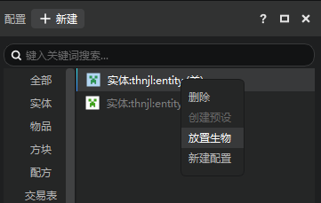
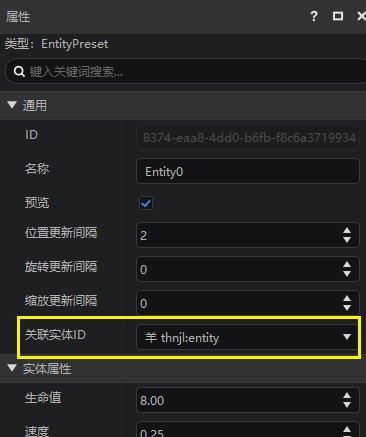
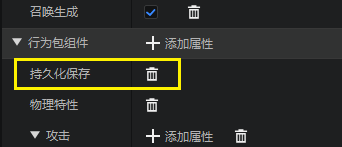

---
front:
hard: 入门
time: 10分钟
selection: true
---

# 放置和管理生物

## 放置生物

关卡编辑器支持在地图中放置生物。

- 对于地图组件来说，放置的生物会直接保存在地图存档中。
- 对于AddOn来说，你仍然可以放置生物，但是只能在编辑器中预览放置的结果，因为AddOn不包括地图存档。

放置生物的方法：

1. 在功能区点击放置生物按钮，开启该功能。
2. 功能启用后，功能区的下方会新增一栏，在这里选择希望放置的生物类型。
3. 将鼠标放置到内嵌游戏中，可以发现，会自动生成一个生物预览。
4. 单击鼠标，可以放下一个生物。
5. 使用键盘的Esc键，或者再次点击放置生物按钮，退出放置生物的状态。

除了功能区的放置生物功能之外，对于自定义生物，可以在配置中右键希望放置的生物，在菜单中点击放置生物，来放置这个生物。

> 注意：新建的自定义生物直接放置在地图中，显示可能不正常，你可以重启编辑器，或者使用功能区的重载地图。

放置生物支持的类型

- 原版生物
- 自定义生物（指当前作品的自定义配置的生物）

如果放置的生物类型已经绑定了预设，在放置生物的时候，会直接生成这个生物的预设。

> 如下图，thnjl:entity这个自定义生物被绑定到了实体预设Entity0上：

## 通过舞台管理生物

### 舞台简介

舞台分为上下两个区域，两个区域分别是：

- 上：预设，这里显示所有地图中的预设实例。
- 下：生物，这里显示地图中的生物（仅包括已经加载的）。

> 对于已经绑定实体预设的生物，只会显示在预设区域中。

可以使用鼠标上下拖拽两个区域中间的横条，来修改两个区域占据的比例。

对于下方的生物分区，同类生物会聚合到一个分组，分组可以展开折叠。

舞台中显示如下的信息，以下图羊驼举例：

- 生物和分组的名称，即下图中的羊驼。
- 生物的实体Id（Entity Id），即下图中的-17179869151。
- 如果你放置的某类生物有持久化的属性，也会在生物分组中显示。

> 如果一类生物是持久化的，那么在卸载区块和退出游戏时，该生物会存档。使用编辑器创建的自定义生物，会默认添加持久化属性。有一些原生生物是持久化的，比如羊驼。

### 舞台生物操作

舞台中的生物支持查看/修改属性和删除两种操作。

1. 点击生物，可以在右侧的属性面板中查看这个生物的属性。

> 灰色的属性暂时不支持修改

2. 舞台中右键生物/生物组，或者选中他们之后点击键盘的delete键，可以删除这些生物。

### 预览窗中调整生物

可以通过类似调整预设的方式，在内嵌预览窗中对生物的坐标变换进行调整。

> 1. 使用小键盘的1、2、3，或者预览窗右上角的按钮切换拖柄的模式。
> 2. 目前缩放无法保存到地图存档中，只能在编辑器中预览。
> 3. 如果需要保存缩放，当前可以使用实体预设。

