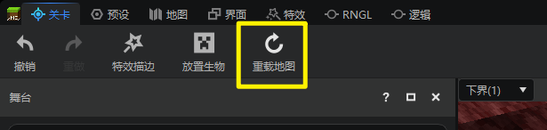
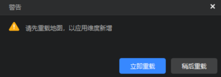
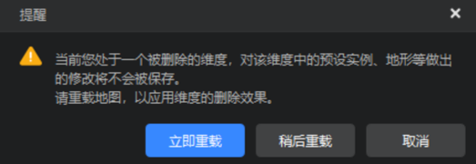
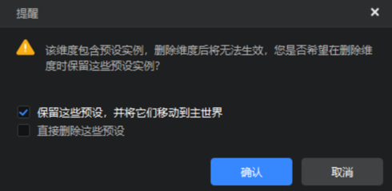

# 关卡编辑器维度切换

在进行玩法创作时，难免会需要使用多个维度，这时就会需要在不同维度之间进行切换。所以我们推出了编辑器维度切换功能。

## 1. 维度切换概述

编辑器内嵌游戏的所处维度可以通过在关卡编辑器或地图编辑器左上角的维度下拉框进行切换，可以传送至下界、末地，以及开发者自行创建的自定义维度。

离开一个维度时，编辑器会记录开发者在该维度最后所处的位置坐标，并在下次切换到该维度时自动传送到这个位置。

## 2. 舞台显示

关卡编辑器的舞台将只会显示当前维度存在的预设和生物，不会显示其他维度的内容。

> 玩家预设、界面预设、开发者设置的常加载预设除外，它们会显示在所有维度的舞台上。

## 3. 通过属性切换预设实例所处维度

除了玩家预设、界面预设以外的其他预设的实例都新增了【所在维度】下拉框。开发者可以单击关卡编辑器舞台上的预设实例，然后在属性窗口修改它的所在维度，从而直接将其从一个维度传送至另外一个维度。

当预设被移动到一个新维度时，将会沿用在旧维度的坐标、旋转、缩放数值，开发者可在新维度进行进一步的调整以适配新维度的地形、场景。

当开发者将一个预设移动至新维度后，将无法在旧维度看见、编辑该预设。此时编辑器会自动询问是否需要将内嵌游戏切换至新维度以进行编辑。
- 选【是】，则会立即切换至新维度，并将相机焦点聚焦到刚刚移动的预设上。
- 选【否】，则会保留在旧维度，但无法再看见或编辑被移走的预设。

## 4. 增删维度的特殊情况

如果开发者对自定义维度进行创建或者删除操作后，需要点击工具栏上的【重载地图】才能真正应用。

**1) 创建新的自定义维度**

如果开发者尝试切换至新维度，或将现有预设移动至新维度时，收到如下图所示的弹窗提醒，说明在创建该维度后未进行地图重载，维度新建在引擎中未得到真正应用。这里需要点击【立即重载】才能继续操作。

**2）删除已有的自定义维度**

开发者删除一个自定义维度后，如果当前尚处于已被删除的维度，会受到弹窗提示要求重载地图。
- 点击【立即重载】后，将会返回主世界，被删除的维度消失。
- 点击【稍候重载】，则仍可以在该维度中活动，但对其做出的任何改动将随着下一次地图重载而消失。
- 点击【取消】，则取消删除维度的操作。

如果被删除维度的舞台上仍有预设，则会额外弹窗请开发者选择如何处理这些预设。开发者可以【保留这些预设，并将它们移动至主世界】或【直接删除这些预设】。

