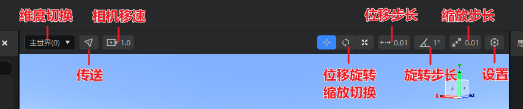

# 预览窗工具栏

**预览窗工具栏**功能。它位于编辑器预览窗的正上方，用于对编辑器内嵌游戏进行设置。不同编辑器下视口工具栏中可以使用的功能是不同的，具体见下表：

| 功能名称 | 功能说明 | 可在以下编辑器使用 |
| --- | --- | --- |
| 维度切换 | 通过下拉框切换内嵌游戏玩家所在维度。 | 关卡、地图 |
| 传送 | 通过输入XYZ三轴坐标在当前维度内传送玩家。 | 关卡、地图 |
| 相机移速 | 有2个参数，一个是“基础速度”，用于在当前倍数下调整相机速度；另一个是“速度倍数”，用于成倍增加相机移速。**最终相机速度 = 基础速度 × 速度倍数**。 | 关卡、预设、地图 |
| 位移、旋转、缩放功能切换 | 三选一按钮，用于在位移、旋转、缩放三个主要功能间相互切换。 | 关卡、预设 |
| 位移步长 | 调整位移操作单次移动的格数。默认为0.01。当选中预设中的素材或带有素材的预设时，步长最小为1，选择小于1的步长无效。 | 关卡、预设、地图 |
| 旋转步长 | 调整旋转操作单次旋转的角度。默认为1°。当选中预设中的素材或带有素材的预设时，步长最小为90°，选择小于90°的步长无效。 | 关卡、预设、地图 |
| 缩放步长 | 调整缩放操作单次缩放的倍数。默认为0.01。 | 关卡、预设、地图 |
| 设置 | 拉起编辑器设置窗口。 | 关卡、预设、地图 |