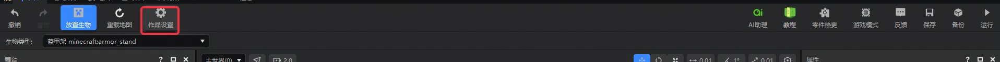
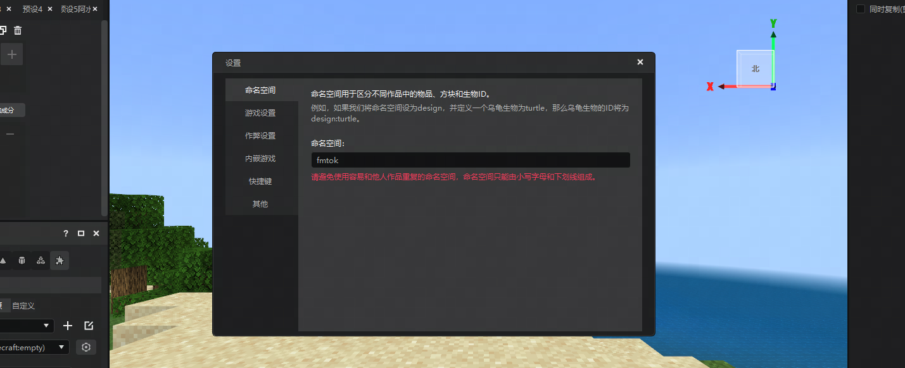
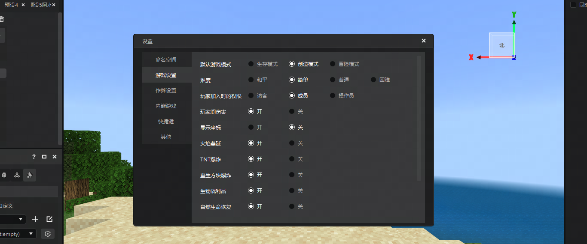
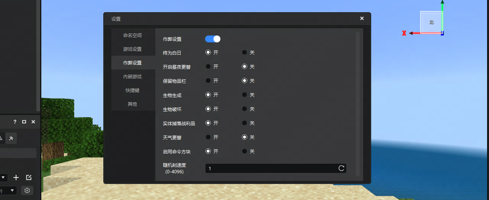
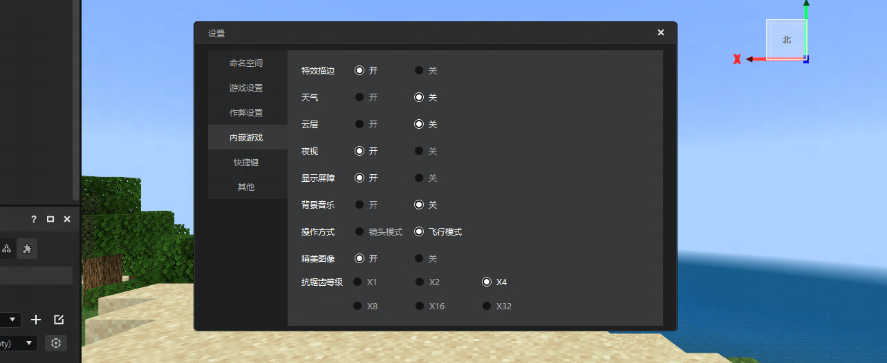
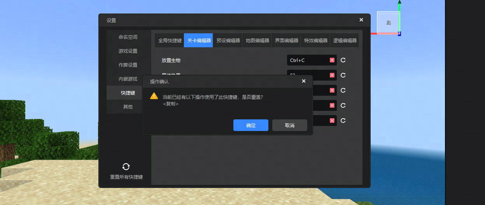
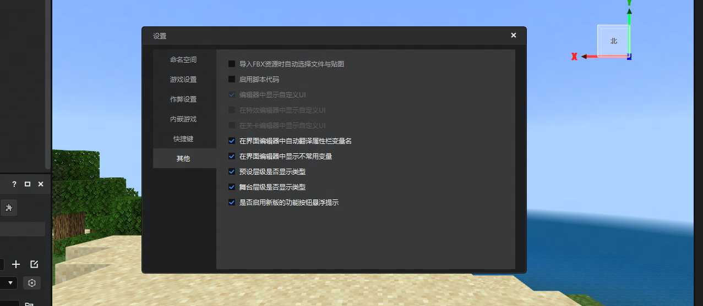

---
front:
hard: 入门
time: 5分钟
selection: 100
---
# 作品设置

在本文中：

- [设置命名空间](#设置命名空间)
- [游戏设置](#游戏设置)
- [作弊设置](#作弊设置)
- [内嵌游戏](#内嵌游戏)
- [快捷键](#快捷键)
- [其他](#其他)

通过本指南，您将学会如何使用作品设置配置命名空间、游戏设置、作弊模式、编辑器快捷键与其他设置。

虽然部分设置与模式在编辑器内嵌游戏中不会生效，但会在编辑器内运行游戏时或作品导出、上传到平台保留。

方便您在制作地图时无需反复调整游戏设置与作弊模式。

## 设置命名空间

在关卡编辑器的顶部工具栏或预览窗的设置中打开作品设置。

按下回退键去掉初始命名空间，直接更换后即可生效。如果新导入的作品已经有了命名空间，系统会自动读取已存在的命名空间。如果作品有多个附加包，系统会随机选取其中一个附加包的命名空间作为作品的命名空间。

::: warning 注意

请勿使用非法名称。这将会导致修改无法生效。

:::

## 游戏设置

现在您可以直接在编辑器中指定游戏设置。例如，打开 **显示坐标** 后，点击 **运行** 自测，可以在`Hud`界面左上角看到坐标位置信息。同时将信息同步至原作品中。

## 作弊设置

现在您可以直接在编辑器中开关作弊选项。例如，当您不希望生物生成或生物对地形产生破坏时，可以勾选开关为关。即可将效果同步至原作品中。

## 内嵌游戏

点击内嵌游戏，勾选的选项将直接影响编辑器内的游戏画质、操作方式、夜视效果、操作方式等。这些设置只会在编辑器内生效，并不会影响到作品或游戏自测。

## 快捷键

您可以在快捷键页签中，修改编辑器中的一些操作的按键组合，目前我们最多支持[*Ctrl+Alt+Shift+某个按键*]这样的组合键。

- 全局快捷键：这个页签下的操作在每个编辑器下都生效，一般是一些通用的操作。
- 其他六个编辑器：这些页签下的操作只针对每个单独的编辑器生效。比如关卡编辑器中"**F1**"表示放置生物，那么在其他编辑器中按下这个按键，关卡编辑器并不会响应。

每个独立的编辑器快捷键互相不冲突，您可以将两个属于不同编辑器的操作绑定到同一个按键上，但是您不可以将独立编辑器中的某个操作快捷键设置为全局快捷键中的某一个，如果尝试这么做，会直接弹出提示框。

同样的，若您尝试将两个属于同一个编辑器的操作绑定到一个按键上时，也会弹出上面这个提示框，点击确认，会将提示框中的操作的快捷键清空掉，然后将当前的按键分配给指定的操作上；点击取消，将会重置当前操作的快捷键。

每个操作快捷键右侧都有两个按钮：

- 红叉：点击之后将会清空这个操作的快捷键
- 重置：点击之后将会把这个操作的快捷键重置为编辑器默认值

另外，点击界面左下角的 **重置所有快捷键** 按钮，将会把当前所有快捷键重置为编辑器默认值。

## 其他

设置编辑器其他属性时，可在其他页签中设置，这里储存了一些编辑器的基础配置。

- 导入FBX资源，勾选自动选文件与贴图后，导入FBX与贴图所在的文件夹后将自动导入FBX资源。
- 启用脚本代码后，编辑器将在启动后启用脚本代码并执行逻辑。
- 勾选编辑器中显示自定义UI，则在全部编辑器中都显示自定义UI，UI主要来自脚本UI。
- 勾选特效编辑器中显示自定义UI，则决定UI是否在特效编辑器中显示，UI主要来自脚本UI。
- 勾选关卡编辑器中显示自定义UI，则决定UI是否在特效编辑器中显示，UI主要来自脚本UI。
- 勾选界面编辑器中自动翻译属性栏变量名，则代表部分变量名源于`UI Json`的英文变量，勾选后会自动翻译成中文。
- 勾选预设层级是否显示类型，代表预设右侧是否显示预设类型名称。
- 勾选舞台层级是否显示类型，代表放置的预设是否显示预设类型名称。
- 勾选是否启用新版的功能按钮悬浮提示，代表是否鼠标悬浮在功能按钮上会弹出功能引导提示。

