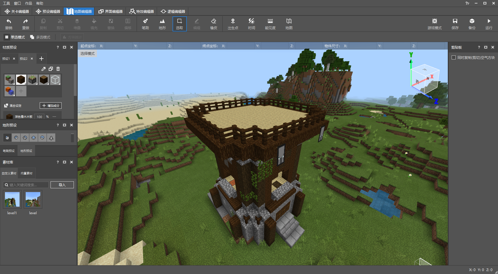

# 准备工作

## 制作目标

本系列文档会带您一步一步从0开始学习如何使用新版逻辑编辑器制作您的第一个蓝图Mod。

我们为这个Mod定下的目标是：制作出一只每次受到实际伤害后会移动速度翻倍的动物（我们先以猪为模板制作），当它的速度达到上限后将不再增加。

这是一个非常简单的逻辑，但可以让初学者了解一些基本的概念和新版逻辑编辑器的使用方式。

## 新建作品

我们需要通过新版编辑器创建作品，这样才能使用新版逻辑编辑器。

如果你尚不清楚如何创建新版作品，请参考[这篇文章](../../14-预设玩法编程/9-第一个预设Mod/0-创建新版作品.md)。

## 准备地图

我们将会需要一个固定的场地来做测试。因为我们的实验对象（那只可爱的猪）最后可能有非常离谱的速度，所以我们需要一个相对封闭的场地将它的活动范围限制住。这里你可以用2格高的墙将它围起来，当然更简单的方式，就是在地图编辑器中，使用一块被栅栏围住的小型平地（例如下图中的塔顶）。

> **第一次使用地图编辑器？**
>
> 你可以查看《[地图编辑器使用说明](../../../14-地图制作/2-地图编辑器使用说明.md)》了解它的基本操作方式。

## 准备实体预设（实验对象）

下面我们需要准备一只猪，作为实验对象。这里我们需要用到新版编辑器的实体预设来制作它。

首先我们点击下方资源管理器界面的【新建】按钮，在【预设】菜单下选择【实体预设】，点击【下一步】。然后我们可以在实体列表中通过关键词搜索找到“猪”，并在下方文件命名处将其命名为“Pig”。最后点击绿色的【创建】按钮，即可通过预设编辑器打开我们新创建的Pig实体预设。

我们接下来可以在【关卡编辑器】中，将刚刚创建好的Pig预设拖到场景中，并放置到刚刚用栅栏圈出的区域里，这样它就不会到处乱跑了。

放置完成后务必记得点击右上角的【保存】按钮，勤保存是一个很好的习惯。

**在下一篇文档中，我们将使用蓝图零件，来为这只猪附上蓝图脚本。**

