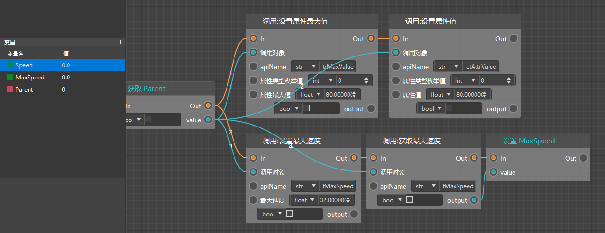
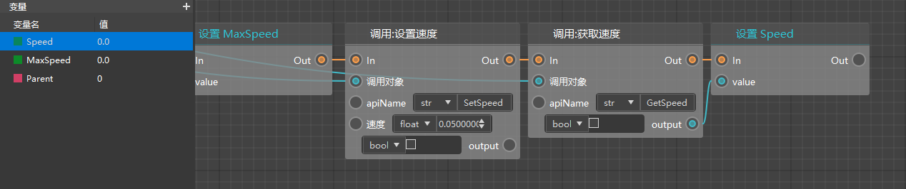

# 蓝图逻辑编写：必要的准备工作

回忆一下，我们的目标是：让猪每实际受到一次伤害，其移动速度都会翻倍。在此之前，我们需要做一系列的准备工作：

1. 获取实体预设对象：我们后面调整血量、设置速度等操作都需要指定具体是对谁进行；
2. 提升猪的血量：目的是为了让猪在我们的测试中不会打几下就去世了。这里需要调整血量上限和当前血量两个属性；
3. 设置并猪的速度和最大速度：为了让演示效果比较夸张，我们把猪的当前速度设置为0.05（正常移速的五分之一），并把它的最大速度设置为32，同时需要使用两个变量将这两个速度值存储起来，用于后续计算和赋值。

## 获取实体预设对象

我们需要在客户端初始化的时候就获取实体预设对象，并存为一个独立的变量Parent，以便在后续的逻辑中随时使用它。我们可以从服务端初始化节点的输出执行引脚（Out）拖出一条黄色的执行引线，松开鼠标后会弹出节点菜单。

这里我们需要获取到的是当前蓝图节点的父预设（猪的实体预设），所以我们需要用到【获取父对象】这个接口。我们可以

1. 在节点列表中直接寻找这个节点（在你不知道节点名称的情况下通常需要这么做）
2. 输入中文关键词进行检索，例如“父对象”
3. 输入接口英文名称，例如“GetParent”

这三个方法都可以找到我们需要的节点，在后续的编辑中使用哪种方式大家可根据实际情况自行选择。

我们看到这里其实有2个【调用：获取父对象】节点可以选择，一个是【调用零件接口】，一个是【调用预设对象接口】。其实对于我们当前的情境下使用这两个节点并没有什么区别，但如果我们是在预设多层嵌套的情况下获取预设的父预设，那么我们就不能使用零件接口的获取父对象节点了。

在成功获取到父预设的对象后，我们可以养成一个好习惯，将其用一个变量的形式存储起来，以便后续在图表其他位置或自定义接口的接口图表中调用。

我们首先在左侧脚本元素窗口中的变量菜单下点击右上角的“+”号，创建一个变量，并命名为【Parent】。由于父对象是一个Object类型，不属于当前编辑器提供的自定义变量数据类型，故我们就使用默认的Any类型即可，不需对变量类型做出改动。

创建好【Parent】变量后，我们将其从左侧变量菜单拖到图表空白处，松开左键后选择【设置Parent】，即可创建该变量的设置节点，用于修改该变量的值。我们将【调动：获取父对象】节点与【获取 Parent】节点通过黄色执行引线连接起来，再将获取父对象的结果通过数据引线传递给设置Parent的参数Value，即可将该对象传递到Parent变量存储起来。

## 提升实体的血量

为了让猪不会在我们的测试过程中因为血量不足去世，我们需要将其最大血量和当前血量同时提升，需要用到的接口分别是【调用：设置属性最大值】和【调用：设置属性值】。（注意这里需要选择的是【调用预设对象接口】类）

这两个节点都需要传入实体对象，以确认是对哪个对象进行设置操作。这里由于我们之前已经将父对象存为了变量，我们可以直接获取Parent变量的值，然后将它传递给这两个设置接口的【调用对象】参数。

下面我们需要确定的是，这个设置属性最大值和设置属性值的操作，是对实体的哪一个属性进行的。确定属性类型我们需要查阅对应属性类型的枚举值，并将其传递给这两个设置接口。

更一般情况下，当我们不知道一个节点的参数或者返回值代表的含义，可以直接在开发者官网的API文档中查阅对应接口的信息。比如这里，我们通过搜索找到了【设置属性值（SetAttrValue）】这个接口，在参数信息中，我们可以看到attrType需要填写的是AttrType枚举值，我们点击链接可以跳转到属性类型枚举值页面，看到生命值（Health）对应的属性类型是0，正好是默认值，所以我们这里不需要改变这个参数的值。

然后，我们将这只猪的最大血量和当前血量设置都设置为80，就可以完成提升血量的步骤了。这里我们直接把两个节点的【属性最大值】和【属性值】两个参数都改为浮点数（float），然后将数值都改成80即可。

## 设置并存储实体的速度上限和初始速度

在一般情况下，猪在游戏中的默认移动速度是0.25，为了让演示效果更夸张些，我们将它的初始速度调整为0.05，并且将其最大速度设置为32。同时，为了方便后续计算，我们需要将猪的当前速度存储为变量Speed（浮点型），同时将猪的最大速度存储为变量MaxSpeed（浮点型）。

速度最大值的设置和获取节点我们可以直接使用预设API的接口：【设置最大速度】、【获取最大速度】；

速度的设置和获取节点我们可以直接使用预设API的接口：【设置速度】、【获取速度】。

我们可以直接从获取Parent的输出执行引脚再拖出一条执行连线，连接到设置最大速度，这样代表的逻辑就是，先执行【设置属性最大值】→【设置属性值】这条执行线，再执行【设置最大速度】这条逻辑。同时，我们在最大速度参数处填入我们需要的速度上限32。

设置好最大速度后，我们需要将最大速度存为变量MaxSpeed。这里我们首先通过【获取最大速度】节点获取到当前实体的最大速度值（即等于我们刚刚设置的32），再创建一个名为MaxSpeed的浮点型（float）变量，将其值设置为我们刚刚获取到的最大速度值。

同理，我们还需要获取当前实体速度值，并将其传给新建的变量Speed。

这样，我们就完成了设置并存储实体速度上限和初始速度的工作。

## 小技巧：通过分组、注释工具管理节点

如果图表中有太多的节点，我们通常会感觉比较混乱，寻找某条逻辑的时候不知道从哪里开始找。这时，我们就可以利用分组和注释工具对节点进行标识和管理。

我们在需要框选的节点左上角空白处点击右键，从菜单中选择【创建分组】，可以看到在图表中生成了一个默认大小的分组框，在框内的节点都会被默认识别为该分组的内容，并且在拖动分组的时候会被统一移动。我们可以更改分组的命名，调节分组框的大小使其囊括其他我们需要的节点，也可以更改分组的颜色，使其更加醒目。

同样的，我们也可以为速度设置和存储的节点创建分组。

如果你需要为某个节点添加注释，可以对该节点点击右键，并选择【编辑注释】，这样可以方便地提供更多关于该节点的信息。

