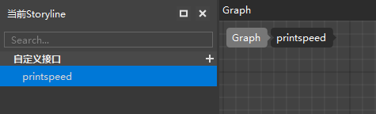
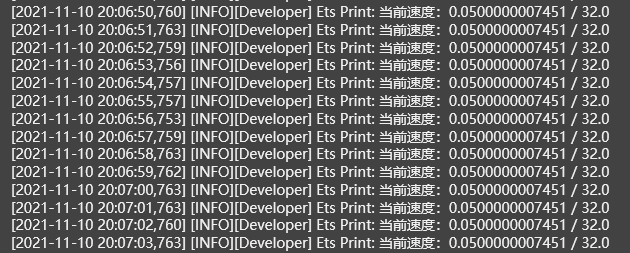

# 蓝图逻辑编写：自定义接口与定时器逻辑

我们的目标是对猪的移动速度进行修改，但是我们并不能通过猪在游戏中的实际奔跑状态看出我们编写的逻辑是否达到了我们预期的效果。这时候，我们就需要通过日志打印，来返回猪的实时移动速度，来精确判断每次实际收到伤害后，猪的移动速度是否翻倍。

## 使用重复定时器

如果使用服务端每刻（TickServer）监听事件来调用打印事件，我们会受到过多的打印信息。其实我们更加希望的是每隔一段时间（以1秒为例），打印一次实时速度。这里我们需要借助一个特殊的节点，也就是【添加重复定时器】。重复定时器与普通定时器的区别是：普通定时器用于一段时间后执行的逻辑，重复定时器用于每隔一段时间都会执行一次的重复逻辑。

首先我们需要把【延迟】参数的类型改为浮点型（float），然后我们需要传入一个触发函数，它的意思是每隔1秒都会执行一次这个函数。这个函数我们需要将其以零件变量的形式传进来，这里我们调用【获取零件变量】接口，用执行连线连接【服务端初始化（InitServer）→ 获取零件变量 → 添加重复定时器】，然后将获取到的零件变量传递给【触发函数】引脚。

> 这里使用【服务端初始化（InitServer）】时间是因为我们希望在服务端初始化后就立刻创建这个定时器，并开始每秒执行一次打印逻辑。这里千万不要使用【服务端每刻（TickServer）】来创建定时器，否则会每个Tick都创建一次，导致日志量暴增。

接下来，我们需要创建一个自定义接口，写入打印逻辑后，将其以作为零件变量传递给触发函数。

## 自定义接口的创建与编辑

首先，我们在左侧脚本元素窗口中点击自定义接口菜单中的“+”按钮，新建一个自定义接口，并命名为printspeed。

创建自定义接口的同时，逻辑编辑器会自动为我们打开该自定义接口的接口图表。我们需要将这个接口的逻辑写在图表里，并形成【输入节点→接口逻辑节点→输出节点】的节点网络，从而才能在根图表中调用这个自定义接口的逻辑。

> 此处我们并不需要这个printspeed接口有参数或返回值，所以不需要添加。
>
> 如果你在今后的编辑过程中需要为自定义接口添加参数和返回值，那么你可以在左侧脚本元素窗口选中该自定义接口，并在右侧属性窗口为其添加参数/返回值。
>
> ** 需要注意的是，在图表中选中自定义接口的调用节点是没法编辑自定义接口的属性的。

然后，我们就可以在自定义接口的接口图表中编辑我们需要的打印速度的逻辑了。

我们需要获取到实体真实最大速度和当前速度，所以先获取到Parent，然后传递给【获取最大速度】和【获取速度】的调用对象参数。

为了让日志打印可读性更高，我们需要使用【连接字符串】节点，定义一下打印信息的格式：【当前速度：(当前实体速度)/(实体最大速度)】

完成了自定义接口的内部逻辑后，我们将它的名字填入根图表【获取零件变量】的key中，这样就可以每秒钟执行一次printspeed接口逻辑。

至此，定时器需要每秒执行的自定义接口逻辑就编辑完了，我们可以简单测试一下。

## 测试定时器逻辑

保存后，我们点击工具栏上的运行按钮，即可开始对定时器逻辑的测试。

从日志窗口中我们可以看到，每秒钟都会有一个猪的速度和最大速度的打印，说明我们定时器的逻辑编写是无误的。

