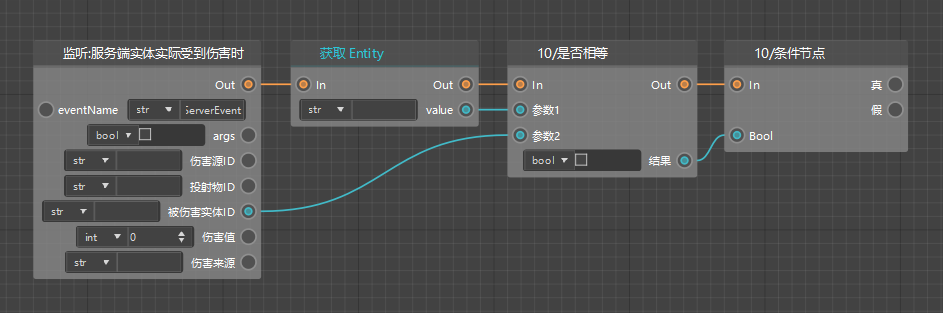

# 蓝图逻辑编写：受击加速逻辑

完成了定时打印逻辑的编写之后，接下来就到了我们的重头戏：受击加速逻辑了。这一部分主要包括2步：

1. 判断受伤实体是否为我们的实体预设
2. 计算受击后猪的速度并传给猪

## 实体ID判断

对于猪实际受到伤害的监听我们用到的节点是：【监听：服务端实体实际受到伤害时】。这里我们可以选择第一个【监听服务端事件】类的，它是一个sdk事件监听节点。

这个节点可以为我们传出被伤害实体的ID，这里我们需要将它与我们生物预设的实体ID进行比较，如果它们完全相等，则判断为实际受到伤害的就是我们的猪，进而继续执行后续的变速逻辑。现在我们需要补充获取猪的实体ID的逻辑。

首先，我们需要通过【调用：获取实体ID】节点，获取到父对象对应的实体ID，然后新建一个类型为字符串（Str）的变量Entity，将获取到的实体ID存入Entity。我们需要将这段逻辑插入到获取父对象存入Parent之后。

然后，我们需要判断这个实体ID与被伤害实体ID是否相同。这里需要用到【是否相等】这个节点，它通过传入两个值，判断二者是否相等，并返回一个布尔值。如果两个参数值相等，则返回真（True）；不相等，则返回假（False）。

接着，我们将这个布尔值传入【条件节点】，它有两个输出执行引线，布尔值为真的时候走“真”这条引线；布尔值为假的时候走“假”这条逻辑。

到此为止，我们就完成了实体ID判断的逻辑。

## 计算受击后实体速度

我们计算受击后猪的速度的思路如下：

获取Speed，并将Speed乘以2得到**2Speed**，然后与**MaxSpeed**相比较：

1. 如果2Speed小于或等于MaxSpeed，则将2Speed重新赋值给Speed变量，并将Speed的值设置为实体当前速度；
2. 如果2Speed大于MaxSpeed，则将MaxSpeed赋值给Speed变量，并将Speed的值设置为实体当前速度。

首先我们获取Speed，并通过【*】乘法节点将其乘以2；再获取MaxSpeed。

然后我们通过【数字比较】节点比较2Speed和MaxSpeed的大小，并根据上述逻辑将对应的值赋给Speed。

最后，我们重新获取最新的Speed，并将它的值设置为实体速度。

至此，我们就完成了受击后实体速度加倍的逻辑，使用紫色分组框将这部分归为一组。接下来，我们就可以测试我们写的逻辑是否正确生效了。

