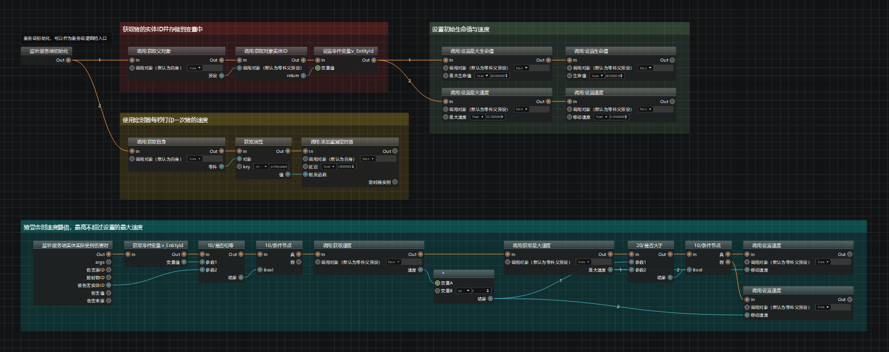
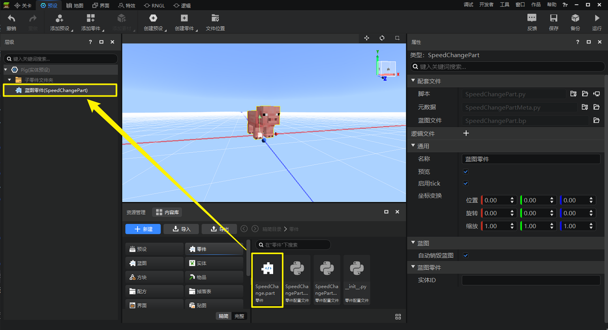
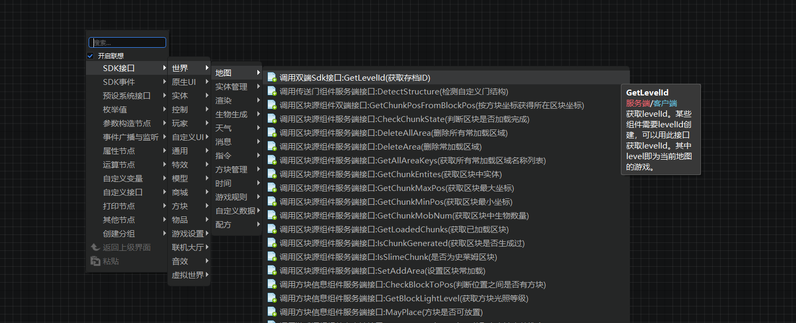
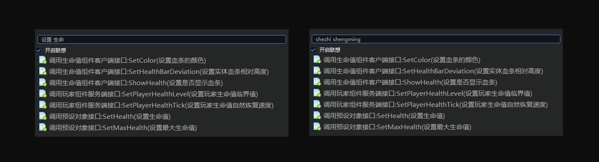
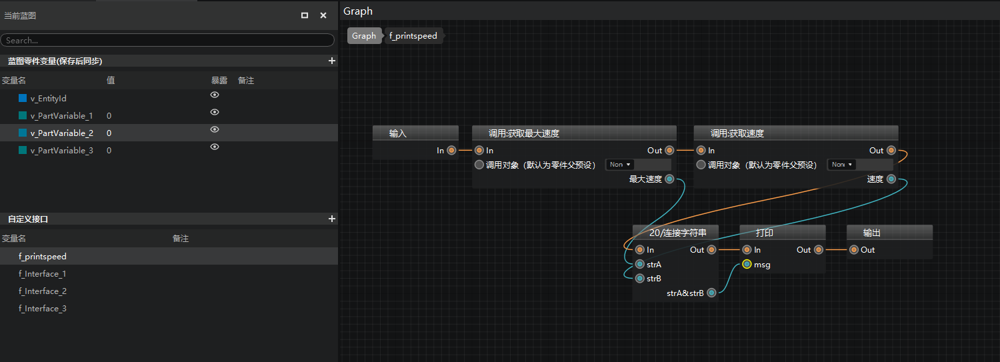
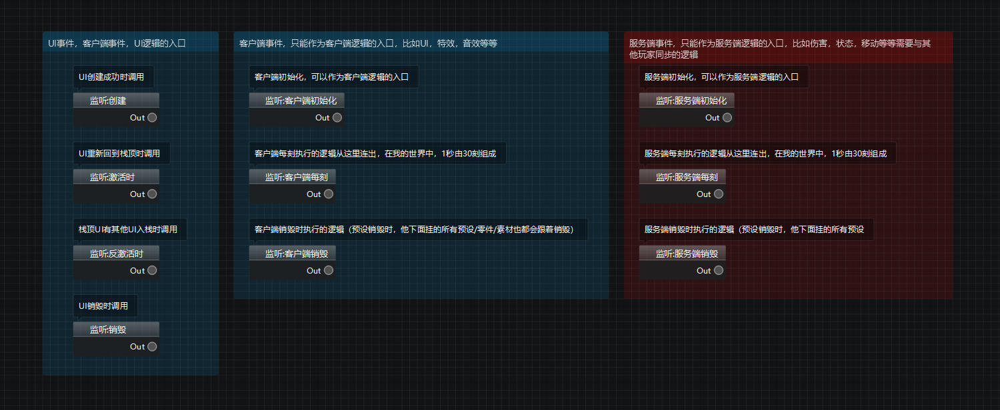

---
front:
hard: 入门
time: 10分钟
selection:
---

# 什么是逻辑编辑器

很多开发者都有这样的疑惑：我不是编程专业出身，或者之前没有模组代码开发的经验，可以制作带玩法逻辑的模组吗？**完全可以！** 使用逻辑编辑器，通过“连连看”就能够快速构建模组的玩法逻辑，编程从此不再是障碍！

## 逻辑编辑器简介

逻辑编辑器是为中国版开发者打造的、以蓝图为载体进行节点式逻辑编写的编辑器。我们将中国版全套SDK接口、python内置函数都集成到了逻辑编辑器中，开发者们可以直接在蓝图中找到自己需要的节点，将它们按照逻辑运行顺序连接起来，就可以在游戏中生效了。

## 逻辑编辑器功能亮点

下面将为大家简单介绍逻辑编辑器的功能亮点：

### 1. 节点式逻辑编写

逻辑编辑器使用节点式的逻辑编写方式，通过节点添加接口，通过连线控制数据传递，方便快捷。

### 2. 即挂即用，方便复用

逻辑编辑器将逻辑保存为一个个**蓝图脚本（.bp）**，每个蓝图脚本都固定绑定到了一个**蓝图零件**上，将蓝图零件挂接到预设下即可使其中的逻辑生效。

同一个蓝图零件可以挂接到不同的预设下，在右侧属性栏对其中开放的属性变量进行调整，从而实现逻辑的快捷复用，提高开发效率。

### 3. SDK接口全覆盖且已汉化

提供了模组SDK的所有接口，以及大幅扩展了对python原生接口的支持。同时还提供了节点搜索和鼠标悬停提示，帮助开发者快速找到自己需要的接口。

同时，逻辑编辑器内的全部接口**均已汉化**，让开发者可以清晰地知道每个节点的作用。

### 4. 快捷的节点搜索

逻辑编辑器的右键节点菜单支持中文、英文、拼音搜索，并且支持在两个词之间插入空格进行分词搜索，最大程度帮助开发者快速定位需要的接口。

### 5. 变量和自定义接口管理

左侧脚本元素窗口提供零件变量、自定义接口的边界管理，包括创建与删除、属性修改、添加备注等。自定义接口还提供了专门的接口图表，供开发者进行接口逻辑编写。

### 6. 支持蓝图编写UI逻辑

逻辑编辑器不仅有蓝图零件，还有蓝图UI零件，支持使用蓝图编写UI逻辑。

