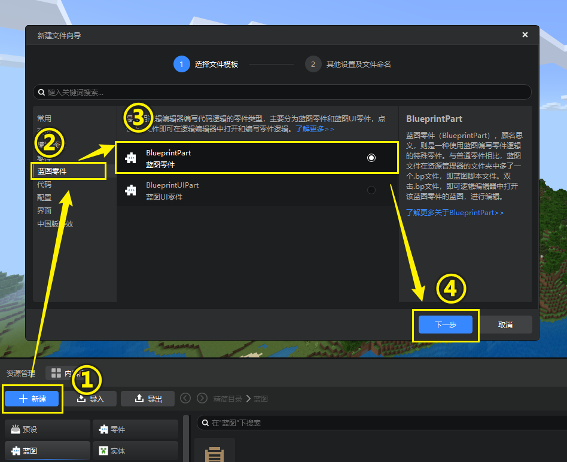
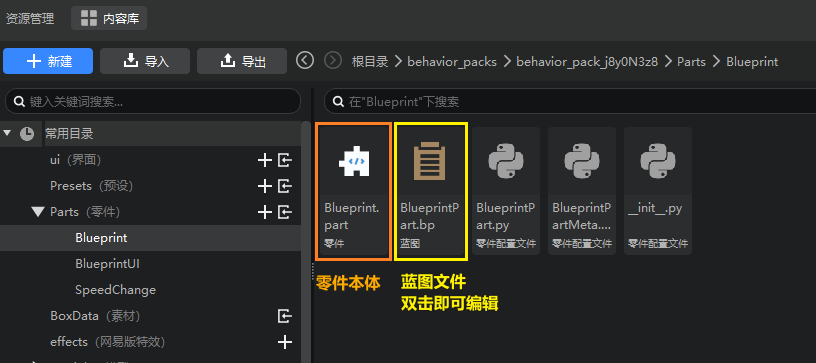

---
front:
hard: 入门
time: 10分钟
selection:
---

# 创建蓝图零件

逻辑编辑器的逻辑都需要在**蓝图**上编写，而蓝图则存在于一个又一个**蓝图零件**中。这篇文档将带各位开发者们了解如何创建蓝图零件。

## 创建蓝图零件

正如普通零件一样，蓝图零件也可以通过新建文件向导创建。点击资源管理器左侧的【新建】按钮打开新建文件向导，选择【蓝图零件】，即可创建一个空的蓝图零件。你可以为蓝图文件自定义名称。创建新的蓝图零件后，下方资源管理器将自动跳转到新创建的零件目录。

> **注意：**
>
> 当前蓝图零件命名仅支持纯英文、数字。

## 两种蓝图零件

正如在新建文件向导的蓝图零件页面显示的那样，蓝图零件目前共有两种：

- **蓝图零件：** 即普通的用蓝图脚本撰写逻辑的零件；
- **UI蓝图零件：** 专门为UI控制而编写的蓝图零件，其中包含了部分专用于UI控制的事件、接口。

### 1. 蓝图零件

蓝图零件的目录下会自动创建如下5个文件（以默认命名Blueprint为例）：

- Blueprint.part
- BlueprintPart.bp
- BlueprintPart.py
- BlueprintPartMeta.py
- \_init_.py

相比与普通零件，这里新增了一个BlueprintPart.bp。这里的.bp文件即是我们的 **蓝图文件** ，对其进行**双击**，即可在新版逻辑编辑器中打开对应的蓝图，通过可视化的节点式编程进行逻辑编辑。

### 2. UI蓝图零件

UI蓝图零件目录下会自动创建如下6个文件（以默认命名BlueprintUI为例）：

- BlueprintUI.part
- BlueprintUIPart.bp
- BlueprintUIPart.py
- BlueprintUIPartMeta.py
- BlueprintUIPartUI.py
- \_init_.py

与蓝图零件类似，该目录下我们可以编辑的是BlueprintUIPart.bp。对其进行**双击**，即可在新版逻辑编辑器中打开对应的UI蓝图脚本进行编辑。

