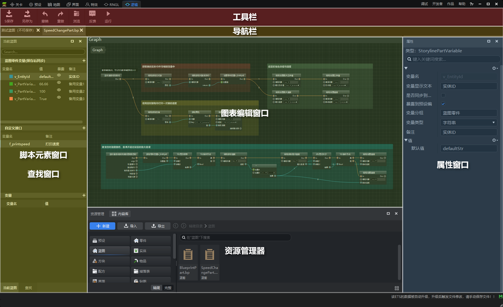
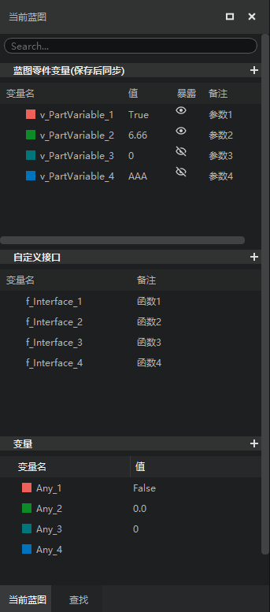
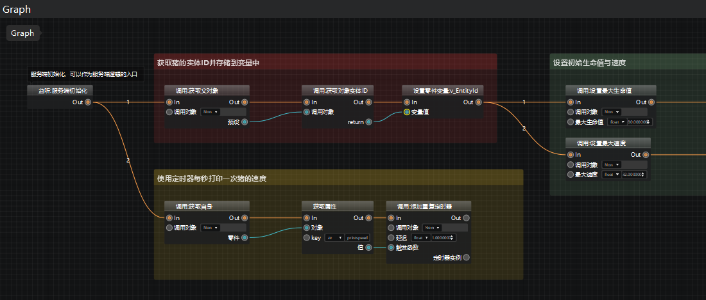
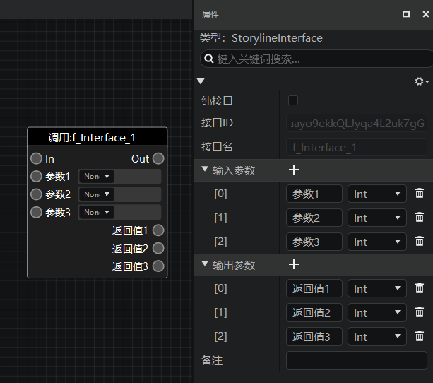
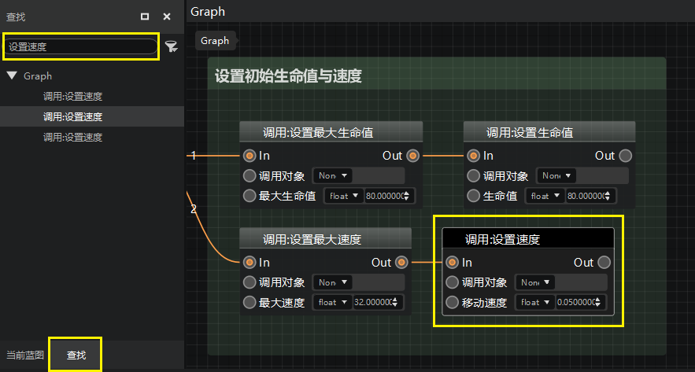

---
front:
hard: 入门
time: 10分钟
selection:
---

# 认识逻辑编辑器界面

逻辑编辑器的界面主要包括如下几个部分：

## 工具栏

工具栏固定显示在逻辑编辑器的顶部，用于访问常用的命令按钮。其中有两个需稍作说明：

- **保存：** 保存对当前蓝图的修改。
- **另存为：** 单独保存当前蓝图.bp文件到本地指定位置。
- **撤销：** 撤销上一次编辑操作。
- **重做：** 重新执行上一次编辑操作。
- **浏览：** 在资源管理器重定位当前蓝图零件脚本的位置。
- **运行：** 使用ModPC开发包运行当前作品，用以测试蓝图逻辑是否正常运行。

## 导航栏

当你同时打开不同的蓝图脚本文件时，它们将以页签的形式陈列在此处，点击即可在不同蓝图间快速切换。

## 脚本元素窗口

脚本元素窗口默认停靠在屏幕最左侧，用于显示或创建蓝图中零件变量、自定义接口等内容，以便让开发者们更加便捷地查看蓝图现有元素或创建新元素。

脚本元素窗口主要包括蓝图零件变量、自定义接口、变量三个区域，用户可点击每个模块右上角的“+”按钮新增对应的元素，也可右键点击现有元素，进行重命名、分组、删除等操作。双击自定义接口，还可打开对应的接口图表，进行内部逻辑编辑。

> **参考：**
>
> 关于脚本元素的更多指南内容，请参考[这篇文档](./40-事件、接口、变量.md)。

> **注意：**
>
> 请开发者们尽量使用【蓝图零件变量】，而不是【变量】。底部的变量窗口是过渡性功能，将在未来合适的时间被逐步废弃。

## 图表编辑窗口

图表编辑窗口是逻辑编辑器的核心窗口，你可以在此创建事件、接口等节点，并将它们用执行或数据引线相连，从而撰写零件的脚本逻辑。

如果你在蓝图脚本中创建了自定义接口，你就会需要**接口图表**来编辑这个自定义接口的内部逻辑。在脚本元素窗口双击该自定义接口，即可打开其接口图表（通常包含一个输入接口和一个输出接口），此时会在图表编辑区域的左上角显示面包屑导航（例图在这个截图中，就展示了在Graph图表中打开了f_printspeed的接口图表，点击面包屑导航上的Graph，即可返回Graph图表）。

## 属性窗口

属性窗口主要用于编辑被选中项的属性。在脚本元素窗口或者图表编辑窗口中选中某个对象，即可在右侧属性窗口中展示出它的各类属性信息，并可供开发者自行按需修改。

>**注意：**
>部分自定义节点属性通过图表中直接选中可能无法完整获取，请在左侧脚本元素窗口中选中后，再在属性窗口中修改。

## 查找窗口

查找窗口用于让开发者输入查询的节点名称、引脚名称或关键词，展示符合条件的查找结果，并可通过双击结果转到对应的节点。

查找窗口与脚本元素窗口位置重叠，可以通过左下角页签切换。如果你关闭了查找窗口，可通过快捷键ctrl+F再次调出。
