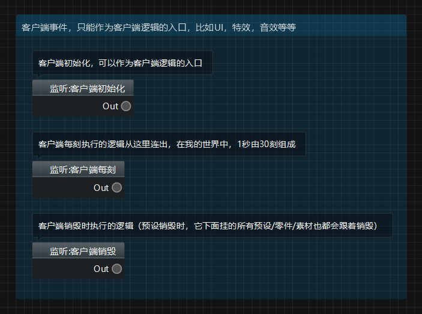
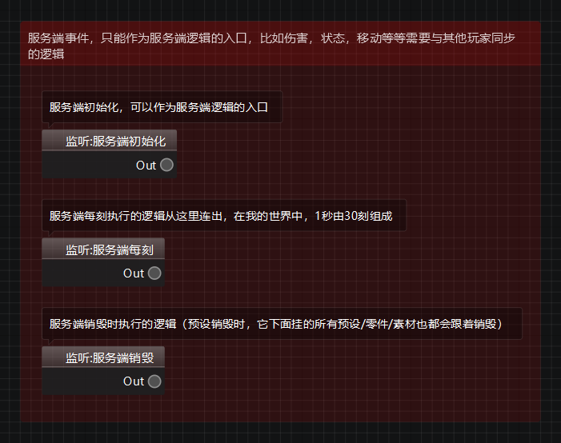
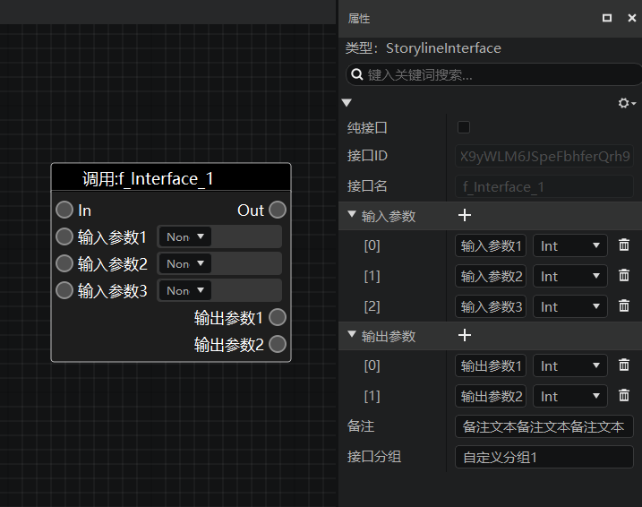
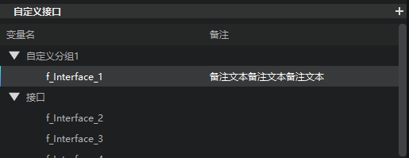
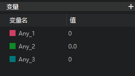

---
front:
hard: 入门
time: 20分钟
selection:
---

# 事件、接口、变量

在我们编写蓝图脚本的时候，一定会用到事件、接口和变量，我们将它们统称为“**脚本元素**”。三者的作用如下：

| 脚本元素 | 描述 |
| ---- | ---- |
| 事件 | 事件节点是节点网络的逻辑起点，当某个事件被触发后，即会执行该事件节点后连接的所有节点逻辑。 当前版本的逻辑编辑器，仅支持通过右键菜单创建编辑器自带的事件，暂时不支持开发者自定义事件。 |
| 接口 | 接口是节点图表的一种，可以从其他蓝图图表中调用其内部逻辑。 |
| 变量 | 用于储存值或对象属性，可通过获取变量节点调用变量值，也可以通过设置变量节点为该变量设置新的值。 |

下面我们将对它们逐一进行介绍。

## 事件

事件是模组逻辑代码的起点，所以任何一条蓝图执行逻辑都必须要以一个事件监听节点为起点，这样整条执行连线串联起来的逻辑链才能够被执行。

### 1. 默认起始事件

以蓝图零件为例，其在新建时会默认自带6个起始事件监听节点，分别为：

**1）客户端默认起始事件**

| 事件名称     | 事件英文名    | 描述                                                         |
| :----------- | ------------- | ------------------------------------------------------------ |
| 客户端初始化 | InitClient    | 客户端初始化，可以作为客户端逻辑的入口。                       |
| 客户端每刻   | TickClient    | 客户端每刻执行的逻辑从这里连出，在我的世界中，1秒由30刻组成。  |
| 客户端销毁   | DestroyClient | 客户端销毁时执行的逻辑（预设销毁时，它下面挂的所有预设/零件/素材也都会跟着销毁）。 |

**2）服务端默认起始事件**

| 事件名称     | 事件英文名    | 描述                                                         |
| :----------- | ------------- | ------------------------------------------------------------ |
| 服务端初始化 | InitServer    | 服务端初始化，可以作为客户端逻辑的入口。                       |
| 服务端每刻   | TickServer    | 服务端每刻执行的逻辑从这里连出，在我的世界中，1秒由30刻组成。  |
| 服务端销毁   | DestroyServer | 服务端销毁时执行的逻辑（预设销毁时，它下面挂的所有预设/零件/素材也都会跟着销毁）。 |

### 2. 创建事件监听节点

除了创建蓝图时默认生成的初始事件监听节点，逻辑编辑器还有丰富的事件库供开发者选择。可以通过右键菜单浏览、搜索我们需要的事件监听节点。

> **提示：**
>
> 关于节点的创建方式，请参考[这篇文档](./43-节点创建与连接.md#创建节点)

## 接口

新版逻辑编辑器为开发者提供了丰富的接口来实现你的创意。这些接口既包括现有中国版模组SDK（即ModSDK）里的全部接口，也包括一些Python接口和逻辑编辑器内置接口。

### 1. 内置接口

内置接口指的是模组SDK接口、Python接口以及一些辅助逻辑完成的基础接口。

可以通过右键菜单浏览、搜索我们需要的接口调用节点。

### 2. 自定义接口

除了右键菜单中的这些编辑器内置接口，新版逻辑编辑器还支持开发者创建自定义接口。找到左侧脚本元素窗口中的【自定义接口】选项卡，点击其右上角的【+】号，即可新建一个自定义接口。

> **自定义接口命名规范**
>
> 创建时可为该自定义接口重命名，其命名规范如下：
> 1. 以“f_”开头（代表function）
> 2. 不超过20个字符
> 3. 仅可包含英文字母、数字、下划线

自定义接口像其他接口一样，拥有一个调用调用节点，触发后即会执行该接口内的蓝图逻辑。

在左侧脚本元素窗口选中自定义接口后，可在右侧属性窗口修改该自定义接口的属性：

- **纯接口：** 可选项。勾选后该自定义接口将转为纯接口（无执行输入、输出引脚）
- **输入参数（inputParams）：** 点击“+”可为该自定义接口添加输入参数，支持编辑参数名和参数数据类型；点击垃圾桶按钮可以清除已添加的参数
- **输出参数（outputParams）：** 点击“+”可为该自定义接口添加输出参数（返回值），支持编辑返回值名和返回值数据类型；点击垃圾桶按钮可以清除已添加的返回值。
- **备注：** 在此处填写的备注信息可以用来增加对该变量的说明。备注将显示在【当前蓝图】窗口中相应的自定义接口后面。
- **接口分组：** 用于对自定义接口进行分类管理。开发者创建的自定义接口会被默认归类于`接口`分组下。如果想要创建一个新的分组并将该接口放入其中，只需要修改`接口分组`字段的文本，左侧【当前蓝图】窗口就会自动用该命名创建一个接口分组，并将该接口放入新的分组。
  

自定义接口创建后，在左侧脚本元素窗口双击该自定义接口（或者直接在图表中双击该接口的调用节点），即可打开该自定义接口的 **接口图表**。接口图表用于编写接口的内部逻辑。每个接口图表都会自带一个 **输入（Input）** 和一个 **输出（Output）** 节点。

- 输入节点是接口的逻辑起点，同时用于将参数传入接口内部逻辑；
- 输出节点是接口逻辑的终点，同时用于将运算完的数据以返回值的形式传出接口。

正如在普通蓝图图表中使用节点编写逻辑一样，你可以在接口图表中使用各类节点，并用执行连线将他们构成一个完整的逻辑网络，但是整个接口的内部逻辑必须是以执行连线从输入节点，经过内部其他节点，能够顺利走向输出节点的。

## 变量

<B>变量</B> 通常指 <B>蓝图零件变量</B>，用于储存值或对象属性，可以通过左侧脚本元素窗口的【蓝图零件变量】选项卡右上角的“+”按钮创建变量。变量在创建后可以自行重命名。

> **注意：**
>
> 对蓝图零件变量做出的所有修改在保存蓝图之后才会生效。

> **蓝图零件变量命名规范**
>
> 创建时可为该变量重命名，其命名规范如下：
> 1. 以“v_”开头（代表variable）
> 2. 不超过20个字符
> 3. 仅可包含英文字母、数字、下划线

蓝图零件变量创建后，**如果开发者按下【保存】按钮**，则该变量会同步显示到该蓝图零件的 **.part** 文件的属性面板中（可在关卡、预设编辑器中查看），这样开发者在其他编辑器中就可以在不打开蓝图文件的情况下，直接修改该蓝图零件变量的默认值了。变量属性栏中的【变量显示文本】字段可以用于指定该变量在其他编辑器的零件属性界面显示什么名字。

**注意必须先关闭改零件的蓝图，才能在其他编辑器修改蓝图零件变量的值，否则会发生冲突报错。**

> **注意：**
>
>除了【蓝图零件变量】选项卡，早期蓝图还有一个【变量】选项卡，在后续版本会逐步淘汰，不建议开发者使用。
>

### 1. 变量属性

在左侧脚本元素窗口单击选中变量，可以在右侧属性窗口浏览该变量的全部属性，并可以修改其中的一部分。主要包括：

- **变量名**：命名规范如上文【蓝图零件变量命名规范】中所示。变量名暂不支持在右侧属性面板直接修改，可在左侧【蓝图零件变量】窗口选中需要修改的变量，右键选中【重命名】或直接按下F2键修改变量名。

- **变量显示文本**：即该变量在蓝图零件.part文件属性面板中显示的名称，可以支持中英文、数字、符号。注意需要**保存**之后，对显示文本的修改才会生效！

- **变量分组**：除了像自定义接口的`接口分组`字段一样具有在【当前蓝图】窗口进行分类管理的功能外，`变量分组`子弹还能定义该变量在蓝图零件.part文件属性面板中所在的分组。默认分组名为【蓝图零件】，开发者可任意修改。注意所有的修改都需要**保存**才能生效！
  如果改为当前属性窗口中不存在的分组名，则会在属性窗口中创建一个该名称的分组，并将这个变量放入其中；
  如果改为当前属性窗口中已经存在的分组名，则会直接将这个变量放入该分组。

- **变量类型**：通过下拉框可以选择该变量的数据类型。变量数据类型主要包括：

  1）布尔值（假false：0，真true：1）

  2）浮点型（有符号：1.234, -3.14）

  3）整型（有符号：1, 2, 3, 0, -1, -2, -3）

  4）字符串（由数字、字母、下划线组成的一串字符："abc", "123", "abc_123"）

- **默认值**：编辑该变量的默认值

### 2. 获取变量

有两种途径可以在蓝图中获取（get）一个变量中存储的值：

1. 直接拖出右键节点菜单，并输入该变量的变量名关键词即可搜索到它的【获取】节点（你也可以在右键菜单中的【零件变量】子目录下找到它；

2. 将变量从左侧脚本元素窗口中拖动到图表中，松开后从弹出的下拉列表中选择获取节点。

### 3. 设置变量值

如果你想为现有的变量设置（set）一个新的值，那么有两种方式可以做到：

1. 直接在右键中搜索该变量名，创建该变量的【设置】节点，再为这个设置节点传入新的值；
2. 将变量从左侧脚本元素窗口中拖动到图表中，松开后从弹出的下拉列表中选择设置节点，再为这个设置节点传入新的值。

为变量传入新的值也有两种操作方式：

1. 通过数据连线连接到设置节点的参数引脚
2. 直接在设置节点的参数输入框中输入

