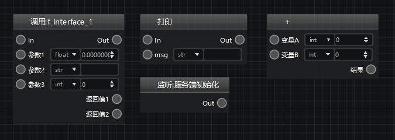
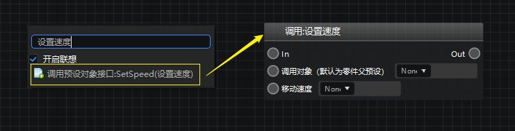
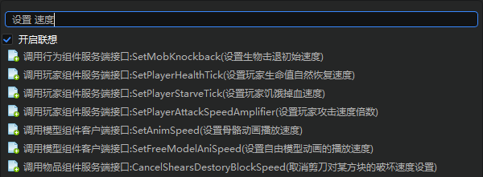
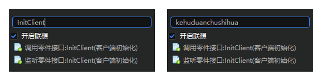
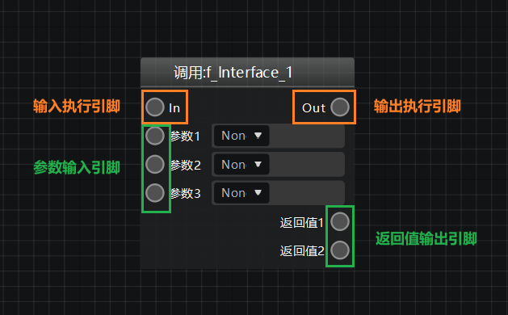
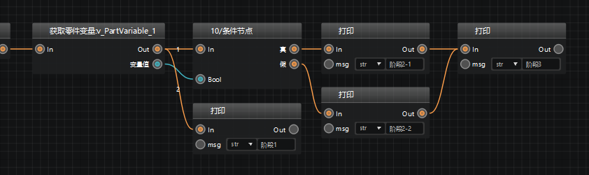
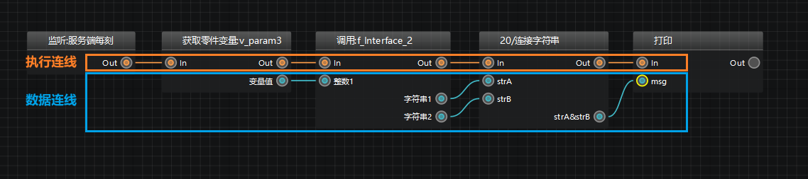

---
front:
hard: 入门
time: 15分钟
selection:
---

# 节点创建与连接

节点是一个蓝图图表的基本组成元素之一。通过将蓝图的节点连接起来，形成一个完整的逻辑网络，我们就可以让这些节点的逻辑按顺序/条件执行，从而写出符合游戏设计需求的逻辑。每一个事件、接口、变量都有自己对应的一个或多个节点，下面让我们简单了解一下这些节点的使用方法。

> 关于事件、接口、变量的更多介绍请 [点击此处查看](./40-事件、接口、变量.md) 。

## 节点组成部分

一个常见的节点通常包括以下几个部分：

1. **节点名称：** 用于节点间相互区别
2. **执行引脚：** 包括输入执行引脚和输出执行引脚
3. **数据引脚：** 包括参数输入引脚和返回值输出引脚

> **提示：**
>
> 节点种类多样，功能不同决定了节点样式不同。有些节点并不会包含上述三种组成部分的全部，比如变量设置节点没有返回值、纯接口没有执行引脚等。

## 创建节点

尽管节点种类繁多，但基本都可以通过下面的两种方式创建：

1、图表空白处右键，会弹出节点菜单，从中选择你需要的节点，也可直接输入节点名称关键词搜索

2、从其他节点的引脚处按住一个左键拖拽出来，松开左键后从弹出的节点菜单中选择或搜索你需要的节点

> **提示：**
>
> ​对于自定义接口、变量等在左侧窗口中有显示的脚本元素，可以直接通过从左侧窗口中拖拽至图表，松开鼠标后，即可生成与之相关的节点。

### 节点搜索功能介绍

逻辑编辑器为开发者们提供了实用的节点搜索功能，帮助大家快速找到自己需要的节点。我们可以通过在右键菜单的搜索框中输入关键词直接查找名称中带有该关键词的节点。

例如我们搜索`设置速度`，即可精准定位到该接口的调用节点。

逻辑编辑器同样支持分词搜索，在两个关键词中加上空格，即可搜索到名称中同时带有这两个关键词的节点。

例如我们搜索`设置  速度`，即可搜索到节点名称同时带有`设置`和`速度`两个关键词的节点。

此外，节点搜索功能还支持英文、拼音搜索。
例如搜索`InitClient`和`kehuduanchushihua`都可以找到“客户端初始化”监听节点。

## 节点选择与移动

单个节点可以通过单击直接选中。选中后节点底色会发生变化。按住鼠标左键可拖拽改变该节点在图表中的位置。

另外也可以通过在图表中拖动鼠标框选或通过按住ctrl连续单击选中多个节点。选中后按住鼠标左键拖拽可同时改变全部被选中节点的位置。

## 节点的引脚

节点共有2种引脚：执行引脚和数据引脚。

### 1. 执行引脚

执行引脚用于控制逻辑的执行顺序，分为输入执行引脚和输出执行引脚。

- **输入执行引脚** 在节点的左上角。当输入执行引脚被通过黄色的执行连线与其他节点相连时，会被激活，开始执行该节点的逻辑。

- **输出执行引脚** 在节点的右上角。当节点逻辑执行完毕后，输出执行引脚会被激活，当这个引脚被通过执行连线与其他节点相连时，则会继续执行后续的流程。

节点不一定会有一对输入执行引脚和输出执行引脚。例如：纯接口调用节点既没有输入执行引脚也没有输出执行引脚；条件节点有1个输入执行引脚和2个输出执行引脚；顺序遍历节点有2个输入执行引脚和2个输出执行引脚。具体哪个执行引脚被执行，有连线和具体节点逻辑判断。

> **提示：**
>
> 可以有多条执行引线连入同一个执行引脚，同样的，同一个输出执行引脚也可以发出多条执行连线。
>
>

### 2. 数据引脚

节点的数据引脚主要用于数据的输入和输出，分为参数输入引脚和返回值输出引脚。

- **参数输入引脚** 在节点的左侧，需要与蓝色的数据连线相连。通过将数据连线与参数输入引脚相连，可将数据传入该节点，并赋值给这个参数。
- **返回值输出引脚** 在节点的右侧，需要与蓝色的数据连线相连。通过将数据连线与返回值输出引脚相连，可将数据以返回值的形式从该节点传递出去。

节点的数据引脚数量没有限制，也可以没有参数输入引脚或返回值输出引脚（即该节点没有参数或没有返回值）。

> 同一个返回值输出引脚可以发出多条数据连线，向不同节点传输同一个数据，但是同一个参数输入节点只能有一条数据连线传入数据，否则会引起混乱。

需要注意的是，数据引脚是与该节点的参数或返回值的数据类型一一对应的，所以两个数据类型不同（或者不兼容）的数据引脚，是不可以通过数据连线直接进行数据传递的。例如，节点A的返回值类型是Int，节点B的参数类型是Bool，那么这两个数据引脚是不可以直接相连的；但如果节点B的参数类型是Any，即不限制传入数据的类型，则二者可以直接相连。

## 节点的连线

节点共有2种连线：执行连线和数据连线。

### 1. 执行连线

执行连线是黄色的，用于连接各个节点的执行引脚，形成一个完整的节点网络，从而正确地执行整个蓝图的逻辑。

> **注意：**
>
> 在非特殊情况下，不要使用执行连线将同一个节点的输入执行引脚和输出执行引脚相连。

### 2. 数据连线

数据连线是绿色的，用于连接各个节点的数据引脚，从而保证数据在各个节点间的正确传递。

> **注意：**
>
> 在非特殊情况下，不要使用数据连线将同一个节点的参数输入引脚和返回值输出引脚相连。

## 一些节点连接的规则

尽管蓝图节点的连接相对自由，但是其中还是有一些规则需要遵守：

### 1. 数据引脚的数据类型限定

数据引脚是与该节点的参数或返回值的数据类型一一对应的，所以两个数据类型不同（或者不兼容）的数据引脚，是不可以通过数据连线直接进行数据传递的。例如，节点A的返回值类型是Int，节点B的参数类型是Bool，那么这两个数据引脚是不可以直接相连的；但如果节点B的参数类型是Any，即不限制传入数据的类型，则二者可以直接相连。

### 2. 两个支持端冲突的节点不可以直接相连

根据功能不同，每个节点的支持端是不同的。共分为以下三类：

1）双端支持：该节点既可以用于服务端逻辑，也可以用于客户端逻辑。

2）仅客户端支持：该节点仅可用于客户端逻辑，不能与仅服务端支持的节点相连。

3）仅服务端支持：该节点仅可用于服务端逻辑，不能与仅客户端支持的节点相连。

例如“监听：玩家升级时”是一个仅服务端支持节点，而“调用：客户端设置左上角通知内容”是一个仅客户端支持节点，二者之间是不可以直接相连的。

### 3. 同侧引脚不可以直接相连

不可以将一个节点的输入引脚与另一个节点的输入引脚相连（无论是执行还是数据引脚）；
不可以将一个节点的输出引脚与另一个节点的输出引脚相连（无论是执行还是数据引脚）。

### 4. 数据输入引脚不可以有多条数据连线传入

节点的执行输入引脚可以有多条执行连线传入，但是数据引脚不能有多条数据连线传入。

