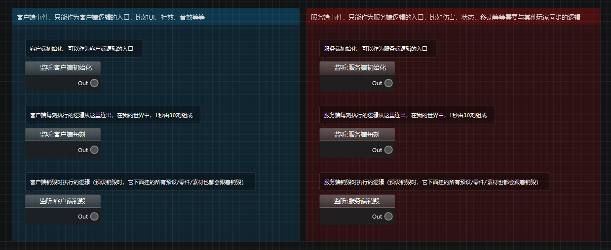
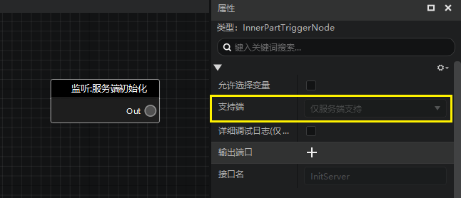

---
front:
hard: 入门
time: 10分钟
selection:
---

# 区分服务端与客户端

## 什么是服务端、客户端？

当你运行我的世界的时候，一部分逻辑是在服务端跑的，另一部分是在客户端跑的，两者之间有着较为严格的界限。

如果涉及到数据同步的逻辑，一般都是需要在服务端运行的，这样当你进行多人游戏的时候，每个玩家才会看到其他玩家的行为。比如实体（或者）生物的移动/位置，攻击，血量计算，生成实体/方块等等等等。

如果无需数据同步，或者只是表现层的逻辑，一般在客户端运行即可。比如使用自定义模型，动画，特效，音效等等，以及界面，按键等等交互内容。

客户端是运行在本地的，即你当前游玩我的世界使用的电脑或者手机，而服务端的逻辑视情况而定，如果你在进行单机游戏，那么服务端也是运行在本地设备上的，如果你进行联机游戏，那么所有玩家的服务端逻辑都是运行在房主的设备上的，如果你在玩服务器（比如租赁服或者网络游戏），那么服务端的逻辑是运行在服务器上的。

>**注意：**
>
>由于客户端和服务端相对分割，所以在任何时候都不能在一端调用另外一端的逻辑！

## 服务端节点，客户端节点

所有的节点都被区分为3类：

- **仅服务端节点：** 他们只能运行在服务端。
- **仅客户端节点：** 他们只能运行在客户端。
- **双端节点：** 在服务端和客户端都能跑，会根据当前执行的环境改变逻辑。

下图是创建一个蓝图零件时，默认写到蓝图里的节点，可以看到包含3个服务端的节点和3个客户端的节点，你需要根据上述的标准判断自己需要从哪个端的节点连出后续的逻辑。

如下图，你可以点击节点，在他的属性面板里查看他支持哪个端。

我们使用逻辑编辑器创建的自定义接口都是双端支持的（无法修改这一属性，即使你没有做双端的支持）。

仅客户端节点与仅服务端节点不能存在于同一条执行连线连接的逻辑链上。

## 网络通讯

如上节所述，我们无法直接在一端直接调用另一端，如果我们需要此类的逻辑，可以通过事件广播和监听来实现网络通讯。

关于事件监听和广播的详细说明，请看下一篇指南：[事件监听与广播](./47-事件监听与广播.md)