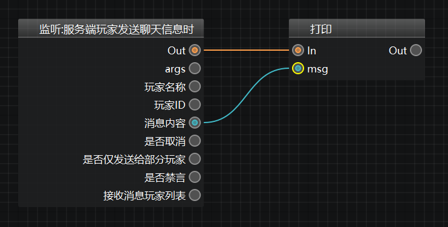
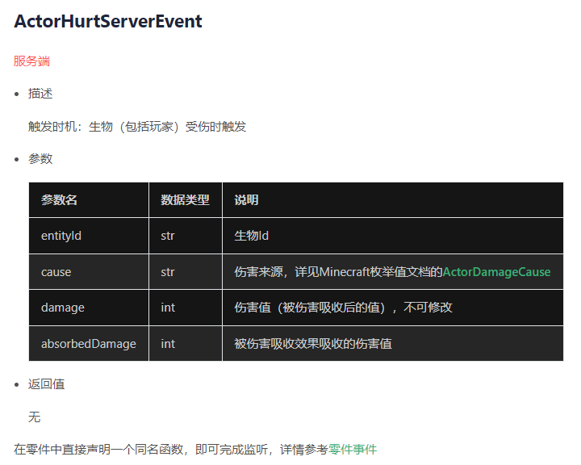
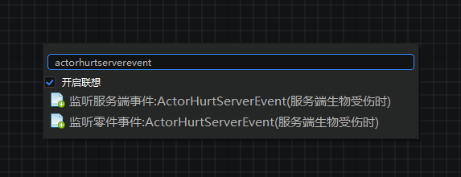
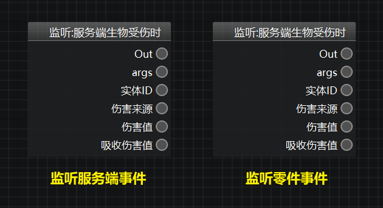
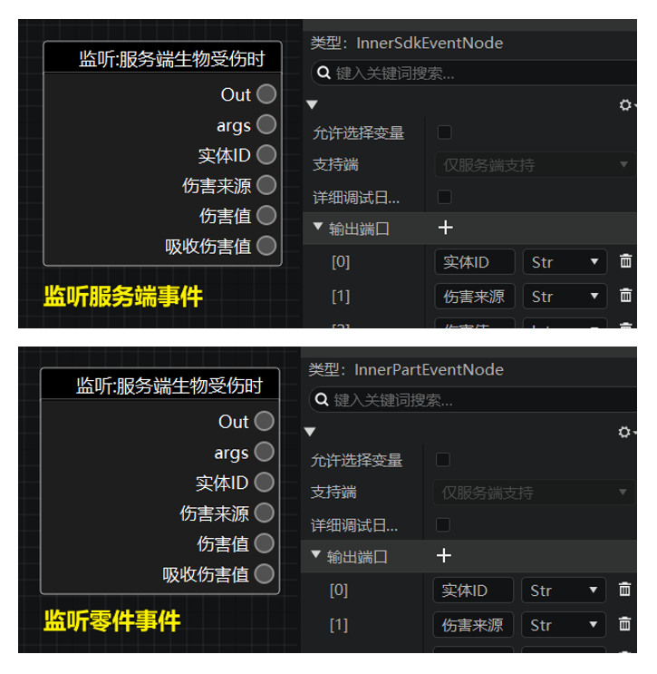
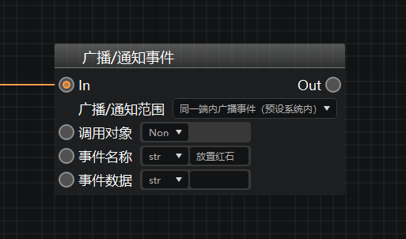
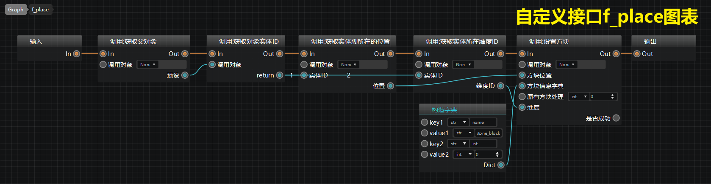
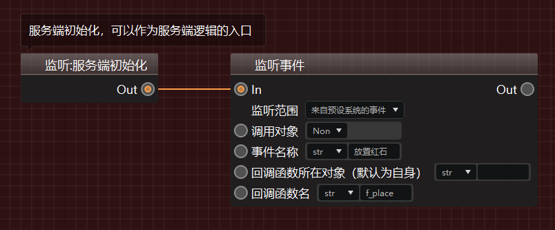
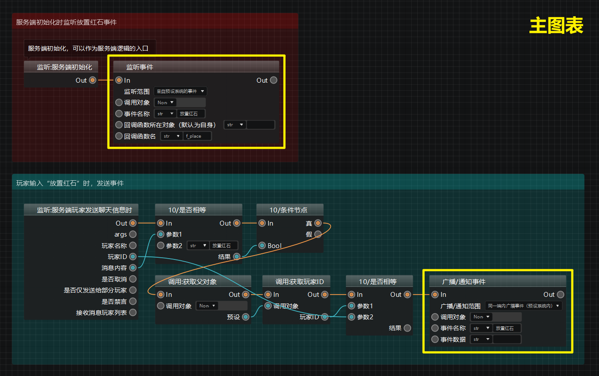
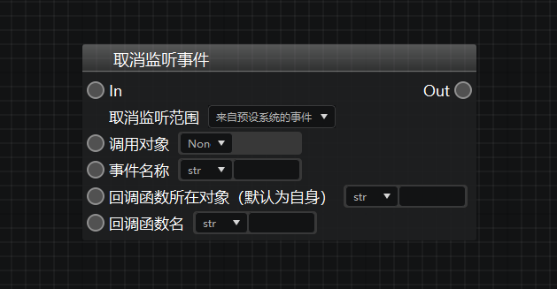

---
front:
hard: 入门
time: 20分钟
selection:
---

# 事件监听与广播

## 事件简介与引擎事件

### 1. 什么是事件

事件是模组SDK架构的核心组成部分，也是编程的一类常用技术。模组SDK的事件系统可以参考这篇文档：[事件简介](../../../20-玩法开发/13-模组SDK编程/2-Python脚本开发/9-事件简介.md)。

在我的世界中国版的游戏进行的过程中，模组SDK会在各种时机广播一些事件，比如游戏开始时，玩家加入时等等，我们监听这些事件，然后在这些事件触发的时候执行相应的逻辑，即可对游戏产生影响。

### 2. 什么是引擎事件

模组SDK中有大量已经内置在我的世界中的事件，他们被称为**引擎事件**，可以参考技术手册的这篇文档：<a href="../../../../mcdocs/1-ModAPI/事件/世界.html" rel="noopenner"> 世界 </a>。

如果你使用Python编程的话，需要手动监听引擎事件，但是对于蓝图来说并不需要。

当你想要监听某个引擎事件时，你只需要添加一个对应的节点即可，比如希望在玩家发送聊天信息的时候在后台日志打印出该玩家的聊天内容。

如下图（你可以在新的指令模板里找到），当玩家发送聊天信息时，蓝图会开始执行这个事件节点，并且按连线顺序继续执行后面的打印信息节点，将信息内容打印出来。

## 模组SDK事件与零件事件

当我们在蓝图中搜索事件节点时，很多情况下我们会找到多个结果。

零件事件是预设架构的事件系统，在模组SDK事件的基础上进行了一些改进。如果你还不太了解零件事件，可以参考这篇文档：[零件事件](../../../20-玩法开发/14-预设玩法编程/12-深入理解零件/0-零件开发.md#零件事件)。

我们以<a href="../../../../mcdocs/1-ModAPI/事件/实体.html#actorhurtserverevent" rel="noopenner"> 服务端生物受伤事件 </a>为例，他在API文档中的说明如下：

当你在逻辑编辑器中搜索这个节点时，你会发现两个版本：

- 监听服务端事件……：这个是模组SDK的事件节点；
- 监听零件事件……：这个是零件事件的节点。

这两种节点外观上看起来没有什么区别，但你可以选中他们，在属性面板上找到不同。

- 模组SDK事件（“监听服务端事件：”开头的节点）的类型为**SdkEventNode**；
- 零件事件（“监听零件事件：”开头的节点）的类型为**PartEventNode**。

对于生物受伤来说，如果你希望当前场景中的任何一个生物在受伤的时候，都会从监听节点开始执行一些逻辑，那么你应该使用**模组SDK事件**（“监听事件：”开头的节点）。当然后续你可以根据伤害来源，实体ID来判断到底是谁触发的这个事件。

**零件事件**只用于预设架构，如果你使用了实体预设/玩家预设，并且将你的蓝图零件挂接在了这个预设下，那么如果使用零件事件的话，只有实际受伤/造成伤害的生物（玩家），才会监听到这个事件并且执行后续的逻辑，在某些情况下，你可以省去判断ID的步骤。即如果你希望只有零件挂接的当事人触发这个事件，那么建议使用零件事件。

使用零件事件通常会拥有更好的性能，尤其是如果你把零件挂接在会生成大量实例的预设下的时候，比如覆盖原版的僵尸预设。

## 监听和广播自定义事件

### 1. 事件系统

**事件系统**的主要目的是降低功能逻辑之间的相互关联性，提高开发者管理、编辑的便捷度。

如果有良好的代码习惯的话，你应该尽力减少功能逻辑之间的直接关联，并将不同的逻辑写到不同的零件中，挂接到合适的预设下。比如跟HUD相关的UI，写到界面蓝图零件里，并且挂接到界面预设下；跟玩家有关的逻辑，写到另外的零件，挂接到玩家预设下。在这种前提下，你就需要使用事件系统来进行不同零件（实例）之间的通讯（沟通）。

除了自带的引擎事件外，你自己也可以使用事件系统来进行**自定义事件**的广播和监听。为了让开发者更方便地使用自定义事件，我们将过去复杂的各类通讯节点整合为三个复合节点：

- 广播/通知事件节点
- 监听事件节点
- 取消监听事件节点

下面我们将通过一个例子展示如何使用这些节点。我们希望实现的效果是：**当监听到“放置红石”的事件时，在零件当前位置放置一个红石块。**

### 2. 广播/通知事件节点

当我们需要广播/通知一个事件时，可以单击鼠标右键，在节点菜单中找到【事件广播与监听】目录，然后在二级菜单下找到【广播/通知事件】节点，点击即可创建。

这个节点需要先选择一个【**广播/通知范围**】，并传递2个参数：【**事件名称**】和【**事件数据**】。

#### 1）广播/通知范围

广播/通知范围指的是我们希望这个事件可以被哪些对象监听到。在这个范围之外的对象，都不会对这个事件做出任何反应。点开下拉框，我们可以看到5个选项，它们分别的使用场景如下表所示：

| 广播/通知范围 | 使用场景 |
|  ----  | ----  |
| 同一端内广播事件 (预设系统内) | <b>常用的广播选项。</b> 可用于<b>在预设系统内</b>进行<b>同一端</b>的事件广播，例如服务端广播到服务端，客户端广播到客户端。 监听时范围请选择“来自预设系统的事件”。|
| 同一端内广播事件 (通用) | 可用于在<b>同一端内</b>广播零件事件，例如服务端广播到服务端，客户端广播到客户端。 监听时范围请选择“来自某个零件的事件”或“来自零件自身的事件”。|
| 从客户端通知到服务端 | 适用于<b>在客户端，通知服务端</b>执行某些逻辑。 监听时范围请选择“来自某个零件的事件”或“来自零件自身的事件”。|
| 从服务端通知到单个客户端 | 适用于<b>在服务端，通知某个（玩家的）客户端</b>执行某些逻辑。 监听时范围请选择“来自某个零件的事件”或“来自零件自身的事件”。|
| 从服务端广播到所有客户端 | 适用于<b>在服务端通知所有（玩家的）客户端</b> 都执行某些逻辑。 监听时范围请选择“来自某个零件的事件”或“来自零件自身的事件”。|

我们在使用时可以直接将鼠标悬停到每个选项上，通过弹出的hover提示来阅读使用说明。

在这个示例中，我们没有其他特殊需求，故使用【同一端内广播事件（预设系统内）】即可。

#### 2）事件名称

即希望这个事件叫什么。这里我们需要输入名称字符串，可以按照它的功能直接将其命名为 **“放置红石”**。

#### 3）事件数据

如果你需要在事件触发时传入一些数据，可以将它们传到这个引脚。例如你需要在监听到放置红石的事件发生时，判断是否是玩家A放置的，则需要在事件广播时，在事件数据引脚中传入玩家Id，方便后续监听时调用。

当需要传递数据时，一般需要传递一个**字典**，然后在事件接收方执行的函数里通过**获取属性**的方式获取传过去的参数。如果不需要传递数据的话，这个参数留空即可。

> **提示：** 创建字典可以使用节点菜单中找到【参数构造节点】目录下的【构造字典】节点。

#### 4）其他参数

部分广播/通知范围选项会需要我们传入额外的参数。例如在选择【从服务端通知到单个客户端】时，我们可以发现下面新增了一个【玩家ID】引脚，用于指定是需要通知到那个玩家的客户端。

我们将广播/通知事件节点与其他节点通过执行连线连接起来，就可以在需要时进行“放置红石”事件的广播了。

### 3. 监听事件节点

当我们广播了一个事件，就需要在合适的地方对齐进行监听，保证能收到这个事件“信号”，从而进行后续操作。我们同样可以在【事件广播与监听】目录下点击【事件监听节点】来创建它。

使用事件监听节点时，首先需要指定该节点的【**监听范围**】，然后传入【**事件名称**】、【**回调函数所在对象**】、【**回调函数**】名三个参数。

#### 1）监听范围

监听范围指的是我们希望这个监听来自哪些对象的事件广播。在这个范围之外的对象发出的事件，都会被忽略。点开下拉框，我们可以看到5个选项，它们分别的使用场景如下表所示：

| 监听范围 | 使用场景 |
|  ----  | ----  |
| 来自预设系统的事件 | <b>常用的监听范围。</b>  可用于监听<b>来自预设系统</b>的某个事件。 对应广播范围“同一端内广播事件（预设系统内）”。 |
| 来自某个零件的事件 | 只监听来自<b>某个零件</b>的某个事件。需要传入零件ID进行范围限定。 可以监听<b>除</b>“同一端内广播事件 (预设系统内)”<b>以外</b>的其他所有广播范围的事件。 |
| 来自零件自身的事件 | 只监听来自<b>当前零件自身</b>的某个事件。是“来自某个零件的事件”的特殊形式。 可以监听<b>除</b>“同一端内广播事件 (预设系统内)”<b>以外</b>的其他所有广播范围的事件。 |
| 来自引擎的事件 | 监听来自<b>引擎</b>的某个事件。 “来自引擎的事件”指的是中国版ModSDK自带的事件，你可以在<b>官网API文档</b>中查阅到它们。 |
| 任意事件 | 监听<b>任意来源</b>的某个事件。 如果需要监听你在模组中使用SDK代码自己写的事件，可以使用这个选项。 |

在这个示例中，我们没有其他特殊需求，故使用【来自预设系统的事件】即可。

#### 2）事件名称

即我们需要监听到的事件名字叫什么。这里我们可以填写之前广播的事件名称 **“放置红石”**。

#### 3）回调函数所在对象

**回调函数**是一个开发者在蓝图中创建的自定义接口。我们将需要执行的逻辑写到这个自定义接口中。当事件被监听到时，即可调用这个自定义接口，来执行对应的逻辑。

但是当零件A监听到一个事件E时，可能是要求另外一个零件B执行这个逻辑f_b。在这种情况下，我们应该将这个自定义接口f_b写在零件B的蓝图中。

这里的零件B就是**回调函数所在对象**。默认为零件自身。

在我们的例子中，由于事件就是零件本身发出的，所以这里可以留空不传入任何值。

#### 4）回调函数名

上面例子中的自定义接口名称f_b就是回调函数名。直接输入名称字符串即可。

> **注：自定义接口的命名规范：**
> - 以“f_”开头
> - 仅可包含英文字母、数字、下划线
> - 不超过20个字符

在这个例子中，我们已经创建了一个自定义接口，名为“f_place”，所以这里我们在【回调函数名】处选择str类型，并填入“f_place”即可。

**提示：回调函数中事件数据的使用方式**

如果事件在发送过程中传入了事件数据，则需要将其传入到回调函数对应的自定义接口图表中去。具体方法是：
- 在左侧【当前蓝图】窗口中**鼠标左键点击**对应的自定义接口，右侧属性栏出现其属性；
- 点击【输入参数】右侧的【+】号，创建一个输入参数，**并将其类型修改为Any**；
- 创建【获取属性】节点，并将输入参数传递到【对象】引脚，然后在【key】中填写你需要获取的数据在字典中对应的key值，即可输出需要的事件数据了。

**5）其他参数**

部分监听范围选项会需要我们传入额外的参数。例如在选择【来自某个零件的事件】时，我们可以发现下面新增了一个【零件ID】引脚，用于指定是需要监听来自哪个零件的事件。

放置方块是一个服务端操作，使用到的节点【设置方块（SetBlock）】是一个仅服务端节点，所以我们需要在服务端初始化的时候进行监听。将监听事件节点连接到【服务端初始化】节点之后，就可以监听到“放置红石”事件了。

至此，使用广播/通知事件节点和监听事件节点，我们就完成了我们所期望的逻辑编写。最终蓝图如下，其中主要运用的就是【广播/通知事件】和【监听事件】两个节点：

### 4. 取消监听事件节点

如果你有特殊需要，希望在逻辑执行过程中取消对某个事件的监听，则可以使用【取消监听事件】节点。该节点的各个参数配置方式、使用场景均与上述【监听事件】节点一致，故再次不再赘述。

