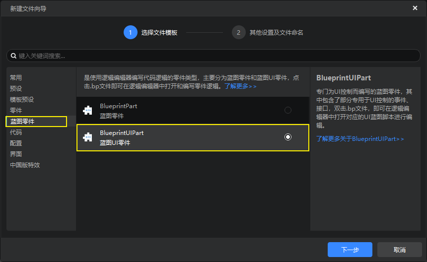
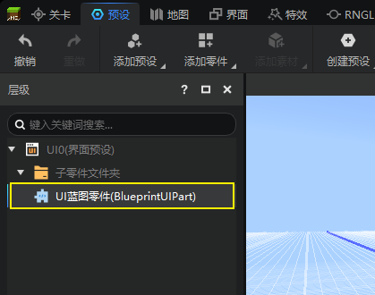
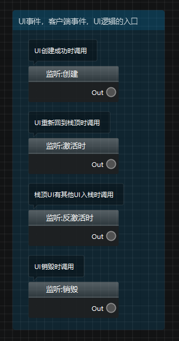
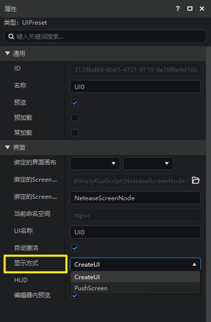
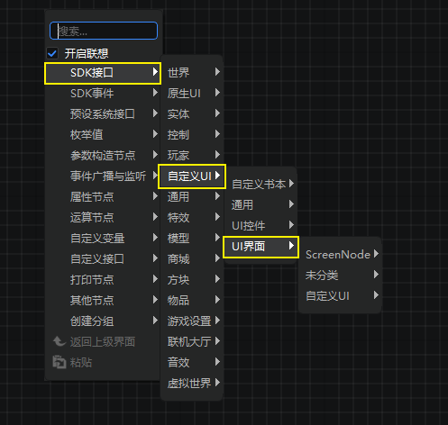
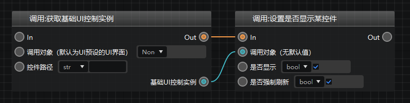
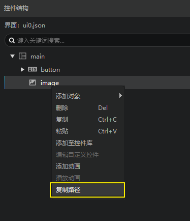

---
front:
hard: 高级
time: 20分钟
selection:
---

# 界面蓝图

界面蓝图学习起来相对较复杂，推荐开发者们先观看下列视频：

- [更换模型和添加界面](../30-新版示例教程（视频）/07-制作简易射击附加包（视频）/01.md)
- [开关瞄准镜](../30-新版示例教程（视频）/07-制作简易射击附加包（视频）/02.md)

## 创建蓝图和组装预设

在编辑器蓝图简易射击模板中，有界面蓝图的使用示例，我们可以参考其中的写法进行学习。

新版逻辑编辑器支持制作界面，在制作前，你可能需要先了解一下[界面预设](../../14-预设玩法编程/0-理解预设系统/10-预设/5-界面预设.md)。

在创建完UI预设之后，你可以通过新建文件向导创建一个UI蓝图零件。

注意，想要UI蓝图零件生效，你必须将其直接挂接到对应的UI蓝图下，类似下图。

## 起始事件

打开UI蓝图零件，除了蓝图零件自带的6个事件之外，你会发现他还有4个额外的UI相关的事件，如下图，分别是：

- **创建：** UI创建成功时，一般在这里进行UI逻辑的初始化
- **激活：** 当你的UI被激活时
- **反激活：** 当你的UI被取消激活时
- **销毁：** 你的UI被销毁时

可以查看一下你的UI预设，如果你选择的CreateUI，那么你主要使用上述的“创建”节点，否则（选PushScreen），你主要使用“激活”和“反激活”节点。

## 调用接口

界面相关的接口主要分布在下图的菜单中。

我们以`设置是否显示某控件（SetVisible）`为例，下面这个节点是我们需要使用的节点

- **调用对象：** 希望对哪个控件调用，需要使用`获取基础UI控制实例（GetBaseUIControl）`传入基础UI控制实例。
- **是否可见：** 希望控件显示还是隐藏。
- **是否强制刷新：** 是否在调用接口后立刻刷新这个控件的显示状态。

对于控件路径，我们可以在界面编辑器中获取，比如右键复制下面这个控件的路径，并粘贴到上图的节点中。

