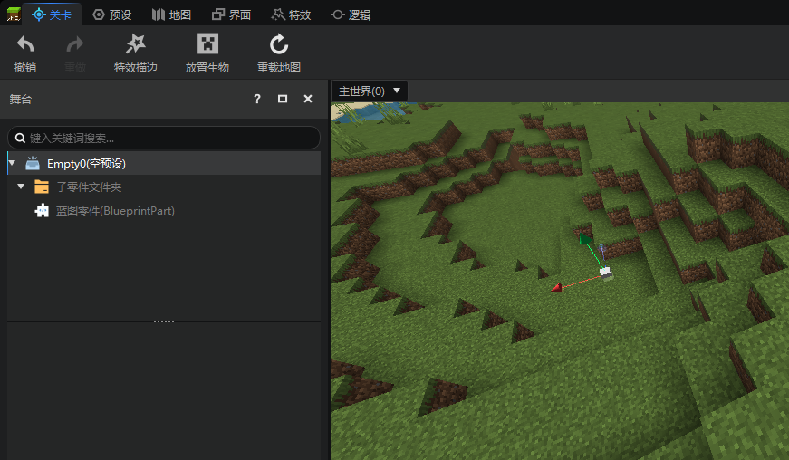
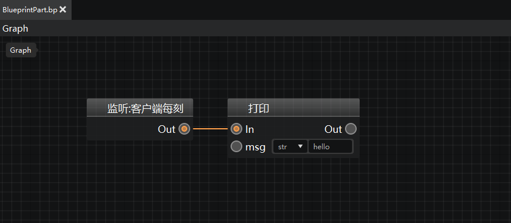
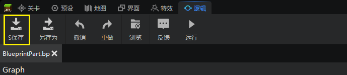
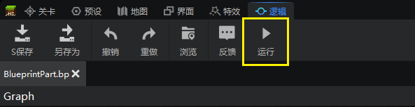
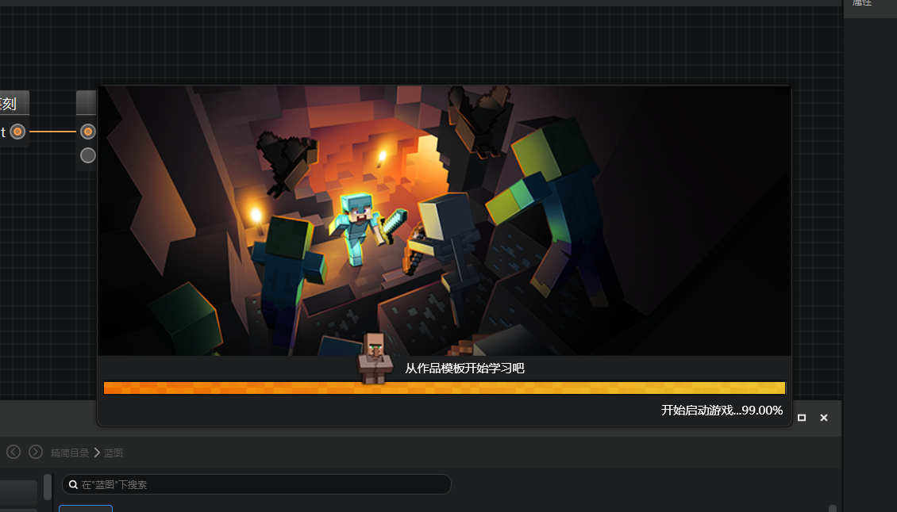
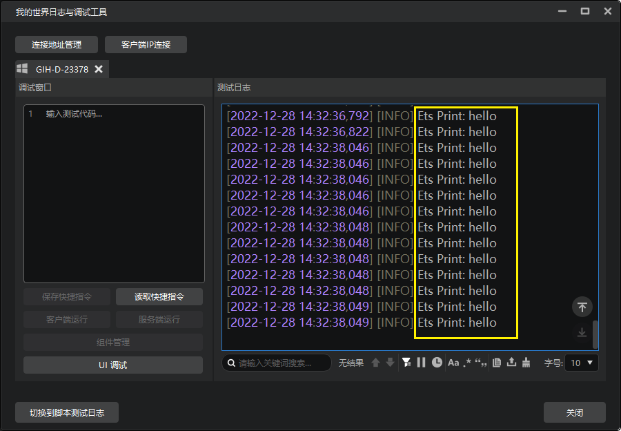

---
front:
hard: 入门
time: 5分钟
selection:
---

# 测试蓝图逻辑

当我们编写完蓝图逻辑，就可以进行测试，来检验我们的逻辑编写得是否正确。下面我们将演示蓝图的测试：

我们以一个挂在预加载空预设下的蓝图零件为例，该蓝图的逻辑是：每帧在日志窗口打印一句hello。

在.bp文件中编辑完蓝图的逻辑后，首先需要点击保存按钮保存蓝图。

保存蓝图之后，我们点击运行按钮，即可在开发包中测试我们的蓝图逻辑：

初次进入时，可能需要等待较长的时间以完成加载。

进入游戏后，会为我们自动打开调试工具窗口，可以看到每帧都会打印一句hello，证明该蓝图零件的逻辑已在游戏中生效。

