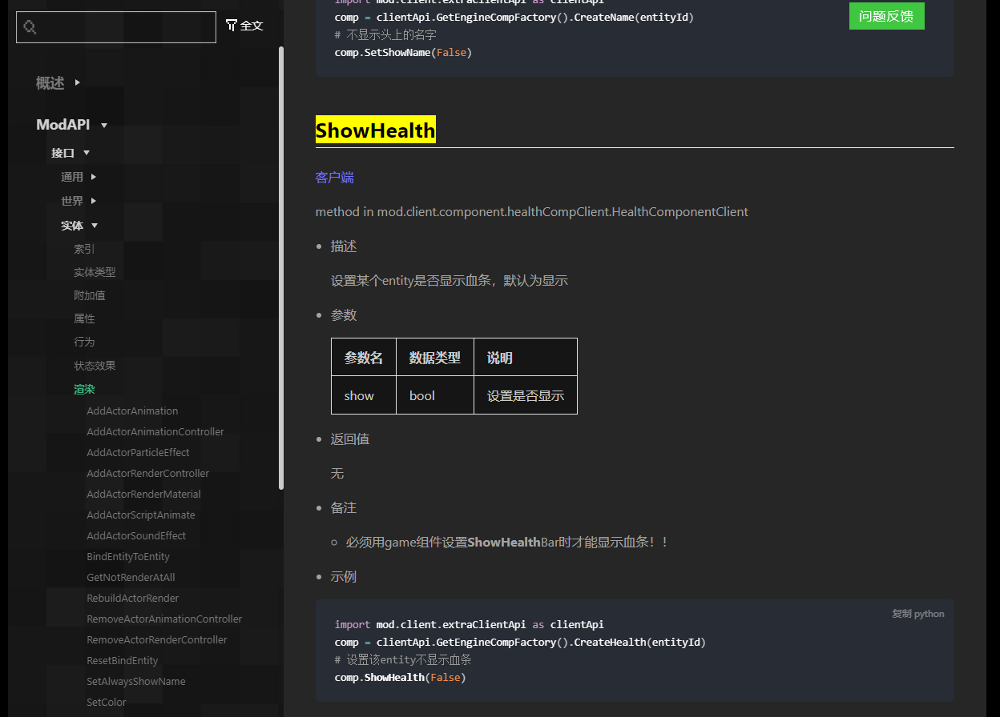

# 在文档中查阅内置游戏接口

新版编辑器有大量的**内置游戏接口**，开发者在使用时可能难以通过节点本身样式了解到该节点是如何使用的。在这种情况下，开发者可以使用节点的接口名在官网API文档中查阅对应接口的说明。

第一步：选中节点，在右侧属性窗口中找到该内置游戏接口的接口名，通过ctrl+c复制下来。

第二步：打开开发者官网的[API文档](https://mc.163.com/dev/mcmanual/mc-dev/mcdocs/0-%E6%A6%82%E8%BF%B0/0-%E6%A6%82%E8%BF%B0.html)。

第三步：将复制下来的接口名粘贴到页面搜索框中，然后在弹出的搜索结果中根据接口类别找到对应的接口。

第四步：点击后，会自动跳转到对应接口的说明文档。

