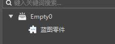
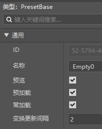
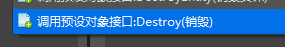
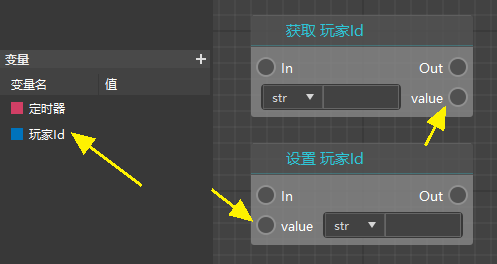

# 节点基础

新版逻辑编辑器提供的蓝图在使用上与Python代码保持着比较大的一致性。使用不同类型的节点会有不同的规则。

## 让蓝图生效

注意，想要让你写的节点图运行起来，你需要将蓝图零件挂接至一个勾选有预加载的空预设（请参考[新建预设并添加素材](../../14-预设玩法编程/9-第一个预设Mod/1-新建预设并添加素材.md)），或者挂接至预设，并将其通过关卡编辑器放置在场景中。





## 监听和调用

通过在图表的空白处右键浏览节点时，你会发现我们相同的节点会有不同的前缀，分别是“监听”和“调用”。


调用的意思是，执行这个接口的操作，比如“发送向某个玩家聊天框消息”，如下图你可以看到调用类型的节点，既有“In”也有“Out”，有执行引脚，才能连到节点图中用于执行逻辑。

监听的意思是：当“发送聊天框消息”这个接口被调用的时候。可以看到监听类型的节点没有“In”，只有“Out”，因为它表示一个时机，在这个时机生效，并开始顺序想“Out”连接的节点执行。


## 调用对象和静态方法

这部分需要你对面向对象有一个基本的概念，这是一个编程的概念，如果你不知道的话，可以看这个视频：[什么是面向过程编程,面向对象编程](https://www.bilibili.com/video/BV1pV411d7sL?from=search&seid=7248194267465509786&spm_id_from=333.337.0.0)，UP主对此进行了深入浅出的讲解。

我们以下面两个节点举例，第一个节点是静态方法，不需要对象即可调用。

第二个节点是零件的节点，只能通过零件的对象（实例）调用，你可以发现在此类节点的参数中，都包含一个“调用对象”。


如果你希望自身去调用这个接口（这个零件本身去执行这个接口），你需要通过自身（self）调用，即下面这样。但是这种情况实在是太多了，所以我们做了简化处理，即如果调用对象没有传入数据，那么就默认调用对象的是自身（self）。


现在举另外的例子，比如，你希望摧毁自己的父对象，那么显然你需要让“父对象”去调用摧毁这个接口，如下图（因为要销毁的是预设对象，你需要使用预设对象的销毁接口）。




## 获取/设置变量

我们提供了独立的变量管理功能，在新建变量之后，你可以通过直接将变量拖拽出来，并选择获取和设置两种功能节点：

- 获取：在获取的value输出节点，可以获取到这个变量的值
- 设置：在设置的value节点，可以传入，或者直接编辑希望设置的值



## 获取/设置自定义接口

除了变量之外，在Python里，函数（自定义接口）也可以作为一种变量，但是我们目前没有提供拖拽自定义接口来获取或者设置的方法。

你需要使用这两个节点来获取和设置自定义接口：

- 获取零件变量：在key里面输入接口名称，就可以从value节点获取到接口了
- 设置零件变量：在key里面输入接口名称，就可以把这个接口设置为value节点传入的节点


## 零件预设接口和SDK组件接口

我们以传送玩家为例，可以看到3种不同的调用接口：

- 维度组件服务端接口：归属于模组SDK的接口
- 零件接口：归属于预设架构的接口
- 预设对象接口：与零件接口基本一致


下图左边是维度组件服务端接口，右边是零件接口，我们可以对照他们的api文档进行讲解。


下图是维度组件服务端调用传送玩家的接口，我们重点关注他的示例。


可以看到，这里是先给player（玩家）创建了一个Dimension组件，然后再调用组件执行后续的传送逻辑。

```python
import mod.server.extraServerApi as serverApi
comp = serverApi.GetEngineCompFactory().CreateDimension(playerId)
comp.ChangePlayerDimension(0, (0,4,0))
```

所以这个节点的entityId应该传我们希望进行传送的玩家。


像下图的零件接口的版本，翻译比较清晰。


建议在有类似这种有相同名称的接口的情况下，直接选择零件接口。
