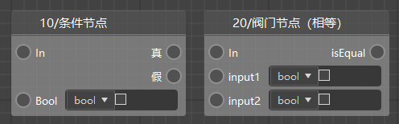
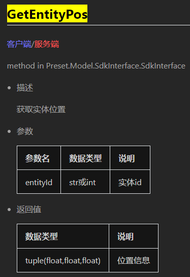
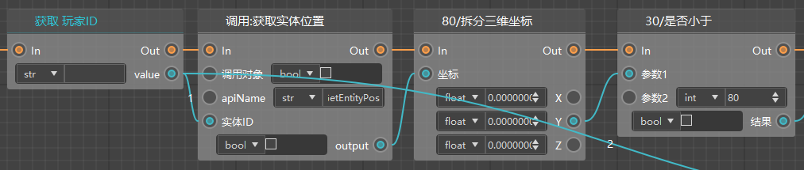

# 常用节点

## 参数节点

参数节点可通过右键菜单直接创建，用于构造并传递对应类型的参数，共有以下3类：

#### 1）构造列表（ListParameterNode）

用于构造一个列表，并传递给下一个节点。可以通过右边属性窗口【长度】属性修改列表长度。列表元素可以分别选择数据类型，并直接填入值。同时，也可以通过数据连线将值传入列表，对列表元素进行赋值。

#### 2）构造列表（ListParameterNode）

用于构造一个字典，并传递给下一个节点。可以通过右边属性窗口【长度】属性修改字典键值对数。字典的键（key)、值（value）可以分别选择数据类型，但一般键都会是字符串（Str）。键和值都可以直接填写，也可以通过数据连线将值传入。

#### 3）其他参数节点

剩余的参数节点共有5种，分别是：任意类型参数（Any）、布尔型参数（Bool）、整型参数（Int）、浮点型参数（Float）、字符串参数（Str）。这些类型可用于固定值的传入，以及同一个值同时传入多个节点的情况（方便统一修改）。

## 定时器

定时器是一种用于延迟执行自定义接口的节点，我们提供了：

- 添加定时器：在一段延迟时间后，执行函数
- 添加重复定时器：在一段延迟时间后，重复执行函数，重复的时间与延迟时间相同

函数使用获取自定义接口的方法获取，比如我们下图中，我们希望每隔1秒，执行一次Ticking函数。

添加定时器的输出节点是定时器实例，如果你想要停止定时器，你可以

- 在添加定时器的时候，将返回值设置到一个变量中
- 获取变量，并调用取消定时器的接口

## 条件和阀门

当你想编写分支逻辑的时候，你需要用到条件节点或者阀门节点

- 条件：根据传入的bool（布尔值）判断，如果是真（true）执行“真”连出去的逻辑，否则执行“假”连出去的逻辑
- 阀门：对传入的input1和input2进行判断，如果他们相等，那么继续向后执行，否则不再继续执行

如下图，这个是跑酷模板的一部分逻辑，如果可以获取到红石预设的话，我们就销毁这个红石，如果获取不到，我们就生成一个红石。

## 拆分/合并坐标

如果一个节点需要tuple（元组）类型的参数，除了通过list（列表）转化为tuple之外，你可以通过下面4个节点进行2,3个元素的tuple的拆分和合并。

例如下面这个例子，我们要判断玩家的高度是否小于80，需要用到这个接口，他的返回值是一个包含3个float的tuple。

我们可以这样连接蓝图。

需要传入tuple同理，参考下面的蓝图，可以把玩家传送到（0，175，-3）处。

## 枚举节点

如果你遇到某些节点需要传入枚举值数据，那么枚举节点可以很方便地帮你找到对应的枚举值。

在逻辑编辑器的节点菜单中，我们可以找到 **“枚举节点”**，在它的二级菜单中有我们可能用到的所有枚举值类型。

例如我们需要“盔甲槽位”枚举值，可以直接需要传入枚举值的引脚拖出连线，调出节点菜单，然后在 **“枚举节点”** 中选择 **“构造 盔甲槽位 枚举值”**，即可创建该枚举值节点。想要选择具体传入的值，我们直接在右侧属性窗口的 **“盔甲槽位”** 下拉框中选择需要的值即可。

## 循环

我们很开心的告诉大家，旧版逻辑编辑器不支持的循环在新版里得到了支持。你可以看到下面两种节点，他们的生效机制略有不同，我们分开来讲。

下图是顺序循环遍历节点的使用示例，从起始索引开始，向终止索引按照1的步长，每次迭代执行一次循环体，并在迭代结束后，执行遍历完成。

他的日志输出结果如下图。

 
另外一种循环是对列表的所有元素进行迭代，这种循环的应用场景要广泛的多。我们的很多接口都会返回一个列表，除了直接获取第几个元素之外，我们最常见的应用方法还是直接使用条件循环对其进行迭代。

循环的另外一个功能是，当有输入从循环节点的跳出连进去时，直接跳出这个循环（立刻执行遍历完成的逻辑）。

上图的日志结果如下图所示。

