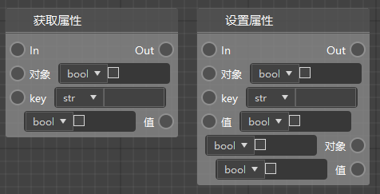
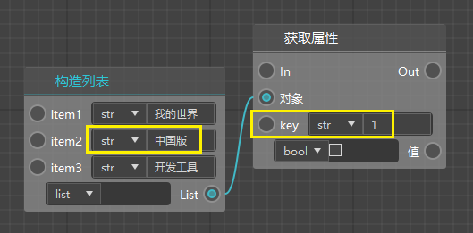
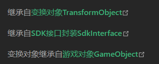
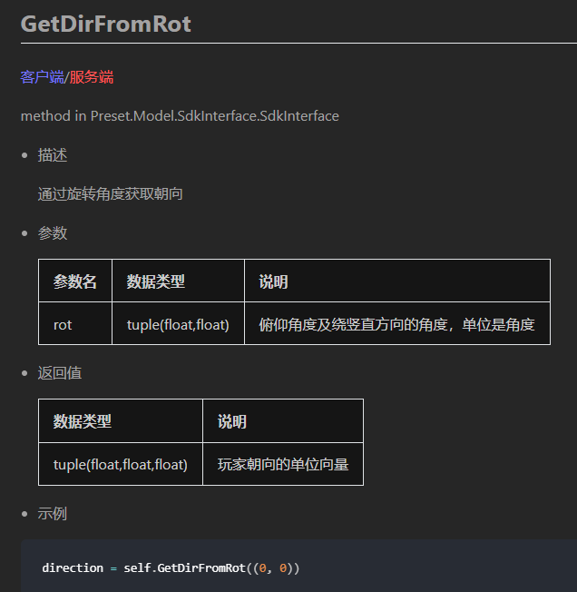
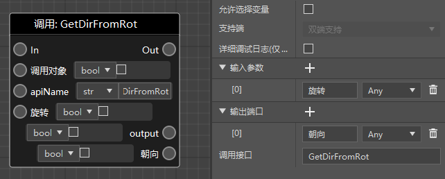
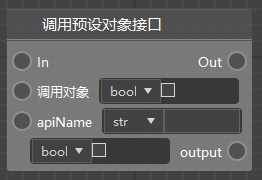
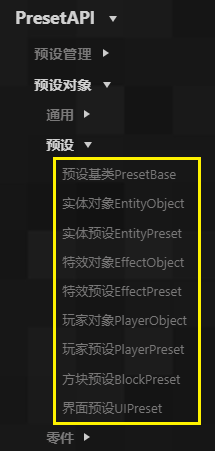
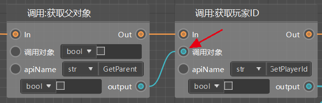
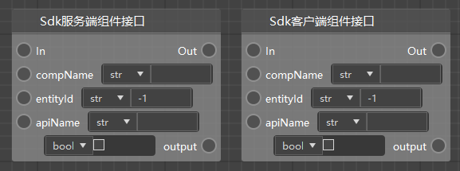
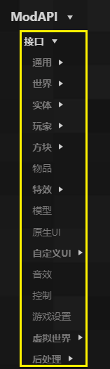

# 万能节点

## 获取/设置属性

这两个节点几乎可以用于任何对象的属性获取和设置

- 对象：从“谁”那获取
- key：获取哪个属性
- 值：获取的值

例如你可以通过这个节点获取字典某一个key对应的值

获取列表的某个元素也可以使用这个节点，如下图，在key里填写1，即可获取到列表的第2个元素（列表的元素的序号是从0开始的）。

## 调用零件接口

目前我们已经支持了几乎所有的零件接口，如果你还是会遇到零件接口确实，或者参数/返回值缺失等等情况，那么你可以直接使用“调用零件接口”，在他的属性界面进行设置。

- 输入参数：可以增加输入参数，参数的名称随意，但是类型需要尽量和官方文档里的类型匹配（如果没有，可以设置为any）
- 输出端口：与输入类似，对应文档的输出
- 调用接口：填写接口的名称

调用零件接口只能在<a href="../../../../mcguide/20-玩法开发/14-预设玩法编程/13-PresetAPI/预设对象/零件/零件PartBase.html" rel="noopenner"> 零件PartBase </a>的接口中寻找。

如图，可以使用partbase和其继承的接口。

例如下面这个接口。

可以在进行如下简单设置后直接使用。

## 调用预设对象接口

与调用零件接口非常类似。

适用于下面的所有分类下的接口。

注意，这些接口往往不是通过零件自身调用的，调用对象一般不能留空，例如。

这个是玩家对象的接口，只能由玩家预设（继承自玩家对象）来调用。

## 调用预设管理接口

与上面的节点类似，适用于<a href="../../14-预设玩法编程/13-PresetAPI/预设管理/PresetApi.html" rel="noopenner"> PresetApi（预设管理接口） </a>的直接调用。

## SDK组件接口

与上面的节点类似，分为服务端和客户端两种不同的接口。

适用于Mod API的接口的调用。

