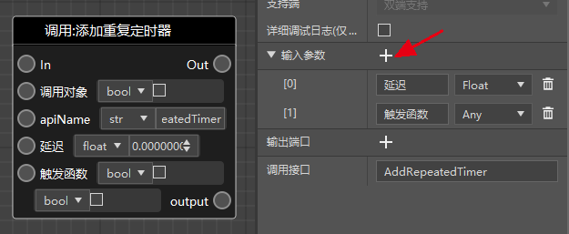

# 使用变长参数

变长参数是Python的一种函数的参数用法，现阶段的逻辑编辑器没有自动支持，但是需要的时候你仍然可以自主添加。

目前的内置接口里，涉及到变长参数的有下面这些

- AddRepeatedTimer（添加重复定时器）
- AddTimer（添加定时器）
- LogDebug（调试日志）
- LogInfo（消息日志）
- LogError（错误日志）

不同节点的变长参数的作用不同，我们以“添加重复定时器为例”。下图是其在技术手册中的<a href="../../../../mcguide/20-玩法开发/14-预设玩法编程/13-PresetAPI/预设对象/通用/SDK接口封装SdkInterface.html#addrepeatedtimer" rel="noopenner"> 文档 </a>。

在文档的参数表格中可以看到，这个节点最后包括一个变长参数和一个字典变长参数。

在逻辑编辑器中添加这个节点，点击节点，可以在节点的属性面板中看到它的输入参数（一般情况下，对于内置节点来说这个是无需改动的）。

我们按照技术手册的文档为这个函数手动增加两个参数，就可以使用变长参数了，如下图。对于定时器来说，你可以给变长参数传递触发函数所需要的参数，是一种比较常见的用法。

