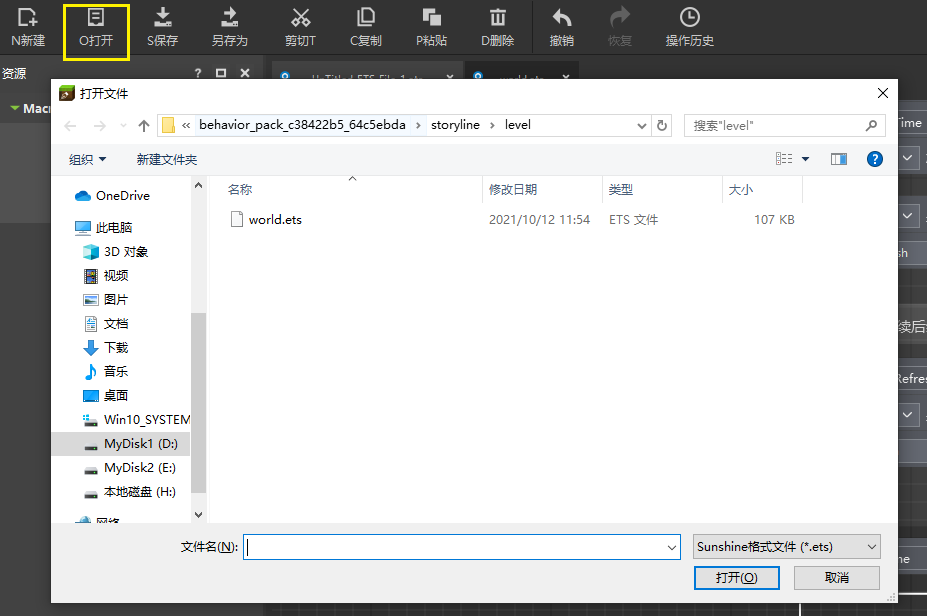
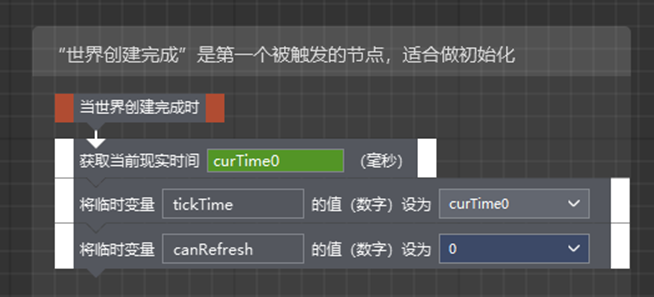
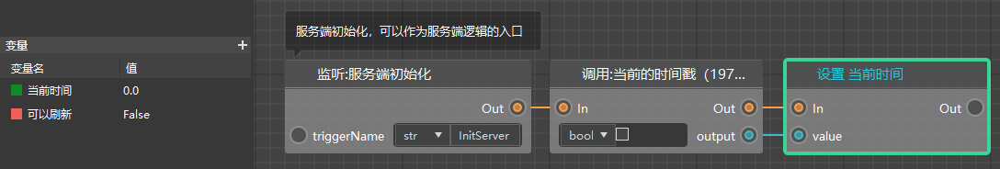
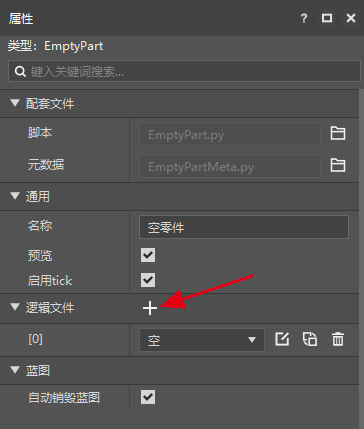

# 将旧版逻辑编辑器作品到新版

## 打开ets文件

新建新版作品和旧版作品升级的方法请见[创建新版作品](../../14-预设玩法编程/9-第一个预设Mod/0-创建新版作品.md)。

对于逻辑文件来说，旧版编辑器使用的是.ets文件，而新版使用的.bp文件。

新版逻辑编辑器的改动非常大，无法正常支持ets文件，你只能在旧版编辑器里打开，并在新版编辑器中再连接一遍，对此带来的问题我们深表歉意。

新版编辑器虽然不支持打开ets，但是ets文件仍然是生效的，并且手机和电脑端的我的世界也将继续支持使用ets的模组。

如果你需要继续编辑ets，可以打开旧版编辑器，使用逻辑编辑器的打开功能，选择需要编辑的ets文件（这一步可以是任意目录，不需要是作品自身的目录）。

## 新旧逻辑文件的对比

新旧逻辑编辑器在形式和功能上有巨大的差异，但是底层逻辑实际是相似的。

下图是跑酷模板的开头，我们现在将其转换为新版的写法。

他们的对应关系可以参考下面的表格。

| 旧版逻辑编辑器                             | 新版逻辑编辑器                                    |
| ------------------------------------------ | ------------------------------------------------- |
| 语句                                       | 节点                                              |
| 箭头引脚（语句的突起和凹陷）               | 节点的执行引脚（“In”相当于凹陷，“Out”相当于突起） |
| 事件语句（橙色），只有突起（用于引出箭头） | 事件节点，只有“Out”引脚                           |
| 临时变量                                   | 变量                                              |
| 宏                                         | 自定义接口（功能有一定区别）                      |

对于变量来说，旧版逻辑编辑器的变量只出现在语句之间，而新版有了正式的变量，并且移除了旧版的临时变量。

你可以看到新版逻辑编辑器的左侧有变量的管理界面，你可以在这里新建/删除/重命名变量，并且设定变量的类型和默认值。例如上图的最后一个语句（设置一个临时变量的默认值），在新版的结构中就不再需要一个单独的节点了。

新版逻辑编辑器引入了几乎所有对中国版模组开发有用的节点，并且删除了大量之前的语句，例如你可以看到，“世界创建完成时”语句被替换成了“服务端初始化”，“获取当时时间”被替换成了“当前时间戳”。

## 旧逻辑文件的使用

无论你是使用旧版逻辑文件（ets）还是新版逻辑文件（bp），你都需要用到零件。

除了在熟悉的世界零件里添加ets之外，你可以在任意零件的属性面板里发现逻辑文件，点击“+”即可添加一个逻辑文件的选择下拉框，在这里选择ets文件即可。

只把ets配在这里是不会让他在游戏内生效的，你需要将零件挂接在预设中，并且让预设最终在游戏内实例化。相关的文档可以查看这里：[在场景中实例化](../../14-预设玩法编程/9-第一个预设Mod/2-在场景中实例化.md)。

