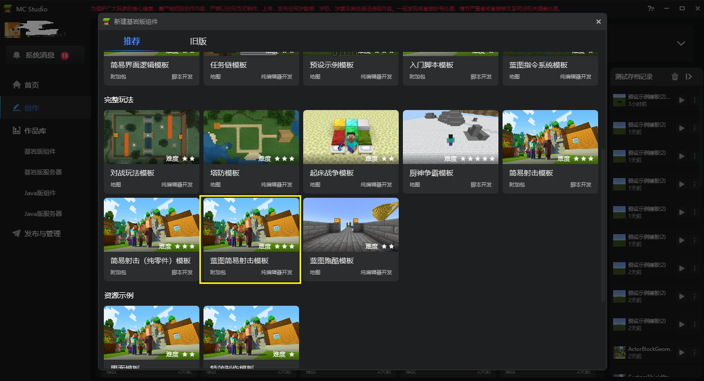
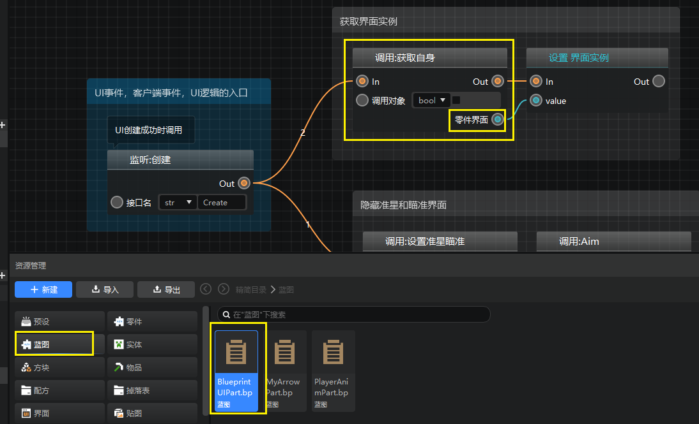
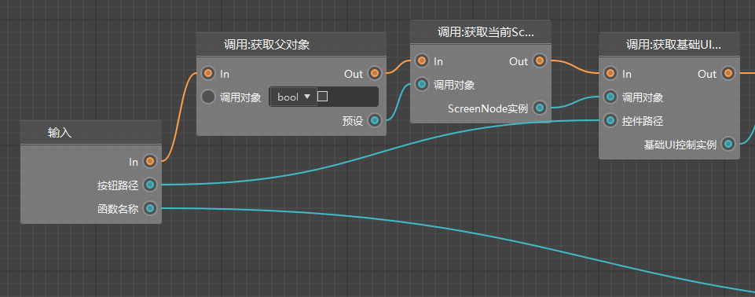
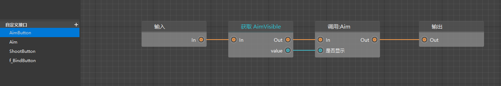
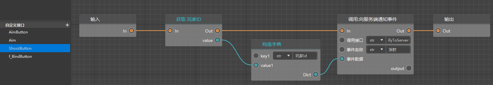
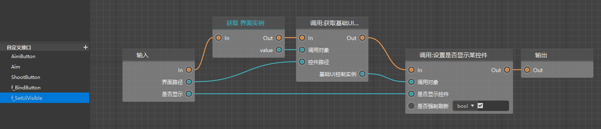

# 更新（勘误）

1、视频关于界面的部分接口已过时，如果遇到问题，请参考工作台的最新模板

2、在蓝图界面零件中获取界面实例的方式修改。

3、BlueprintUIPart，增加了一个新的自定义接口：f_BindButton，用于将按钮抬起的事件和自定义接口绑定起来。

4、打开自定义接口 f_BindButton，可以看到，现在的写法采用了最新的UI面向对象的节点。

5、对于绑定的两个自定义接口，里面也不再需要判断是否是按下事件，因为我们在上面调用接口的时候已经明确是抬起事件了。下面是这两个自定义接口的新图表。

6、此外还新增了一个f_SetUiVisible接口，用于替代之前已废弃的控制控件显隐的节点

在下图的地方，和Aim接口里都有用到这个自定义接口。

