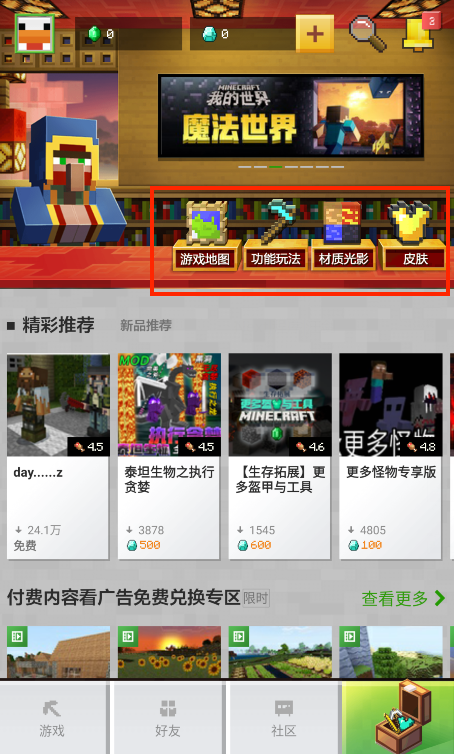
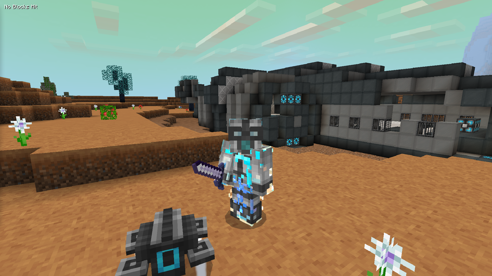

---
front:
hard: 入门
time: 分钟
---

# Mod简介

## 组件

打开我的世界中国版的资源中心，可以看到我们把组件分为游戏地图，功能玩法，材质光影与皮肤。

皮肤组件其实就是一张png贴图，搜索引擎搜索“我的世界皮肤制作”即可找到很多大神分享的教程。

功能玩法与材质光影都是通过“附加包”来制作，这也是《MODSDK 模组开发》这个文档主要讲述的内容。

游戏地图一般是一个搭建好的游戏存档，但是还可以添加附加包来实现更丰富的玩法。

## 附加包

### 什么是附加包

附加包（Add-ons）能够自定义修改我的世界基岩版中的游戏内容，是基岩版对模组（Mod）的一种支持方式。

在后续的文档中，我们会使用“Mod”来指代基岩版AddOn

### 附加包可以做什么

- 实现对原版游戏内容的修改，例如修改原版方块物品的贴图，代表是各种材质包

- 额外添加新的游戏内容，例如添加新的自定义生物，物品，方块等

  “异星求生”玩法是其中一个集成了各MODSDK功能的作品，包含了自定义维度，丰富的自定义物品方块与装备，以及python脚本开发制作出异世界生存的玩法。

