---
front:
hard: 入门
time: 分钟
---

# 制作第一个附加包

## 下载安装我的世界开发工作台

从[我的世界开发工具网站](https://mc.163.com/dev/index.html)下载MC Studio：
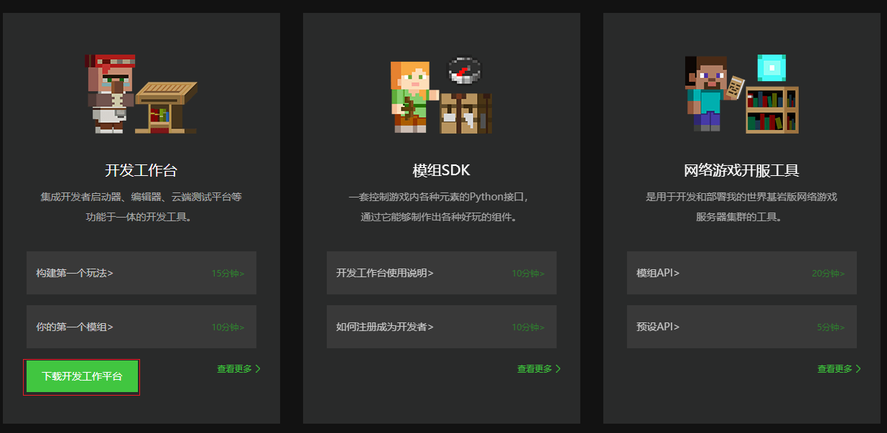

## 注册开发者账号

- 安装完成后，使用网易通行证账号登录我的世界开发工作台，如您没有网易通行证,可以点击页面中的邮箱注册按钮前往网易邮箱注册网页进行注册。
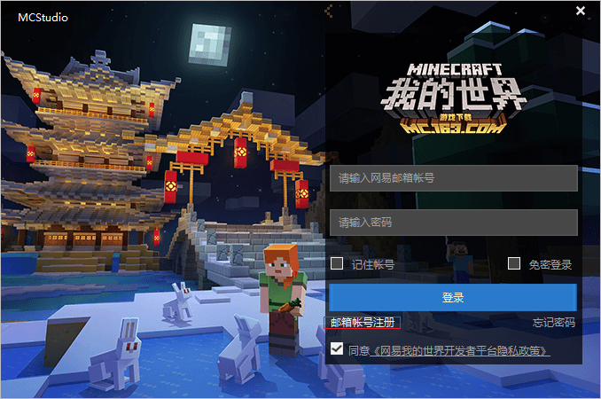

- 成功登录后，对于没有注册开发者账号的用户，会进行弹窗拦截，点击“注册开发者”按钮，前往[开发者注册页面](https://mcdev.webapp.163.com/#/reg)
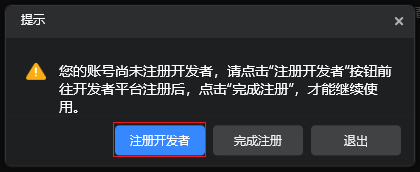。

- 在开发者注册页面填写相关信息并提交成功后，就可以返回我的世界开发工作台，点击“完成注册”，即可正常登录和使用我的世界开发工作台啦！
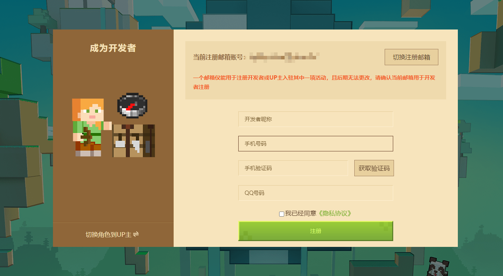

## 新建一个空白附加包

新建作品→基岩版组件→空白附加包，点击新建：

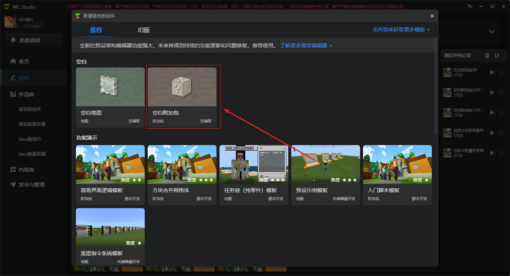

填写好地图名称后点启动编辑。然后studio会自动下载最新的mod开发包：

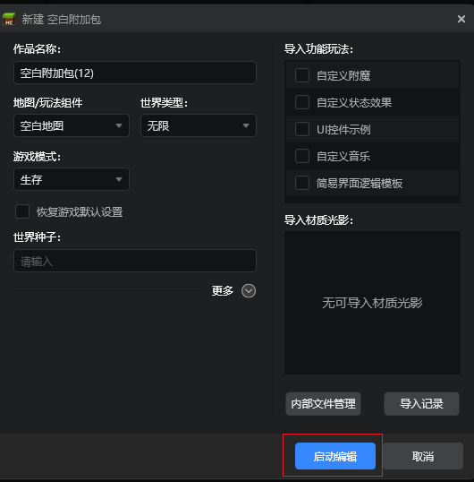

## 添加一个自定义方块

1. 在关卡编辑器的配置页面点击新建→选择配置→新建一个方块配置：
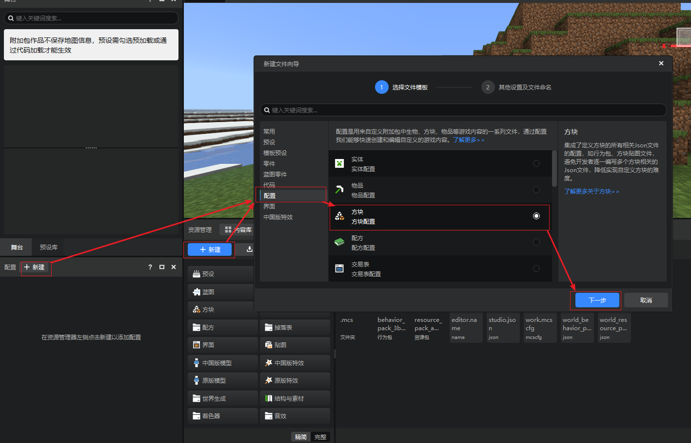

2. 选择【发光的普通方块】模板，点击创建按钮完成创建：
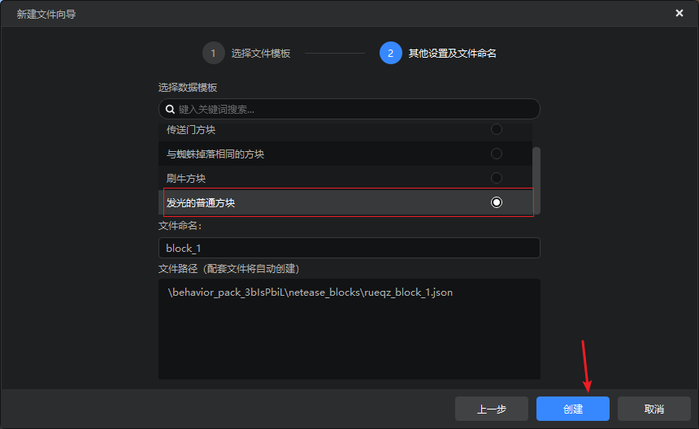

3. 在配置面板选中新增的方块配置，然后在右侧的属性面板找到方块贴图的属性：
   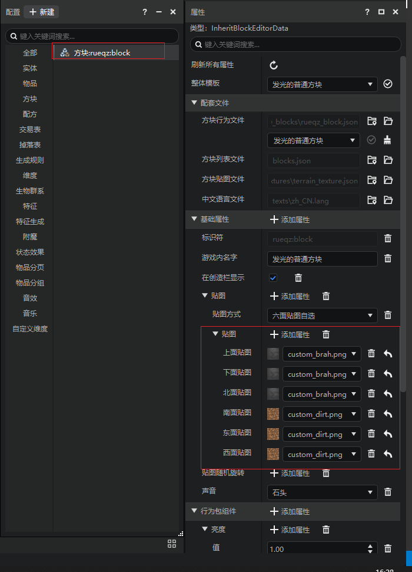

4. 如果你需要导入作品外部的贴图，可以点击资源管理器面板中的导入按钮，选择导入方块贴图，在弹出的文件选择框外部贴图所在的文件夹并选择贴图导入：
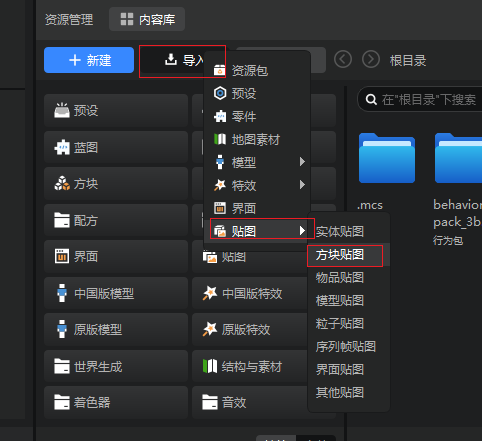
5. 如果你需要导入MC原版的贴图，可以寻找下列路径中的贴图：
   `你安装studio的盘符:\MCStudioDownload\MCPresetEditor`

   我们在此基础上定位到：`Game\data\resource_packs\vanilla\textures\blocks`

   这里我们可以找到原版方块的贴图，我们选择barrel_bottom.png，
   然后下面贴图与侧面贴图也选择这张贴图：

   

6. 然后我们在属性找到“射线碰撞盒”，把“右上角”的数值都设置为1：
   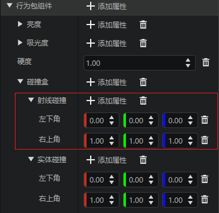

7. 右上角点击保存：
   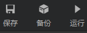

## 测试我的作品

1. 在开发者启动器打开创作页，找到你刚才新创建的附加包→开发测试：

2. 选择稳定版本的开发测试版本，并勾选创造模式与作弊模式，然后点开始。这时启动器会下载《Mod PC开发包》。
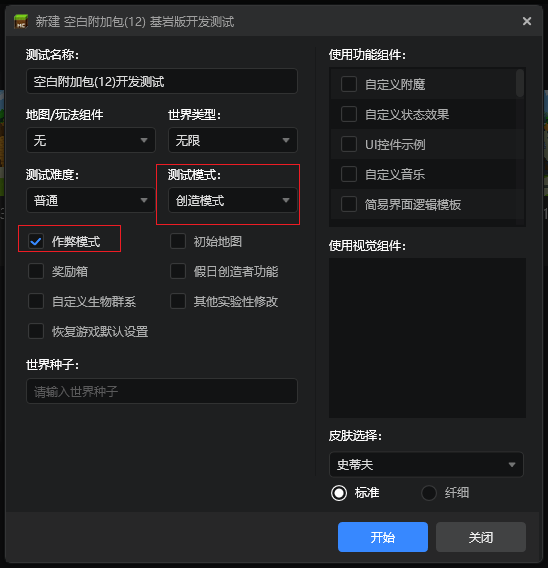

1. 下载完成进入游戏后，我们打开物品栏，就可以看到我们新加的自定义方块，可以拿出来并进行放置。

## 进阶

以上我们制作了一个非常简单的mod，但实际测试的过程中我们会发现一些问题，例如方块可以穿过。

这是因为我们只配置了方块的贴图，而没有配置方块的碰撞箱，如何制作一个完善的自定义方块则需要我们阅读相关模块的文档。

此外仅仅添加一个方块无法构成一个有趣的玩法。一个有意思的玩法通常可以允许玩家对方块进行交互，或者采集方块合成其他有趣的物品。这需要我们学习其他自定义游戏内容，以及python脚本。

## 导出发布

假设我们已经制作好了一个很棒的玩法的mod，测试完毕后，我们需要把我们的Mod上传到开发者平台，这样其他玩家才能玩到我们的Mod。

回到开发者启动器，在创作页或基岩版组件找到该作品，选择更多→导出，然后选择一个位置，启动器会把附加包导出为一个zip文件。
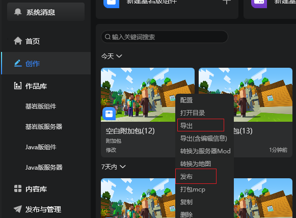

然后点击启动器上的“发布与管理”按钮，前往开发者平台：
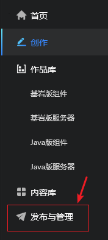

点击发布新资源，上传刚才导出的zip文件，遵循说明和指引一步步填写即可。

> 温馨提示：你也可以通过点击作品更多菜单→发布按钮，将自动为您导出作品、上传到开发者平台，并打开发布资源的页面，如下图：
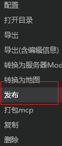

## 在移动端测试我的作品

为了测试和体验Mod在手机上的效果，确保最终发布后没有问题，我们需要在手机上进行测试Mod（包括**安卓**和**IOS**设备）。按下面的步骤进行：

- 按前面的介绍，将需要测试的组件，在“发布”页面上传，并提交审核，使组件处于“审核中”的状态。
    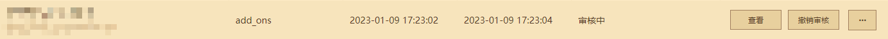
- 安装我的世界手机测试APP：在“发布”页面中，点击左下角的“测试版启动器下载”，下载手机测试APP并安装。
    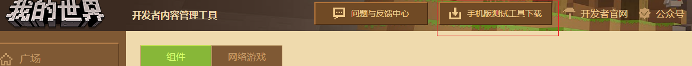
- 使用开发者账号登录手机测试APP。
- 在资源中心搜索，找到刚刚提审的组件，即可进行测试。