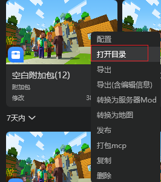
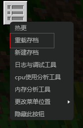
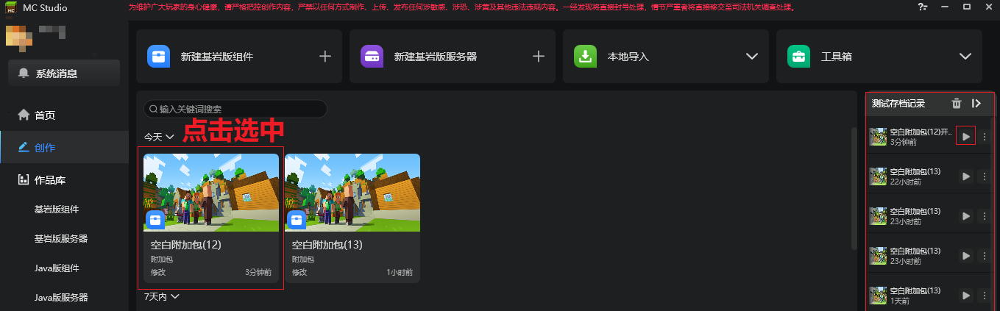
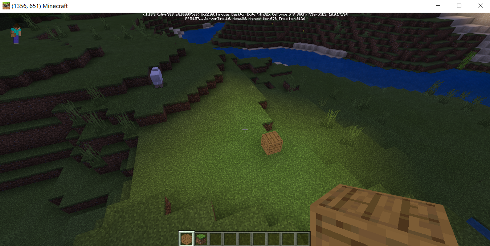
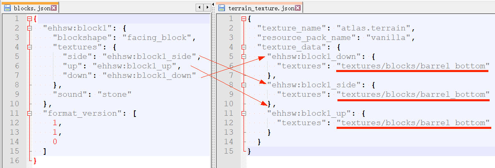
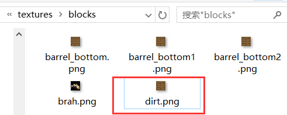
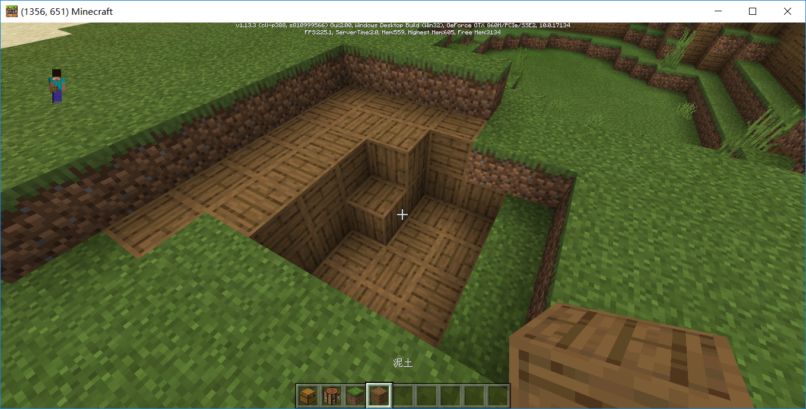
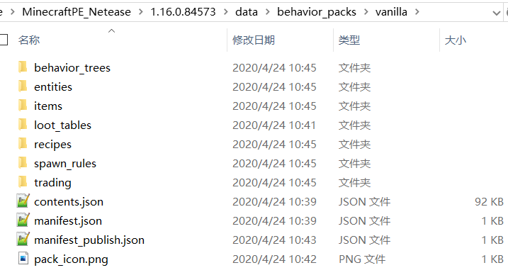

---
front:
hard: 入门
time: 分钟
---

# Mod是如何工作的

虽然我们已经通过工作台制作出了一个简单的mod，其中没有涉及任何的代码以及文件操作，但是了解mod具体是如何运作是很有必要的，会帮助你更好地设计玩法的实现方式，多个mod之间如何协作与避免冲突，以及使用一些目前还不支持编辑器配置的功能。

## 行为包与资源包

附加包可以分为行为包（behavior_pack）与资源包（resource_pack）。

在研究这个之前我们先来了解一下什么是Client-Server架构。

Client-Server结构分为服务器与客户端。服务器负责数据的管理与逻辑的计算，客户端负责完成与用户的交互任务。

通俗的理解，在mc里，服务器会负责地图的生成与存储，生物的AI行为计算，物品的使用逻辑等等；而客户端主要负责把地图，生物等等画到屏幕上，以及接受玩家的操作，例如移动跳跃，物品的使用操作等等。

当服务器与客户端在启动的时候，会有一个初始化的步骤，在这个步骤中，游戏会到一些特定的路径上读取配置以及资源。因此我们只要按照规则把我们制作的东西放置在特定的路径，就可以被游戏识别并加载，实现我们的自定义玩法。

一般来说，我们会把服务器需要用到的东西放到行为包（例如地图的生成规则，方块的碰撞盒，生物的AI），把客户端需要用到的东西放在资源包（例如方块的贴图，生物的模型与动作）。

以我们在上一篇中制作的自定义方块mod为例。

在作品中点击更多→打开目录。我们会看见一个behavior_pack与一个resource_pack开头的文件夹。

### 行为包

打开behavior_pack，里面有一个netease_blocks目录，这个目录专门用来放自定义方块的配置。打开netease_blocks后，里面有一个json文件。使用文本编辑器打开这个json文件，可以看到里面记录了我们在上一篇中添加的自定义方块的定义，与关卡编辑器里的属性栏是一一对应的，例如“netease:solid”对应“是否实心”。游戏启动时，会分析这个json文件并根据里面的定义来添加一个自定义方块。

然后我们把"minecraft:block_light_emission"的值改为1.0（这个属性在关卡编辑器中对应的是渲染属性-亮度），并保存。

然后点击ModPC开发包上的重载存档，再次加载此测试存档

如果你已关闭ModPC开发包，可以在启动器选中作品，并在右侧的测试存档记录中找到对应的测试存档再次启动测试。

把时间设置成晚上，可以发现我们的自定义方块与之前不同，变成与萤石一样会发光。你也可以编辑直接编辑json文件中的其他字段来修改方块的其他属性，当然这需要学习自定义方块模块的文档。

### 资源包

然后我们来到resource_pack目录。这里会看到一个blocks.json，以及textures文件夹下的一个`terrain_texture.json`。游戏启动时会读取这两个文件来加载方块的贴图。

现在我们还不需要了解这两个文件的具体含义，但大体上我们可以看出这两个文件一起定义了我们上一篇中自定义方块的上面，底面以及侧面的贴图，最后指向了`textures/blocks/barrel_bottom`这个路径

然后我们来到`textures/blocks`这个路径，会发现这里`barrel_bottom.png`的确是我们之前选择的自定义方块贴图。

## 原版数据包

一些原版的游戏内容（例如群系，生物，光影材质等）也是通过与附加包相同的格式，把配置与资源的方式放置在游戏安装包的特定位置上，在启动时进行加载。通过研究这些原版的数据包，有助于我们修改原版的游戏内容，以及从中获得如何制作自定义内容的灵感。

### 如何找到原版数据包

我们打开目录`您安装mcstudio的盘符\MCStudioDownload\game\MinecraftPE_Netease`，这里是我们的“Mod PC开发包”。“Mod PC开发包”中可以找到原版的群系，生物等等的配置文件来提供开发的参考，后面很多模块的文档都会提到。

点开最新版本的文件夹，里面的`data\behavior_packs\vanilla`便是游戏原版的行为包。

而`data\resource_packs\vanilla`便是游戏原版的资源包

### 如何修改原版数据包

对于原版的游戏内容，与附加包一样都是在启动的加载阶段读取指定路径的配置与资源。在这个阶段附加包与原版数据包拥有同等的地位，并且优先级更高。因此只要在附加包中的相同路径放一个同名的文件，游戏就会使用我们这个文件来代替原版的文件。

到原版的资源包下，会发现`textures/blocks`下也有一张dirt.png，就是我们平时看到的泥土方块的贴图。

我们打开我们在上一篇中的AddOn的resource_pack目录，来到`textures/blocks`，然后把`barrel_bottom.png`拷贝一份，并且重命名为`dirt.png`

然后我们再次启动测试存档，会发现原版的泥土方块的贴图改变了。

## 数据包的文件结构

在数据包中一般会有一个该数据包的描述文件，以及一些按照功能来划分的文件夹，我们以原版数据包为例来看一下。

### 行为包

| 文件/文件夹   | 解释                                                         |
| ------------- | ------------------------------------------------------------ |
| entities      | 生物的定义。 在我的世界中国版中，行为包中必须有这个文件夹 |
| ...           |                                                              |
| manifest.json | 资源包的描述文件，包含了该资源包的标识符，作者信息等。 更多可以参考[官方wiki](https://zh.minecraft.wiki/w/基岩版附加包文档#manifest.json)，以及下方的“制作规范” |

### 资源包

| 文件/文件夹   | 解释                                                         |
| ------------- | ------------------------------------------------------------ |
| entity        | 生物的定义                                                   |
| textures      | 贴图资源 在我的世界中国版中，资源包中必须有这个文件夹 |
| ...           |                                                              |
| manifest.json | 资源包的描述文件，包含了该资源包的标识符，作者信息等。 更多可以参考[官方wiki](https://zh.minecraft.wiki/w/基岩版附加包文档#manifest.json)，以及下方的“制作规范” |

## 开始动手吧

如果想更深入了解如何手动配置addon，可以阅读[制作资源附加包](https://zh.minecraft.wiki/w/教程/制作资源附加包)与[制作行为包](https://zh.minecraft.wiki/w/%E6%95%99%E7%A8%8B/%E5%88%B6%E4%BD%9C%E8%A1%8C%E4%B8%BA%E5%8C%85)。

如果想了解更多的自定义游戏内容，可以查阅“自定义游戏内容“里的文档

如果想了解脚本开发，可以查阅”Python脚本开发”文档

