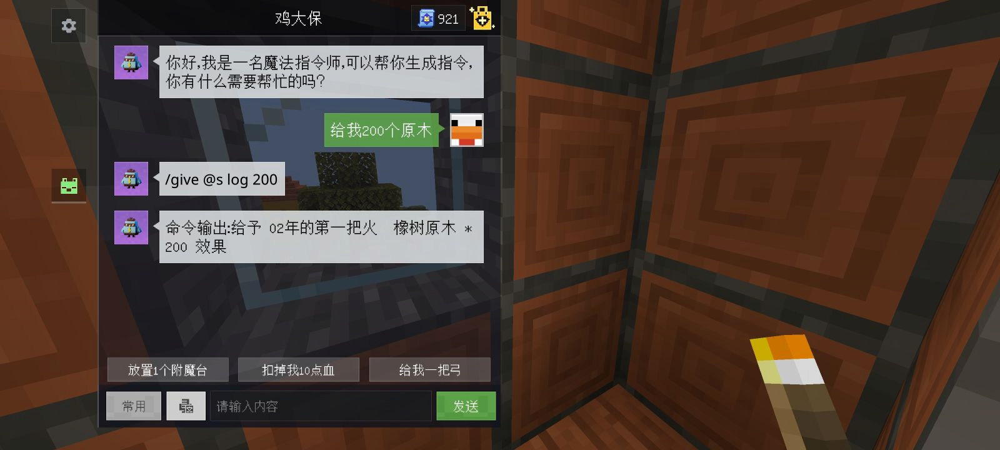
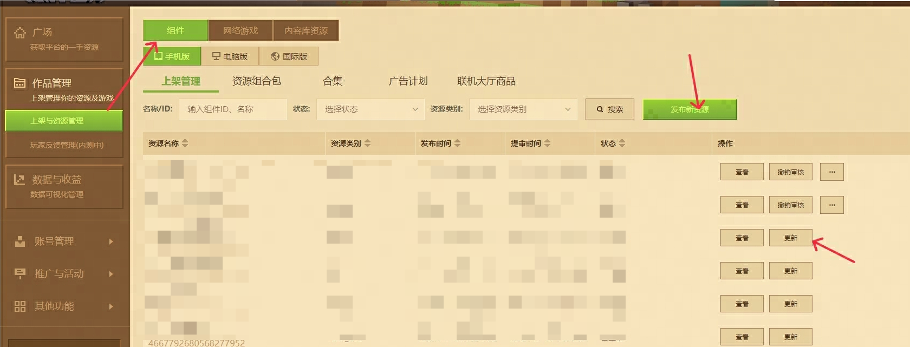
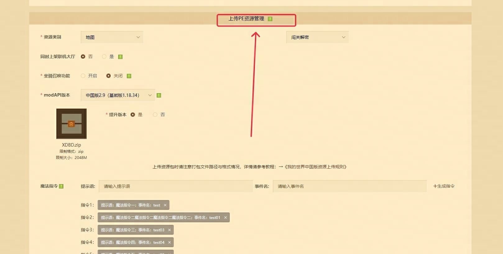

---
front:
hard: 入门
time: 分钟
---

# <span id="魔法指令功能"></span>魔法指令功能

## 什么是魔法指令

魔法指令是中国版官方近期推出的功能，可以使用玩家输入的中文提示来生成MC原生的指令。

魔法指令可以用于手机平台，非网络游戏的所有模式。

需要开启作弊才能使用魔法指令。



## 开发者如何使用魔法指令

功能暂时不向所有开发者发布，仅位于功能白名单中的开发者可以使用。

开发者可以在自己的模组中注册魔法指令。
如果玩家的提示输入，与注册的指令完全相同，将不再生成指令，而是执行开发者定义的功能。

注册魔法指令的位置在开发者内容管理平台的组件管理中。



每个作品最多可配置10条魔法指令，每条由提示语和事件名组成

提示语：仅中文，字数不超过20字，不可与本资源其余提示语重名

事件名：仅可输入字母和数字，限制长度在20位以内，不可与本资源其余事件名重名

> 事件名最好保证在中国版的所有组件注册的魔法指令中保持唯一，所以请增加一些特定的前缀或者后缀（作用类似组件的命名空间），并且不要出现特别短的事件名



## 如何使用魔法指令

在组件中使用SDK的ListenForEvent接口监听namespace="Minecraft"，systemName="aiCommand"，eventName为上一步配置的事件名，回调函数的参数包含了`playerId`参数表示输入提示语的玩家的entityId。

例如：

	提示语：我的世界越来越好
	事件名：neteasemcgood

则在服务端中注册：

```python
class MySystem(ServerSystem):
    def __init__(self, namespace, systemName):
        # 省略一些初始化
        self.ListenForEvent('Minecraft', 'aiCommand', 'neteasemcgood', self, self.neteasemcgood)

    def neteasemcgood(self, args):
        print args['playerId'], "说：我的世界越来越好"
```

测试时就会发现，使用魔法指令输入“我的世界越来越好”时，系统会打印出相关日志

## 如何测试

魔法指令功能无法在开发者启动器的Mod PC开发包中使用。
目前只能在手机测试版中使用。

> 注意：
>
> 1.测试自定义的魔法指令之前需要在内容管理平台中配置魔法指令的提示语和事件名。
>
> 2.在手机测试版中，需先在游戏内开启作弊，才能看到魔法指令的界面并进行测试。

手机测试版的魔法指令，不会消耗次数，即使提示语不能命中内容管理。平台中配置的魔法指令，也不会尝试使用AI生成指令。即此版本仅用于测试开发者配置的魔法指令。

## 文明注册提示语

在注册提示语时，请保持文明，提示语也是审核的一环

1. 提示语最好不好出现纯原生的效果，例如：“给我一些钻石”，会影响原生的魔法指令功能的使用
2. 提示语最好仅与注册提示语的组件关联，不要出现其他组件的内容
3. 由于玩家会尝试通过语音转文字功能使用魔法指令，请注意不要注册容易出现发音错误的提示语