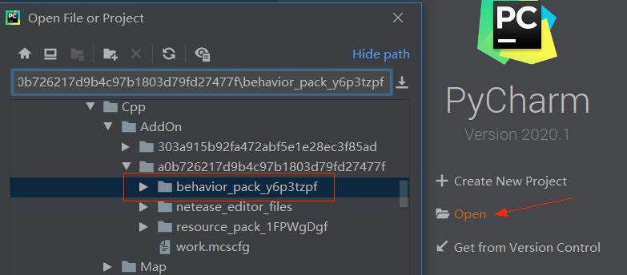

# 脚本开发入门

## 什么是Python脚本开发

原生的AddOn的方式可以改变很多原版游戏内容，以及添加自定义的游戏内容，但一般无法实现一些较复杂的逻辑，比如右键自定义方块时，会给予物品。这就需要使用脚本来实现了。

在我的世界中国版中，我们使用python来编写mod脚本。

我们封装了很多的游戏事件与组件，游戏事件是指游戏内触发了某个操作或达到某一种条件（例如玩家右键了自定义方块），可以通知到我们的代码，进而实现我们的逻辑。组件是我们封装好的游戏引擎接口，可以用来设置或获取某些数据（例如操作玩家背包），或者执行一些特殊的功能。

脚本开发就是一个监听事件与调用组件的过程，配合自己的逻辑来实现很酷的玩法。


## 第一个脚本Mod

在启动器→新建基岩版组件窗口→推荐分页→入门脚本模板，点击新建，会自动创建一个“入门脚本模板“的附加包。


然后我们直接选择这个AddOn进入开发测试。进入游戏后我们在聊天栏输入“钻石剑”，就会发现在背包里多了一把钻石剑。这个是使用原版AddOn无法实现的效果。

下面我们通过尝试修改入门模板来了解如何进行Python脚本开发。


## 开发环境搭建

### python安装

**我们的python脚本开发使用的python版本是python 2，而不是python 3**

我们进入[python官网下载页](https://www.python.org/downloads/)，拖到下面的“Looking for a specific release”，然后点进最新的python2的版本。


安装时需要选择将python添加到环境变量中，其余按照提示点下一步即可。


### IDE安装

集成开发环境（*IDE*）可以很好帮助我们编写代码，对于python来说，pycharm与vscode都是很不错的IDE，这里我们以pycharm为例

进入pycharm的[官网下载页](https://www.jetbrains.com/pycharm/download)，选择Community版本下载，然后按照提示点下一步安装即可。


### 安装Mod SDK补全库


#### 使用mcstudio安装

打开studio编辑器，点击工具：

若只有稳定版本存在时，开发者可点击稳定版补全库下载。

若beta版本与稳定版本共存的时候，开发者可根据需要选择所需要的版本补全库。

点击检查补全库更新，可把最新版本的补全库更新到菜单列表。


#### 手动安装补全库

对于高端开发者，可以使用pip来安装补全库。

* 安装

  在命令行中输入以下指令即可安装最新版的补全库

  ```
  python -m pip install mc-netease-sdk
  ```

* 升级

  补全库有新版本时，可以使用以下指令升级到最新版本（如果存在新版本的beta补全库时，这种方法会将本地的补全库更新到最新的beta版）

  ```
  python -m pip install --upgrade mc-netease-sdk
  ```

* 安装到指定的python

  当系统内有多个python时，可以指定python的路径来安装到对应的python：

  ```
  C:\xxx\python.exe  -m pip install mc-netease-sdk
  ```

* 安装特定版本的补全库

  在[pypi](https://pypi.org/project/mc-netease-sdk)上查询可选的版本，然后使用：

  ```
  python -m pip install mc-netease-sdk==要安装的版本号
  ```


## Python入门

python是一门很容易入门的编程语言，没有接触过python的开发者可以先浏览[这个网站](https://www.liaoxuefeng.com/wiki/1016959663602400)的下面这些页面，跟着上面的示例代码来了解python：

* 第一个Python程序
  * 使用文本编辑器
* Python基础
  * 数据类型和变量
  * 条件判断和循环
  * 使用dict
* 函数
  * 调用函数
  * 定义函数
  * 函数的参数
* 模块
  * 使用模块
* 面向对象编程
  * 类和示例

## 为自定义方块mod添加脚本

1. 打开“入门脚本模板”的目录，打开“tutorialBehaviorPack_xxx”文件夹，把里面的“tutorialScripts”复制到我们在“制作第一个Mod”中创建的自定义方块AddOn的行为包中。

   

2. 用IDE打开自定义方块AddOn的行为包，并且配置python环境。

   以pycharm为例，点open，然后把行为包的路径拷贝进来，打开。



然后选择File→Settings→Project: behavior_pack_xxx→Python Interpreter，点设置按钮，然后Add。然后选System Interpreter，然后选择我们刚才安装的python路径。然后我们就可以使用pycharm的自动补全功能了


3. 实现右键自定义方块时获得钻石剑

   打开tutorialScripts/tutorialServerSystem.py，我们看到监控聊天信息并生成物品的代码。

   我们通过监听ServerChatEvent，然后在响应函数里用item组件向玩家背包添加物品。

   

   我们参考这些代码来实现右键自定义方块的逻辑。

   首先我们在ListenEvent函数里监听ServerBlockUseEvent事件，然后添加一个OnServerBlockUseEvent函数用来处理这个事件。根据文档，我们可以知道这个事件会告诉我们执行这个操作的玩家以及右键的方块的信息。根据这些信息我们使用与OnServerChat函数一样的方法给玩家的背包添加一个钻石剑。

```python
    def ListenEvent(self):
        # 在自定义的ServerSystem中监听引擎的事件ServerChatEvent，回调函数为OnServerChat
        self.ListenForEvent(serverApi.GetEngineNamespace(), serverApi.GetEngineSystemName(), "ServerChatEvent", self, self.OnServerChat)
        # 监听引擎的事件ServerBlockUseEvent，回调函数为ServerBlockUseEvent
        self.ListenForEvent(serverApi.GetEngineNamespace(), serverApi.GetEngineSystemName(), "ServerBlockUseEvent",
                            self, self.OnServerBlockUseEvent)

    ...

    # 监听ServerBlockUseEvent的回调函数
    def OnServerBlockUseEvent(self, args):
        # 这里的sdkteam_test:block1替换成你自己的自定义方块的命名空间与方块名
        if args["blockName"] == "sdkteam_test:block1":
            # 调用给予物品的接口，与OnServerChat中相似
            comp = serverApi.CreateComponent(serverApi.GetLevelId(), "Minecraft", "item")
            # 这里填钻石剑的物品名
            comp.SpawnItemToPlayerInv({"itemName":"minecraft:diamond_sword", "count":1, 'auxValue': 0}, args["playerId"])
```


4. 再次进入测试存档，右键我们的自定义方块，发现背包添加了钻石剑。

   如果一直点着右键会发现背包一下子就被钻石剑填满了。这是因为ServerBlockUseEvent事件每一帧（tick）都会触发，开发者在阅读文档时也应留意。


## 脚本结构

我们以tutorialScripts为例来讲解python脚本的目录结构。

``` json
| behavior_packs_xxx
	| entities
	| tutorialScripts
		| __init__.py
		| modMain.py
		| tutorialClientSystem.py
		| tutorialServerSystem.py
	| ...
	| manifest.json
```

| 文件/文件夹             | 解释                                                         |
| ----------------------- | ------------------------------------------------------------ |
| tutorialScripts         | python脚本的根目录，该目录的脚本会被加到python运行环境下，可以从该路径开始import脚本文件，例如from tutorilaScripts import modMain |
| \_\_init\_\_.py         | 是python module的标识，表示这是一个可以import的module，同时也可以做一些初始化的操作,内容可为空，但是文件必须有。 |
| modMain.py              | 必须有该文件，用来初始化我们的Mod                            |
| tutorialClientSystem.py | 执行客户端逻辑的system                                       |
| tutorialServerSystem.py | 执行服务器逻辑的system                                       |

### 命名建议

为了与其他mod的脚本区分，以免发生冲突，脚本的目录应该有足够的区分度。

建议采用`[团队名称][Mod名称][Scripts]`格式，例如SDKTeamTestScripts。这个文件夹更改命名后，代码里相应的地方也需要修改。

### modMain.py是什么

modMain是Python逻辑的入口文件，需要包含mod的初始化与退出时的处理函数。这些初始化函数中，InitClient和InitServer分别初始化客户端和服务端，通常用于系统与组件的注册，也可以做一些自定义的初始化操作。DestroyServer和DestroyClient用来做一些退出游戏时的处理，例如保存数据，恢复一些设置或销毁一些内容。

``` python
# Mod属于SDK的内部类用于绑定
from mod.common.mod import Mod

# 将引擎的方法绑定到我们自己的类HugoMod上用于识别
@Mod.Binding(name = "HugoMod", version = "0.0.1")
class HugoMod(object):

    def __init__(self):
        pass

    # 服务端脚本初始化的入口函数
    @Mod.InitServer()
    def testServerInit(self):
        pass

    # 服务端脚本在退出时执行的析构函数
    @Mod.DestroyServer()
    def testServerDestroy(self):
        pass

    # 客户端脚本初始化的入口函数
    @Mod.InitClient()
    def testClientInit(self):
        pass

    # 客户端脚本在退出时执行的析构函数
    @Mod.DestroyClient():
    def testClientDestroy(self):
        pass
```

| 代码                                            | 解释                                                         |
| ----------------------------------------------- | ------------------------------------------------------------ |
| from mod.common.mod import Mod                  | Mod是一个注册类，需要用其来绑定类和函数                      |
| @Mod.Binding(name = "HugoMod", version = "1.0") | HugoMod是我们的Mod类，name表示Mod的名称，version表示Mod 的版本 |
| @Mod.InitServer()                               | 作用是标识该函数是我们的Server端初始化的函数，会在游戏Server端开始的时候被调用 |
| @Mod.DestroyServer()                            | 作用是用来标识我们的Server端关闭的时候执行的一些销毁内容的函数 |
| @Mod.InitClient()                               | 作用是用来标识我们的Client端开始的时候执行初始化的函数，会在游戏Client端开始的时候被调用 |
| @Mod.DestroyClient()                            | @Mod.DestroyClient()的作用是用来标识我们的CLient端关闭的时候执行一些销毁操作，会在游戏Client端关闭的时候被调用 |

### 服务器与客户端

还记得我们在[Mod是如何工作的](../1-Mod开发简介/3-Mod是如何工作的.md)中提到的Client-Server架构吗，脚本开发也分为服务端脚本与客户端脚本，这就是为什么我们需要InitServer，InitClient，以及ServerSystem和ClientSystem。

在”ModAPI“系列文档中也可以看到，事件分为服务端事件与客户端事件，组件分为服务端组件与客户端组件。服务端与客户端的脚本需要互相独立，两部分的代码不要互相import，使用对方的事件与组件也不会生效。一般情况下我们需要把游戏逻辑相关的代码写在服务端（例如给予物品），把表现相关的代码写在客户端（例如UI与特效）。而服务器与客户端之间的通信会用到“自定义事件”，在后面阅读AwesomeMod时学习。

## 如何调试

Mod代码目前不支持断点调试，因此只能通过在不同的地方打Log来调试代码。打Log可以使用 print 也可以使用 logging模块（后面阅读AwesomeMod时会看到）。Log会显示在”脚本测试日志“窗口中，脚本的Log最好加上特殊的前缀方便查找。


推荐使用mod_log模块打印日志

```python
from mod_log import logger
logger.info("print log: %s", "OK")
```

目前Mod代码支持热更新调试，在运行游戏进行开发测试时，增加，删除，修改相关本地Python文件后，回到Studio或者编辑器界面，Studio会自动热更新修改的内容，并在”脚本测试日志“窗口中提示“正在重载相关的Python模块”。

如下图所示，原本点击开始游戏会打印出日志“test 1”。修改打印内容为“test 2”后，点击”脚本测试日志“窗口时，会输出"正在重载script_StartLogic.StartLogicUI"，然后再次点击开始游戏，打印的内容变成了“test 2”。


自动热更对**函数内实现**具有较好的支持，但涉及到**全局变量，新增类/文件**等可能无法生效。

此时可以通过**保存退出到菜单界面**后，再**重新进入存档**以完整加载修改后的MOD。

## 开始行动吧

首先阅读[系统简介](./4-系统简介.html)，[事件简介](../2-Python脚本开发/9-事件简介.md)，[组件简介](./8-组件简介.html)，然后从modMain.py入手，阅读[TutorialMod](../60-Demo示例.md#TutorialMod)的代码与注释。

掌握了事件与组件的用法后，可以阅读我们提供的射击玩法示例[AwesomeMod](../60-Demo示例.md#AwesomeMod)来学习更多的MOD开发技巧（从modMain.py开始入手哦）。

熟悉了modsdk的用法后，可以继续阅读[这个网站](https://www.liaoxuefeng.com/wiki/1016959663602400)的“高级特性”，“面向对象编程”，“常用内建模块”，有助于使用python编写出更复杂的玩法逻辑。

遇到自身没法解决的问题时，及时通过频道或开发者频道的反馈功能和官方沟通。

