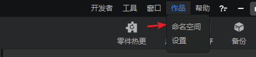
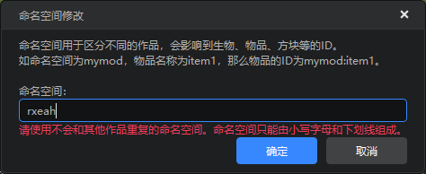
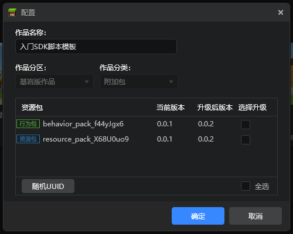

---
front:
hard: 入门
time: 分钟
---

# 制作规范

## 命名

为了与我们开发的其他mod区分，以及其他开发者的mod区分，以免同时使用时发生冲突，行为包与资源包文件夹的命名应该有足够的区分度。

使用studio创建的AddOn添加了随机字符串的后缀，而如果开发者打算手动构造mod，或者拷贝官方示例来创作mod，这里给出一些命名建议：

这里采用驼峰命名法，开发者也可以结合个人习惯采用下划线命名法。

1. Mod命名建议采用`[团队名称][Mod名称](Mod)`格式，即以团队名称开头，中间为mod的游戏内容或者具有辨析度的命名。

   例如上一篇自定义方块mod的命名为“SDKTeamTest”

2. 行为包命名建议采用`[团队名称][Mod名称][BehaviorPack]`格式，以`BehaviorPack`结尾使该文件夹更具辨析度。

3. 行为包中的python脚本文件夹命名建议采用`[团队名称][Mod名称][Scripts]`

4. 资源包命名建议采用`[团队名称][Mod名称][ResourcePack]`格式。

简而言之，在命名时带上团队名和游戏内容基本可以让该mod的命名独具一格了。

## 命名空间

### 什么是命名空间

在后续的学习过程中，我们经常会看到“命名空间”这一概念，例如在自定义物品，自定义方块等。

命名空间同样也是为了使我们的mod区分于其他的mod，避免冲突。

原版数据包的命名空间为minecraft，例如泥土的方块名为“minecraft:dirt”。

命名空间的建议为：`[团队名称][下划线][Mod名称]`

### 如何修改命名空间

我们选择上一篇新建的作品并打开编辑器→在顶部菜单找到作品→命名空间

会看到编辑器帮我们随机生成了一个命名空间，这个命名空间与我们自定义方块的json中的一致。

然后我们把它修改为“sdkteam_test”，然后保存。再次打开自定义方块的json，发现命名空间已经修改。

## manifest.json

在旧版的MCStudio创建的AddOn里又叫pack_manifest.json，其实是一样的东西。

这个文件包含了mod的标识符（uuid），版本号（version）等关键信息。通过studio来创建的AddOn都会自动生成这个文件，如果开发者想要手动创建这个文件可以参考[官方wiki](https://zh.minecraft.wiki/w/教程/制作资源附加包#.E5.88.9B.E5.BB.BA.E4.B8.80.E4.B8.AA.E8.B5.84.E6.BA.90.E9.99.84.E5.8A.A0.E5.8C.85)。

这个文件里一般有两个uuid字段。这两个字段一旦生成，后续请勿修改。

里面的两个version是mod的版本，玩家之间联机时会检查本地的mod是否与房主相同。因此发布新版本时，记得提升这两个版本号（例如把最后一位加一），否则可能导致拥有新旧mod的玩家互相联机，出现bug。

如果开发者通过拷贝官方示例的基础上来创作mod，记得修改uuid，

除了手动修改，也可以在启动器选择作品→更多菜单→配置，在此进行版本号升级和UUID的更换。

## entities与textures文件夹

虽然在上面的文件结构已经提到过，但这里再说一遍。我的世界中国版要求行为包中必须有entities文件夹，资源包中必须有textures文件夹。通过studio来创建的AddOn会自带这两个文件夹，如果开发者通过手动创建目录的话这点需要注意。

## 图片资源

### 图像模式

mc目前不支持灰度模式的贴图，请统一使用RGB模式

### 通道数

皮肤的贴图只允许使用32位四通道贴图，需要包含alpha通道。mod中使用的贴图没有该限制。

### 内存规范

图片资源主要有UI，模型贴图，特效贴图。图片资源加载后占用总内存不能超过100M。图片资源占用内存的计算方法，以分辨率(1024 x 1024)的32位png图片为例：1024 x 1024 x 32 / 8 = 4194304Bytes = 4M

可参考：[图片在内存中的占用的空间大小](https://blog.csdn.net/w1144054497/article/details/50903285)