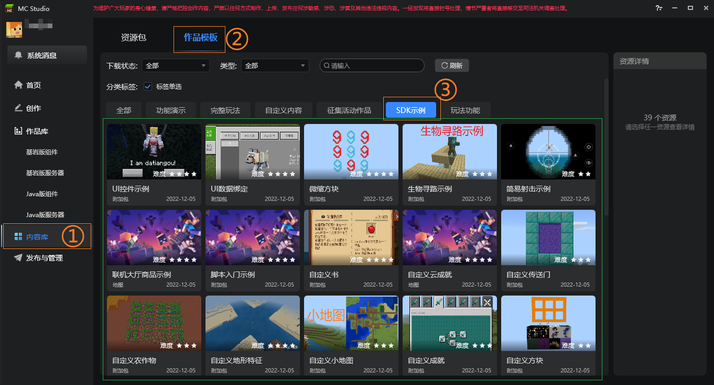

---
front:
hard: 入门
time: 分钟
---

# 示例简介

## 示例下载

下载地址：[示例Demo](https://g79.gdl.netease.com/3.3Demo.zip)。

从2.5版本开始，SDKDemo示例会同步上架到MC studio内容库→作品模板→勾选**SDK示例**标签，具体使用方法参考[内容库使用说明](../../15-资源管理/11-内容库.md)

## DemoMod

内容库的SDK示例标签下主要放置了下列ModSDK模组开发相关的示例模板。

* 脚本入门示例-TutorialMod

  新手入门必备，展示了如何使用聊天信息发放物品

* 简易射击示例-AwesomeMod

  进阶必备，实现了一个简单的射击玩法

* 自定义地形特征-CustomBiomesMod

  展示了[自定义维度](../15-自定义游戏内容/4-自定义维度/1-自定义维度.md)，[群系地貌](../15-自定义游戏内容/4-自定义维度/2-群系地貌.md)，[生物生成](../15-自定义游戏内容/4-自定义维度/3-生物生成.md)与[自定义特征](../15-自定义游戏内容/4-自定义维度/4-自定义特征.md)的基本用法

* 自定义方块-CustomBlocksMod

  展示了[自定义方块](../15-自定义游戏内容/2-自定义方块/0-自定义方块概述.md)模块的基本用法

* 自定义成就-CustomAchievementMod

  展示了[自定义成就系统](../15-自定义游戏内容/16-自定义成就系统.md)的基本用法

* 自定义书-CustomBookMod

  展示了[自定义书本](../15-自定义游戏内容/5-自定义书本/01-自定义基础书本.md)模块的基本用法

* 自定义农作物-CustomCropMod

  展示了[自定义农作物](../15-自定义游戏内容/2-自定义方块/3-特殊方块/3-自定义农作物方块.md)的基本用法

* 自定义状态效果-CustomEffectsMod

  展示了[自定义状态效果](../15-自定义游戏内容/7-自定义状态效果.md)的基本用法

* 自定义生物-CustomEntityMod

  展示了“ModSDK模组开发 - 自定义游戏内容 - 自定义生物”模块的基本用法

* 自定义熔炉-CustomFurnaceMod

  请配合[自定义熔炉Demo](../15-自定义游戏内容/2-自定义方块/a-自定义熔炉.md)食用

* 自定义物品-CustomItemsMod

  展示了“ModSDK模组开发 - 自定义游戏内容 - 自定义物品”模块的基本用法

* 自定义音乐-customMusicDemo

  展示了[自定义音乐](../15-自定义游戏内容/8-自定义音乐.md)的基本用法

* 自定义远程武器-CustomRangedWeaponMod

  展示了[自定义远程武器](../15-自定义游戏内容/6-自定义远程武器.md)的基本用法

* 自定义传送门-portalGateDemo

  请配合[自定义传送门DEMO](../15-自定义游戏内容/4-自定义维度/5-自定义传送门.md)食用

* UI控件示例-UIDemoMod

  展示了各种UI控件的基本用法，请配合[UI说明文档](../../18-界面与交互/30-UI说明文档.md)食用

- 网易版纸娃娃示例-NeteasePaperDollDemo

  该模组演示了[网易版纸娃娃](../../18-界面与交互/30-UI说明文档.md#NeteasePaperDoll)的功能。

- UI数据绑定-DataBindingMod

  展示了[UI数据绑定](../../18-界面与交互/70-UI数据绑定.md)的基本用法

* 修改原生UI界面示例-NativeUIDemoMod

  展示了如何修改原生UI界面，请配合[原生界面修改](../../18-界面与交互/61-原生界面修改文档.md)食用

* 联机大厅商品示例-LobbyGoodDemo

  展示了[联机大厅商品Mod文档](../../26-联机大厅/6-联机大厅商品2.0文档.md)的基本用法

* 自定义小地图-CustomMapMod

  展示了小地图的基本用法

* 虚拟世界示例-VirtualWorldDemo

  展示了虚拟世界的基本用法

* 微缩方块-MicroBlocksMod

  展示了[微缩模型](../15-自定义游戏内容/10-微缩方块.md)的基本用法

- 自定义附魔-EnchantDemo

  展示了[自定义附魔](../15-自定义游戏内容/11-自定义附魔文档.md)的基本用法

- 自定义盾牌-CustomShieldItemMod

  展示了[自定义盾牌](../15-自定义游戏内容/1-自定义物品/8-自定义盾牌.md)的基本用法

- 自定义方块网格体-ActorBlockGeometryMod

  展示了多方块合并及生成方块几何体模型的基本用法

* 虚拟世界动画示例-VirtualWorldAnimDemo

  展示了虚拟世界的动画接口基本用法

- 自定义云成就-CloudAchievementMod

  展示了[云成就](../../28-成就系统/云成就使用文档.md)的基本用法

- 微软粒子发射骨骼模型-NeteaseModelParticleDemo

  展示了[微软粒子发射骨骼模型](../../16-美术/9-特效/21-原版特效属性详细说明.md#发射骨骼模型)的基本用法

- 生物寻路示例-NavigationMod

  展示了如果通过ModApi控制生物的寻路模式

- 自定义流体-CustomLiquidMod

  展示了[自定义流体](../15-自定义游戏内容/2-自定义方块/3-特殊方块/5-自定义流体.md)

- 自定义实体模型材质-CustomEntityMaterialMod

  该模组演示了如何配置和使用自定义生物的自定义材质的功能。

- 自定义玩家模型材质-CustomPlayerMaterialMod

  该模组演示了如何配置和使用玩家自身（BB模型）的自定义材质的功能。

- 自定义骨骼模型材质-CustomSkeletonMaterialMod

  该模组演示了如何配置和使用骨骼模型的自定义材质的功能。

- 自定义中国版粒子特效材质-CustomNeteaseParticlesMod

  该模组演示了如何配置和使用网易版粒子特效的自定义材质的功能。

- 自定义后处理材质-CustomPostprocessMod

  该模组演示了如何配置和使用自定义后处理的功能。

- 手柄UI交互-GamepadModDemo

  展示了[手柄与UI交互](../../18-界面与交互/30-UI说明文档.md#手柄)的基本用法

- 自定义精灵蛋-CustomNBTEggMod

  该模组演示了如何使用NBT接口将生物信息保存至物品中，并在另一处生成相同实体的功能。

- 自定义指令-CustomCommandDemo

  该模组演示了[自定义指令](../15-自定义游戏内容/9-自定义指令.md)的功能。

## 资源制作

该文件夹下的资源请配合[开发指南——美术——模型和动作](../../16-美术/6-模型和动作/00-模型制作方案.md)食用