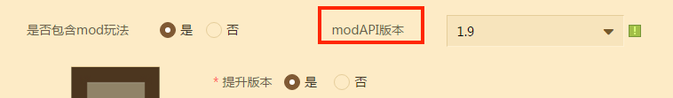
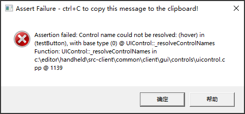
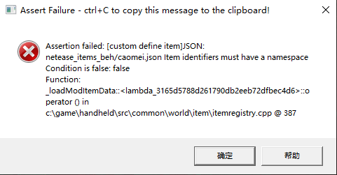

# Mod 开发BUG解决方案

## 开发打包问题

### SDK包加载不成功

可能的原因如下：

- 检查SDK包和mod的路径不能在中文路径下面

- 检查当前存档是否加载过其余mod，清理或者重新创建一份存档

- 检查mod的uuid是否和别的mod一样，每个mod中的uuid必须唯一

  生成uuid的方法：

  ```python
  import uuid
  uuid.uuid4()
  ```

  


### 加载多个mod，只有一个mod生效

- 每个mod在注册服务端、客户端的system的时候，是不是system名字一样？如果一样的话只会第一个注册成功的mod生效

  

- 检查一下多个mod的uuid是不是一样的（在resource和behavior文件夹的manifest.json里面）

- 检查一下多个mod中注册的物品、道具、方块、装备等东西的ID是不是有一样的


### 前一个mod卸载后，后一个mod加载不正常

请检查是否调用了UnListenForEvent、UnDefineEvent等清理注册事件的接口。如果没有调用，则mod卸载之后可能内存中还有残留数据，会影响到下一个安装的mod。


### 上传的包含mod玩法的地图，在本地玩都OK，但是在联机大厅玩却是原版的生存地图

上传的地图mod，压缩包下请严格只包含唯一一个一级目录。
比如，下面这样的就是正确的（只有一个一级目录，一级目录下面就是resource和behavior文件夹）


### 上架的地图mod只有地图生效了，mod没生效

- 请检查打包mod时，设定的modAPI版本号是否正确，是不是由于线上的APP版本已经不支持这个API版本导致mod没生效

  

- 请检查一下存档里面的*world_behavior_packs.json* 和 *world_resource_packs.json* 的内容，是否与behavior_packs和resource_packs的 *manifest.json* 的内容一致，只有保持一致，mod才会在地图中加载成功

  

  


  ### 更新了mod资源，下载到的mod还是旧版本

  每次更新了mod资源之后，要在mod的behavior和resource文件夹下面，更改 *pack_manifest.json* 的版本号，比如上个mod的version是[0, 0, 1]，那么这次mod的version就要是[0, 0, 2]。地图mod和组件mod如果有更新，都要改version才会触发更新

  

  

  ### 上传MOD，提示打包失败

  - 路径过深，目前mod资源最长的路径只能到150个字符，路径深度超过150个字符就会上传失败
  - 目录格式不对，一般上传的mod文件，zip文件下面要有唯一一个一级目录，然后在这个目录下面包含behavior和resource文件夹
  - mod的behavior文件夹下面的entities文件夹要有一个`__init__.py`文件
  - mod的python文件里面有语法错误
  - mod里面没有modMain.py

  

  ### **mod在联机大厅\网络游戏服上运行的时候，手机客户端的部分逻辑无法正常运行**

  如果开发的mod运行在联机大厅\网络游戏服上面的时候，客户端有一部分逻辑失效了，很有可能是是客户端线程里面import了包含服务端线程内容的模块，导致客户端线程不能正常工作

  

## 开发打包设置建议

### 1.地图mod *server.properties* 设置

地图mod请在存档中放置一个server.properties，这样在联机大厅玩这个地图mod，玩家每次进入都是server.properties文件中设置的游戏模式


请使用GetMinecraftEnum()，尽量避免硬编码

### 2.命名规则

namespace、自定义物品名称等尽量命名的独特一点，防止与别的mod冲突

### 3.不要使用中文文件名

mod里面不要有中文或乱码字符命名的文件（behavior文件夹和resource文件夹），否则会导致mod在游戏中加载失败

### 4.脚本编码格式

请在每个python文件的开头， 指定编码格式：`# -*- coding: utf-8 -*- -`，否则可能会导致import模块异常


## 开发包断言错误

### 索引

| 错误码        | 类别           | 简介                                  | 相关链接                                                     |
| ------------- | -------------- | ------------------------------------- | ------------------------------------------------------------ |
| [1001](#1001) | UI             | UI控件缺少type字段                    | [控件通用属性](../../18-界面与交互/30-UI说明文档.md#控件通用属性)        |
| [1002](#1002) | UI             | UI控件type属性错误                    | [控件通用属性](../../18-界面与交互/30-UI说明文档.md#控件通用属性)        |
| [1003](#1003) | UI             | UI控件controls内缺少特定子控件        | [按钮控件](../../18-界面与交互/30-UI说明文档.md#按钮)                    |
| [2001](#2001) | 自定义远程武器 | 自定义远程武器序列帧未找到对应texture | [自定义远程武器](../15-自定义游戏内容/6-自定义远程武器.md)  |
| [2002](#2002) | 自定义远程武器 | 自定义远程武器序列帧配置错误          | [自定义远程武器](../15-自定义游戏内容/6-自定义远程武器.md)  |
| [3001](#3001) | JSON           | JSON文件格式错误                      | 1.[JSON语法](https://minecraft-zh.gamepedia.com/JSON)  2.[使用vscode检查JSON格式](#使用vscode检查json文件格式) |
| [3002](#3002) | JSON           | JSON文件内容错误                      | [MC官方WIKI](https://minecraft-zh.gamepedia.com/基岩版实体组件文档)
| [4001](#4001)  | 自定义配方     | 配置的物品加载失败                    | [自定义物品](../15-自定义游戏内容/1-自定义物品/1-自定义基础物品.md) |
| [5001](#5001)  | 自定义物品     | 自定义物品ID错误                      | [自定义物品](../15-自定义游戏内容/1-自定义物品/1-自定义基础物品.md) |
|               |                |                                       |                                                              |

### <span id="1001"></span><span id="1001"></span>1001

##### 错误信息


Assertion failed: Type not specified (or @-base not found) for control: (***testPanel***) in namespace: (***limitedRespawnUI***) @ UIControlFactory::_createFromResolvedDef
Function: UIControlFactory::_createFromResolvedDef in c:\editor\handheld\src-client\common\client\gui\controls\uicontrolfactory.cpp @ 346

##### 参数描述

| 序号 | 参数                                   | 描述                     |
| ---- | -------------------------------------- | ------------------------ |
| 1    | for control: (***testPanel***)         | UI控件的名称             |
| 2    | in namespace: (***limitedRespawnUI***) | UI控件的命名空间namespce |

##### 解决方案

检查资源包下的ui文件，可搜索对应的命名空间namespace来定位文件，再通过控件名称来确定出错的控件，如本例出错文件内容如下：

```json
{
   "namespace" : "limitedRespawnUI",  # 命名空间namespace，可用于搜索
   "main" : {
      "controls" : [
         {
            "testPanel@limitedRespawnUI.somePanel" : {}  # 控件名称
         }
      ],
      "type" : "screen",
      ...
   },
   "somePanel" : {  # 由于被继承，名称被覆盖，所以并非这个名称
      "layer" : 1,
      "offset" : [ 0, 0 ],
      "size" : [ 100, 100 ],
      "visible" : true
      # 出错位置，缺少"type"字段，应添加 "type": "panel"
   }
}
```

### <span id="1002"></span>1002

##### 错误信息


Assertion failed: Type (***wrong***) not recognized for control: (***testPanel***) in namespace: (***test***) @ UIControlFactory::\_createFromResolvedDef
Function: UIControlFactory::\_createFromResolvedDef in c:\editor\handheld\src-client\common\client\gui\controls\uicontrolfactory.cpp @ 353

##### 参数描述

| 序号 | 参数                           | 描述                     |
| ---- | ------------------------------ | ------------------------ |
| 1    | Type (***wrong***)             | 错误的类型               |
| 2    | for control: (***testPanel***) | UI控件的名称             |
| 3    | in namespace: (***test***)     | UI控件的命名空间namespce |

##### 解决方案

检查资源包下的ui文件，可搜索对应的命名空间namespace来定位文件，再通过控件名称来确定出错的控件，如本例出错文件内容如下：

```json
{
   "namespace" : "test",  # 命名空间namespace，可用于搜索
   "main" : {
      "controls" : [
         {
            "testPanel@test.somePanel" : {}  # 控件名称
         }
      ],
      "type" : "screen",
      ...
   },
   "somePanel" : {  # 由于被继承，名称被覆盖，所以并非这个名称
      "layer" : 1,
      "offset" : [ 0, 0 ],
      "size" : [ 100, 100 ],
      "type" : "wrong",  # 出错位置，没有“wrong”类型的基础控件，这里应改为“panel”
      "visible" : true
   }
}
```

将上面文件的***wrong***改为***panel***即可。

附：支持的基础控件类型有：button, custom, dropdown, edit_box, factory, grid, image, input_panel, label, panel, screen, scrollbar_box, scroll_track, scroll_view, slider, slider_box, stack_panel, toggle, selection_wheel, combox, layout, joystick, stack_grid, rich_text, mul_lines, sixteen_nine_layout, anim_porecess_bar。

### <span id="1003"></span>1003

##### 错误信息



Assertion failed: Control name could not be resolved: (***hover***) in (***testButton***), with base type (***0***) @ UIControl::_resolveControlNames
Function: UIControl::_resolveControlNames in c:\editor\handheld\src-client\common\client\gui\controls\uicontrol.cpp @ 1139

##### 参数描述

| 序号 | 参数                     | 描述                                |
| ---- | ------------------------ | ----------------------------------- |
| 1    | (***hover***)            | 缺少的子control名称                 |
| 2    | in (***testButton***)    | UI控件名称                          |
| 3    | with base type (***0***) | [UI控件的基本类型](#控件基础类型表) |

##### 解决方案

检查资源包下的ui文件，可搜索对应的控件名称来确定出错的控件，如本例出错文件内容如下：

```json
{
   "namespace" : "test",
   "main@common.base_screen": {
      "controls": [
         {
            "testButton@test.someButton": {}  # 控件名称，可用于搜索
         }
      ]
   },
   "someButton@common.button" : {  # 由于被继承，名称被覆盖，所以并非这个名称
      "$default_texture" : "textures/ui/a",
      "$hover_texture" : "textures/ui/b",
      "anchor_from" : "top_left",
      "anchor_to" : "top_left",
      "controls" : [
         {"default" : {"layer" : 2,"texture" : "$default_texture","type" : "image"}},
         {"pressed" : {"layer" : 2,"texture" : "$hover_texture","type" : "image"}}
         # 出错位置，缺少"hover"的定义
      ],
      "layer" : 1,
      "offset" : [ "0%+0px", "0%+0px" ],
      "size" : [ "100%+0px", "100%+0px" ],
      "visible" : true
   }
}
```

在上述文件出错位置添加{"hover" : {"layer" : 2,"texture" : "$hover_texture","type" : "image"}}即可。

<span id="控件基础类型表"></span>附：UI控件基础类型与对应的数字序号如下表：

| 序号 | 控件基础类型 | 序号 | 控件基础类型    | 序号 | 控件基础类型        |
| ---- | ------------ | ---- | --------------- | ---- | ------------------- |
| 0    | button       | 10   | screen          | 20   | layout              |
| 1    | custom       | 11   | scrollbar_box   | 21   | stack_grid          |
| 2    | dropdown     | 12   | scroll_track    | 22   | joystick            |
| 3    | edit_box     | 13   | scroll_view     | 23   | rich_text           |
| 4    | factory      | 14   | selection_wheel | 24   | sixteen_nine_layout |
| 5    | grid         | 15   | slider          | 25   | mul_lines           |
| 6    | image        | 16   | slider_box      | 26   | anim_porecess_bar   |
| 7    | input_panel  | 17   | stack_panel     |      |                     |
| 8    | label        | 18   | toggle          |      |                     |
| 9    | panel        | 19   | combox          |      |                     |

### <span id="2001"></span>2001

##### 错误信息


Assertion failed: Can not find texture (***customrangedweapon:bow_frame***) in (***item_texture.json***) for custom item (***customrangedweapon:bow***)
Condition is false: false
Function: CustomRangedWeaponItem::initClient in c:\editor\handheld\src-plugins\common\world\item\customrangedweaponitem.cpp @ 72

##### 参数描述

| 序号 | 参数                                         | 描述                               |
| ---- | -------------------------------------------- | ---------------------------------- |
| 1    | texture (***customrangedweapon:bow_frame***) | 自定义远程武器的texture_name配置值 |
| 2    | (***item_texture.json***)                    | 图片列表所在文件                   |
| 3    | custom item (***customrangedweapon:bow***)   | 自定义远程武器的identifier         |

##### 解决方案

检查资源包netease_items_res目录下对应自定义远程武器的json文件中的***texture_name***字段，本例中texture_name为customrangedweapon:bow_frame，json文件内容如下：

```json
{
  "format_version": "1.10",
  "minecraft:item": {
    "description": {
      "identifier": "customrangedweapon:bow",  # 自定义远程武器的identifier
      "category": "Equipment"
    },
    "components": {
      "minecraft:icon": "customrangedweapon:bow",  
      "netease:frame_animation": {
        "frame_count": 4,
        "texture_name": "customrangedweapon:bow_frame",  # 对应item_texture.json中的命名
        "animate_in_toolbar": true
      }
    }
  }
}
```

检查资源包textures下item_texture.json文件中是否存在***customrangedweapon:bow_frame***的textures定义。本例文件内容如下。

```json
{
  "resource_pack_name": "vanilla",
  "texture_name": "atlas.items",
  "texture_data": {
    "customrangedweapon:bow": {
      "textures": [
        "textures/items/customitems_ranged_weapon_0"
      ]
    },
    # 错误位置，需要在此处添加customrangedweapon:bow_frame的textures定义
    ...
  }
}
```

在上述文件中错误位置添加以下内容即可。

```json
"customrangedweapon:bow_frame": {
  "textures": [
    "textures/items/customitems_ranged_weapon_0",
    "textures/items/customitems_ranged_weapon_1",
    "textures/items/customitems_ranged_weapon_2",
    "textures/items/customitems_ranged_weapon_3"
  ]
}
```

### <span id="2002"></span>2002

##### 错误信息


Assertion failed: The frame_count (***4***) of custom item (***customrangedweapon:bow***) should be (***2***) specificed in (***item_texture.json***) by (***customrangedweapon:bow***) Condition is false: textureCount >= m_frameCount Function: CustomRangedWeaponItem::initClient in c:\editor\handheld\src\plugins\common\world\item\customrangedweaponitem.cpp @ 71

##### 参数描述

| 序号 | 参数                                       | 描述                                                    |
| ---- | ------------------------------------------ | ------------------------------------------------------- |
| 1    | frame_count (***4***)                      | 自定义远程武器的frame_count配置值                       |
| 2    | custom item (***customrangedweapon:bow***) | 自定义远程武器的identifier                              |
| 3    | should be (***2***)                        | 下述item_texture.json中列出的序列帧图片数量             |
| 4    | specificed in (***item_texture.json***)    | 图片列表所在文件                                        |
| 5    | by (***customrangedweapon:bow***)          | 上述item_texture.json中指定给本自定义远程武器的序列帧id |

##### 解决方案

检查资源包netease_items_res目录下对应自定义远程武器的json文件中的***frame_count***字段，本例中frame_count为3，json文件内容如下：

```json
{
  "format_version": "1.10",
  "minecraft:item": {
    "description": {
      "identifier": "customrangedweapon:bow",  # 自定义远程武器的identifier
      "category": "Equipment"
    },
    "components": {
      "minecraft:icon": "customrangedweapon:bow",  
      "netease:frame_animation": {
        "frame_count": 4,  # 自定义远程武器的frame_count配置值
        "texture_name": "customrangedweapon:bow_frame",  # 对应item_texture.json中的命名
        "animate_in_toolbar": true
      }
    }
  }
}
```

检查资源包textures下item_texture.json文件中***customrangedweapon:bow_frame***对应的***textures***数量，本例中该数量为2，文件内容如下。（***customrangedweapon:bow_frame***对应上述自定义远程武器的json文件中***texture_name***字段内容）

```json
{
  "resource_pack_name": "vanilla",
  "texture_name": "atlas.items",
  "texture_data": {
    "customrangedweapon:bow_frame": {
      "textures": [
        "textures/items/customitems_ranged_weapon_0",  # 这里只配置了2个texture，与上述frame_count=4不符，导致出错
        "textures/items/customitems_ranged_weapon_1"
      ]
    }
  }
}
```

修改第一个文件中的frame_count为2或者在第二个文件中添加两个texture即可修复错误。

### <span id="3001"></span>3001

##### 错误信息


Assertion failed: JSON: ***textures/item_texture.json*** has an error: * Line ***5***, Column ***25***  Syntax error: value, object or array expected.Condition is false: false
Function: TextureAtlas::loadMetaFile in c:\game\handheld\src-client\common\client\renderer\texture\textureatlas.cpp @ 583

##### 参数描述

| 序号 | 参数                             | 描述                   |
| ---- | -------------------------------- | ---------------------- |
| 1    | ***textures/item_texture.json*** | 存在错误格式的JSON文件 |
| 2    | Line ***5***                     | 文件中错误所在行       |
| 3    | Column ***25***                  | 文件中错误所在列       |

##### 解决方案

在自己的mod目录下查找上述格式错误的文件，检查其内容是否存在格式错误

<span id="使用vscode检查json文件格式"></span>附：使用vscode检查JSON文件格式

使用vscode打开对应的json文件，vscode会使用红色波浪线标注出错误位置。


### <span id="3002"></span>3002

##### 错误信息


Assertion failed: node parse failed: ***minecraft:map_color*** Condition is false: ret Function: JsonUtil::JsonSchemaObjectNode<class JsonUtil::JsonParseState<class JsonUtil::EmptyClass,struct BlockDefinition>,struct BlockDefinition>::_validate in h:\\mceditor\\branches\\editor_1.21_20210121\\handheld\\src\\common\\util\\jsonutils.h @ 1008

##### 参数描述

| 序号 | 参数                      | 描述           |
| ---- | ------------------------- | -------------- |
| 1    | ***minecraft:map_color*** | 内容错误的字段 |

##### 解决方案

在自己的mod目录下搜索上述存在错误内容的字段，检查是否与原生内容中对应字段内容相符。如上述 ***minecraft:map_color***。建议在[MC官方WIKI](https://minecraft-zh.gamepedia.com/基岩版实体组件文档)上搜索此关键字获得对应的描述信息。

<span id="使用vscode检查json文件格式"></span>附：参考MC中的原生内容

使用vscode打开游戏目录下的“data”文件夹，一般使用MC Studio时，会在以下目录存在一个完整的游戏端。

```
C:\MCStudioDownload\game\MinecraftPE_Netease\1.21.0.119233
```

其中“1.21.0.119233”为版本号，可能发生变化。因此我们需要使用vscode（或其他支持全局搜索的工具）打开“C:\MCStudioDownload\game\MinecraftPE_Netease\1.21.0.119233\data”目录，全局搜索希望参考的字段，**注意**：部分字段在这里是找不到的，但实际也能使用，一般以[MC官方WIKI](https://minecraft-zh.gamepedia.com/基岩版实体组件文档)为准。

### <span id="4001"></span>4001

##### 错误信息


Assertion failed: can not make the recipe, item missing: ***mymod:item1*** Condition is false: false Function: Recipes::_loadIngredientFromJson in h:\\mceditor\\branches\\editor_1.21_20210121\\handheld\\src\\common\\world\\item\\crafting\\recipes.cpp @ 984

##### 参数描述

| 序号 | 参数              | 描述           |
| ---- | ----------------- | -------------- |
| 1    | ***mymod:item1*** | 缺少的物品定义 |

##### 解决方案

这种错误是未找到对应的物品定义导致的。通常原因有两种：1.配方中填写的id错误；2.对应自定义物品的json文件内容错误，导致未注册成功。第一种情况，可在自己的mod中搜索该名称检查是否正确；如果是自定义物品json文件内容有误，则一般还会弹出自定义物品相关的错误弹窗，再按具体的信息处理即可。

### <span id="5001"></span>5001

##### 错误信息



Assertion failed: [custom define item]JSON: ***netease_items_beh/caomei.json*** Item identifiers must have a namespace Condition is false: false Function: _loadModItemData::<lambda_acd29d58b6c79a1277582817d332e35f>::operator () in h:\\mceditor\\branches\\editor_1.21_20210121\\handheld\\src\\common\\world\\item\\itemregistry.cpp @ 387

##### 参数描述

| 序号 | 参数                                | 描述               |
| ---- | ----------------------------------- | ------------------ |
| 1    | ***netease_items_beh/caomei.json*** | 存在错误内容的文件 |

##### 解决方案

在mod中找到上述错误文件，检查identifier字段是否错误。

例：

```json
{
    "format_version": "1.10",
    "minecraft:item": {
        "description": {
            "category": "Construction",
            "identifier": "caomei",  # 错误位置，缺少命名空间，应该改为mymod:caomei
            "register_to_create_menu": true
        },
        "components": {
            "minecraft:max_stack_size": 64
        }
    }
}
```

上述文件的"identifier"字段缺少命名空间，命名空间即用“:”隔开的前半段，自行添加即可。（命名空间名可自定义）


