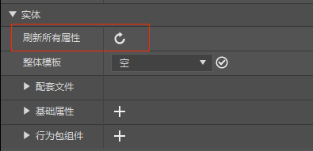
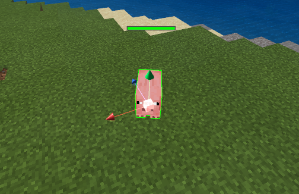

# 实体预设

## 基础介绍

EntityPreset（实体预设）是一类绑定MC的某类实体的特殊预设，通过它可以很方便的使用零件进行一些实体相关逻辑的编程。

实体预设除了预设所具有的基本属性外，额外提供一个"关联实体ID"的属性，可将实体预设和某个identifier的实体绑定起来，如"猪"（"minecraft:pig"）。此时，下方会自动显示所关联的实体的json文件内容，但当关联的文件不在个人存档内时，编辑是无效的（如MC原生的资源）。

注意，在修改所关联实体的json文件内容后，若实际表现与显示属性不符，需要点击刷新所有属性按钮进行更新。或尝试重启编辑器。

此时可从资源管理器或预设库中拖到场景内进行实例化，就可以在地图上看到具体的实体了。

特别注意：实体预设绑定实体ID后，所生成的所有该ID的实体，均会同时绑定一个实体预设，具备预设所具有的所有属性。

当你使用新建文件向导创建实体预设的时候，会附带创建一个实体配置，你也可以先创建一个配置，再通过配置来创建与之绑定的实体预设。更多关于配置的信息请详见[配置](../../../15-自定义游戏内容/0-配置.md)。
## 设置属性
> 此部分内容在我的世界中国版2.1版本上线后才能在正式游戏环境生效。

上面介绍了实体预设的通用和实体(关联实体ID的json文件内容)两个属性栏,除此之外，我们还提供了数十个无法在json文件直接进行定义和修改的实体属性，如实体的重力因子和状态效果等，根据功能存放在多个属性栏中，如图所示：

> 设置实体属性的本质是`将之前在代码里调用API才能设置的属性挪到属性面板进行可视化编辑，并在实体初始化时根据属性面板的设置数据调用对应的接口并生效。`比如物理这一栏的重力因子属性，实际是调用实体对象EntityObject下的SetGravity接口。

实体目前具有以下几种设置属性：

在我的世界中，实体是一个范围非常广的定义，不管是掉落物，生物还是抛射物都可以称之为实体，但下面列出的某些属性，实际上只对部分类型的实体有效，例如，生命值实际上只针对生物有效，对火球、弓箭等实体设置生命值没有意义，也不会生效，请开发者在使用下列属性时，注意甄别自己所选择的实体是否支持设置该属性。

### 实体属性：同时设置实体的几种基础属性的当前值和最大值。

| 属性         | 描述                                                         |
| ------------ | ------------------------------------------------------------ |
| 生命值       | 等同于实体对象EntityObject下的<a href="../../../../../mcguide/20-玩法开发/14-预设玩法编程/13-PresetAPI/预设对象/预设/实体对象EntityObject.html#sethealth" rel="noopenner">SetHealth</a>和<a href="../../../../../mcguide/20-玩法开发/14-预设玩法编程/13-PresetAPI/预设对象/预设/实体对象EntityObject.html#setmaxhealth" rel="noopenner">SetMaxHealth</a>接口，设置实体的最大和当前生命值。 |
| 速度         | 等同于实体对象EntityObject下的<a href="../../../../../mcguide/20-玩法开发/14-预设玩法编程/13-PresetAPI/预设对象/预设/实体对象EntityObject.html#setspeed" rel="noopenner">SetSpeed</a>和<a href="../../../../../mcguide/20-玩法开发/14-预设玩法编程/13-PresetAPI/预设对象/预设/实体对象EntityObject.html#setmaxspeed" rel="noopenner">SetMaxSpeed</a>接口，设置实体的最大和当前速度。 |
| 攻击力       | 等同于实体对象EntityObject下的<a href="../../../../../mcguide/20-玩法开发/14-预设玩法编程/13-PresetAPI/预设对象/预设/实体对象EntityObject.html#setdamage" rel="noopenner">SetDamage</a>和<a href="../../../../../mcguide/20-玩法开发/14-预设玩法编程/13-PresetAPI/预设对象/预设/实体对象EntityObject.html#setmaxdamage" rel="noopenner">SetMaxDamage</a>接口，设置实体的最大和当前攻击力。 |
| 岩浆里的移速 | 等同于实体对象EntityObject下的<a href="../../../../../mcguide/20-玩法开发/14-预设玩法编程/13-PresetAPI/预设对象/预设/实体对象EntityObject.html#setlavaspeed" rel="noopenner">SetLavaSpeed</a>和<a href="../../../../../mcguide/20-玩法开发/14-预设玩法编程/13-PresetAPI/预设对象/预设/实体对象EntityObject.html#setmaxlavaspeed" rel="noopenner">SetMaxLavaSpeed</a>接口，设置实体在岩浆里的最大和当前移速。 |

> ​	 注意：此处的设置属性会先设置最大值，再设置当前值，如给自定义牛设置生命值为10，则其最大生命值为10，当前生命值也为10。

### 物理：设置实体物理相关属性值，如重力因子、是否可推动等

| 属性       | 描述                                                         |
| ---------- | ------------------------------------------------------------ |
| 重力因子   | 等同于实体对象EntityObject下的<a href="../../../../../mcguide/20-玩法开发/14-预设玩法编程/13-PresetAPI/预设对象/预设/实体对象EntityObject.html#setgravity" rel="noopenner"> SetGravity</a>接口，设置实体的初始重力因子，该值为负数。 |
| 是否可推动 | 等同于实体对象EntityObject下的<a href="../../../../../mcguide/20-玩法开发/14-预设玩法编程/13-PresetAPI/预设对象/预设/实体对象EntityObject.html#setpushable" rel="noopenner">SetPushable</a>接口，设置实体是否可被推动，默认为True。 |

### 氧气：设置实体氧气相关的属性值，如氧气储备值和恢复氧气时间等

| 属性             | 描述                                                         |
| ---------------- | ------------------------------------------------------------ |
| 氧气储备值       | 等同于实体对象EntityObject下的<a href="../../../../../mcguide/20-玩法开发/14-预设玩法编程/13-PresetAPI/预设对象/预设/实体对象EntityObject.html#setcurrentairsupply" rel="noopenner">SetCurrentAirSupply</a>和<a href="../../../../../mcguide/20-玩法开发/14-预设玩法编程/13-PresetAPI/预设对象/预设/实体对象EntityObject.html#setmaxairsupply" rel="noopenner">SetMaxAirSupply</a>接口，同时设置实体的氧气储备值的当前值和最大值。 |
| 恢复最大氧气时间 | 等同于实体对象EntityObject下的<a href="../../../../../mcguide/20-玩法开发/14-预设玩法编程/13-PresetAPI/预设对象/预设/实体对象EntityObject.html#setrecovertotalairsupplytime" rel="noopenner">SetRecoverTotalAirSupplyTime</a>接口，设置实体恢复最大氧气量的时间，单位秒。 |

### 状态与物品：设置实体的初始状态效果和物品

| 属性         | 描述                                                         |
| ------------ | ------------------------------------------------------------ |
| 添加状态效果 | 等同于实体对象EntityObject下的<a href="../../../../../mcguide/20-玩法开发/14-预设玩法编程/13-PresetAPI/预设对象/预设/实体对象EntityObject.html#addeffect" rel="noopenner">AddEffect</a>接口，为实体添加指定的初始的状态效果。 |
| 生物物品     | 等同于实体对象EntityObject下的<a href="../../../../../mcguide/20-玩法开发/14-预设玩法编程/13-PresetAPI/预设对象/预设/实体对象EntityObject.html#setitem" rel="noopenner">SetItem</a>接口，为实体设置初始的物品。 |

### 行为属性：设置实体的行为逻辑属性值，如是否屏蔽原始AI，是否免疫伤害等

| 属性         | 描述                                                         |
| ------------ | ------------------------------------------------------------ |
| 是否免疫伤害 | 等同于实体对象EntityObject下的<a href="../../../../../mcguide/20-玩法开发/14-预设玩法编程/13-PresetAPI/预设对象/预设/实体对象EntityObject.html#setimmunedamage" rel="noopenner">SetImmuneDamage</a>接口，设置实体是否免疫伤害，该属性存档。 |
| 保留原生AI   | 等同于实体对象EntityObject下的<a href="../../../../../mcguide/20-玩法开发/14-预设玩法编程/13-PresetAPI/预设对象/预设/实体对象EntityObject.html#setblockcontrolai" rel="noopenner">SetBlockControlAi</a>接口，设置是否保留实体原生AI，屏蔽后实体无法移动，不受重力影响不会被推动。 |
| 是否持久化   | 等同于实体对象EntityObject下的<a href="../../../../../mcguide/20-玩法开发/14-预设玩法编程/13-PresetAPI/预设对象/预设/实体对象EntityObject.html#setpersistence" rel="noopenner">SetPersistence</a>接口，设置实体是否会在卸载区块和退出游戏时存档，默认为True。 |

### 渲染设置：设置实体的渲染与显示属性，如是否渲染实体等

| 属性         | 描述                                                         |
| ------------ | ------------------------------------------------------------ |
| 关闭实体渲染 | 等同于实体对象EntityObject下的<a href="../../../../../mcguide/20-玩法开发/14-预设玩法编程/13-PresetAPI/预设对象/预设/实体对象EntityObject.html#setnotrender" rel="noopenner">SetNotRender</a>接口，设置是否关闭实体渲染，默认为False。 |

