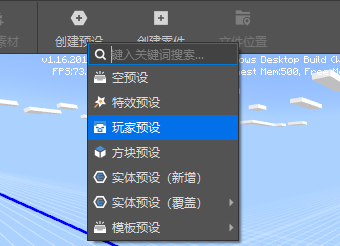
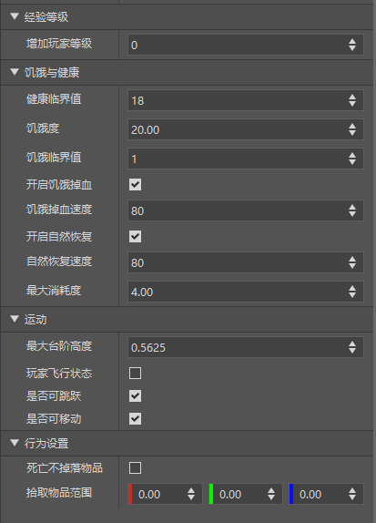

# 玩家预设

## 基础介绍

PlayerPreset（玩家预设）是一类特殊的实体预设，玩家预设与玩家实体进行绑定。

每个AddOn（编辑器作品）只允许创建一个玩家预设。

在预设编辑器，通过菜单栏=>创建预设=>玩家预设我们可以创建一个玩家预设。

如果玩家预设选项已经灰化，说明你的组件内已经存在一个玩家预设。

通过玩家预设，我们可以给玩家赋予一些炫酷的功能。

> 在编辑器保存时，玩家预设的实例不会保存在预设存档中，如果需要修改，请在预设编辑器中直接修改玩家预设

## 挂接特效

我们把刚才创建的变换动画特效挂接到玩家预设身上，回到关卡编辑器，将变换动画零件的关键帧属性按下图进行修改。

修改过后，变换动画零件的效果变成了特效在前两秒扩大到原来的5倍，后两秒恢复为原来的大小。

点击运行，进入游戏后，切换视角可以看到，这个特效已经挂接在玩家身上，并呈现不断缩放的效果。

## 设置属性
> 此部分内容在我的世界中国版2.1版本上线后才能在正式游戏环境生效。

玩家预设除了通用的属性之外，还提供了多种属性的设置，这些属性会在玩家被初始化时设置生效，如设置玩家的经验等级、饥饿度与健康值等等，根据功能存放在多个属性栏中，如图所示：

> 设置玩家属性的本质是`将之前在代码里调用API才能设置的属性挪到属性面板进行可视化编辑，并在玩家初始化时根据属性面板的设置数据调用对应的接口并生效。`比如经验等级这一分栏内的增加等级属性，实际是调用预设的AddPlayerLevel接口。

玩家预设目前具有以下几种设置属性：
### 经验等级：设置玩家的等级相关属性

| 属性         | 描述                                                         |
| ------------ | ------------------------------------------------------------ |
| 增加玩家等级 | 等同于玩家对象PlayerObject下的<a href="../../../../../mcguide/20-玩法开发/14-预设玩法编程/13-PresetAPI/预设对象/预设/玩家对象PlayerObject.html#addlevel" rel="noopenner">AddLevel</a>接口，修改玩家等级，可为负数。|

### 饥饿与健康：设置玩家的饥饿度和健康值相关属性

| 属性         | 描述                                                         |
| ------------ | ------------------------------------------------------------ |
| 健康临界值   | 等同于玩家对象PlayerObject下的<a href="../../../../../mcguide/20-玩法开发/14-预设玩法编程/13-PresetAPI/预设对象/预设/玩家对象PlayerObject.html#sethealthlevel" rel="noopenner">SetHealthLevel</a>接口，设置设置玩家健康临界值，当饥饿值大于等于健康临界值时会自动恢复血量，开启饥饿值且开启自然恢复时有效，原版默认值为18 |
| 饥饿度       | 等同于玩家对象PlayerObject下的<a href="../../../../../mcguide/20-玩法开发/14-预设玩法编程/13-PresetAPI/预设对象/预设/玩家对象PlayerObject.html#sethunger" rel="noopenner">SetHunger</a>接口，设置玩家饥饿度 |
| 饥饿临界值   | 等同于玩家对象PlayerObject下的<a href="../../../../../mcguide/20-玩法开发/14-预设玩法编程/13-PresetAPI/预设对象/预设/玩家对象PlayerObject.html#setstarvelevel" rel="noopenner">SetStarveLevel</a>接口，设置玩家饥饿临界值，当饥饿值小于饥饿临界值时会自动扣除血量，开启饥饿值且开启饥饿掉血时有效。原版默认值为1 |
| 开启饥饿掉血 | 等同于玩家对象PlayerObject下的<a href="../../../../../mcguide/20-玩法开发/14-预设玩法编程/13-PresetAPI/预设对象/预设/玩家对象PlayerObject.html#setnaturalstarve" rel="noopenner">SetNaturalStarve</a>接口，设置是否开启玩家饥饿掉血，当饥饿值小于饥饿临界值时会自动扣除血量，开启饥饿值且开启饥饿掉血时有效.原版默认开启 |
| 饥饿掉血速度 | 等同于玩家对象PlayerObject下的<a href="../../../../../mcguide/20-玩法开发/14-预设玩法编程/13-PresetAPI/预设对象/预设/玩家对象PlayerObject.html#setstarvetick" rel="noopenner">SetStarveTick</a>接口，设置玩家饥饿掉血速度，当饥饿值小于饥饿临界值时会自动扣除血量，开启饥饿值且开启饥饿掉血时有效 |
| 开启自然恢复 | 等同于玩家对象PlayerObject下的<a href="../../../../../mcguide/20-玩法开发/14-预设玩法编程/13-PresetAPI/预设对象/预设/玩家对象PlayerObject.html#setnaturalregen" rel="noopenner">SetNaturalRegen</a>接口，设置是否开启玩家自然恢复 |
| 自然恢复速度 | 等同于玩家对象PlayerObject下的<a href="../../../../../mcguide/20-玩法开发/14-预设玩法编程/13-PresetAPI/预设对象/预设/玩家对象PlayerObject.html#sethealthtick" rel="noopenner">SetHealthTick</a>接口，设置玩家自然恢复速度 |
| 最大消耗度   | 等同于玩家对象PlayerObject下的<a href="../../../../../mcguide/20-玩法开发/14-预设玩法编程/13-PresetAPI/预设对象/预设/玩家对象PlayerObject.html#setmaxexhaustionvalue" rel="noopenner">SetMaxExhaustionValue</a>接口，设置玩家最大消耗度(maxExhaustion) |

### 运动：设置玩家运动相关的属性

| 属性         | 描述                                                         |
| ------------ | ------------------------------------------------------------ |
| 最大台阶高度 | 等同于玩家对象PlayerObject下的<a href="../../../../../mcguide/20-玩法开发/14-预设玩法编程/13-PresetAPI/预设对象/预设/玩家对象PlayerObject.html#setstepheight" rel="noopenner">SetStepHeight</a>接口，设置玩家前进非跳跃状态下能上的最大台阶高度, 默认值为0.5625，1的话表示能上一个台阶。 |
| 玩家飞行状态 | 等同于玩家对象PlayerObject下的<a href="../../../../../mcguide/20-玩法开发/14-预设玩法编程/13-PresetAPI/预设对象/预设/玩家对象PlayerObject.html#changeflystate" rel="noopenner">ChangeFlyState</a>接口，勾选则给予飞行能力并进入飞行状态，不勾选则进入非飞行状态。 |
| 是否可跳跃   | 等同于玩家对象PlayerObject下的<a href="../../../../../mcguide/20-玩法开发/14-预设玩法编程/13-PresetAPI/预设对象/预设/玩家对象PlayerObject.html#setjumpable" rel="noopenner">SetJumpable</a>接口，设置玩家是否可跳跃 |
| 是否可移动   | 等同于玩家对象PlayerObject下的<a href="../../../../../mcguide/20-玩法开发/14-预设玩法编程/13-PresetAPI/预设对象/预设/玩家对象PlayerObject.html#setmovable" rel="noopenner">SetMovable</a>接口，设置玩家是否可移动 |

### 行为设置：设置玩家行为逻辑相关的属性

| 属性           | 描述                                                         |
| -------------- | ------------------------------------------------------------ |
| 死亡不掉落物品 | 等同于玩家对象PlayerObject下的<a href="../../../../../mcguide/20-玩法开发/14-预设玩法编程/13-PresetAPI/预设对象/预设/玩家对象PlayerObject.html#enablekeepinventory" rel="noopenner">EnableKeepInventory</a>接口，设置玩家死亡不掉落物品 |
| 拾取物品范围   | 等同于玩家对象PlayerObject下的<a href="../../../../../mcguide/20-玩法开发/14-预设玩法编程/13-PresetAPI/预设对象/预设/玩家对象PlayerObject.html#setpickuparea" rel="noopenner">SetPickUpArea</a>接口，设置玩家的拾取物品范围 |

### 渲染设置

| 属性           | 描述                                                         |
| -------------- | ------------------------------------------------------------ |
| 原版自定义皮肤 | 等同于玩家对象PlayerObject下的<a href="../../../../../mcguide/20-玩法开发/14-预设玩法编程/13-PresetAPI/预设对象/预设/玩家对象PlayerObject.html#setskin" rel="noopenner">SetSkin</a>接口，更换玩家原版模型的自定义皮肤，会覆盖原有皮肤，但会被骨骼模型覆盖。 |
