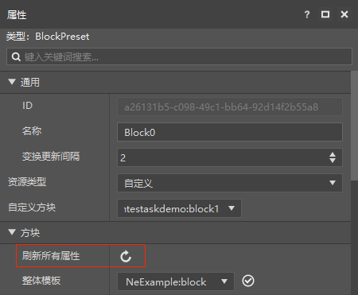
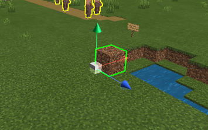

# 方块预设

BlockPreset（方块预设）可与某个位置的方块绑定起来，然后通过方块预设进行一些与方块相关的编程，如利用预设的生命周期在特定时刻摧毁指定位置的方块等，一般需要配合一个合适的零件实现。

在编辑器中新建方块预设，选中该预设文件对其进行编辑时，除了预设的公共属性外，可额外指定方块预设所绑定的方块的类型，支持原生的方块类型与存档内的自定义方块两类。与实体预设不同的是：若方块预设选择"泥土"进行绑定，也**只会**绑定到使用此方块预设生成的那些泥土方块上，而**不会**绑定到直接生成或已存在地图上的那些泥土方块上。

注意：如果自定义方块内容有更新，需要在自定义方块属性中点击刷新所有属性。对自定义方块的编辑可参考[配置](../../../15-自定义游戏内容/0-配置.md)。

设置好方块预设的属性后，即可将方块预设拖拽至场景中达到在指定位置放置特定方块的目的了。这样一来，在启动开发包进行测试时，就会发现对应的位置放置了一个指定的方块。

如果需要添加一些自定义的逻辑，可制作零件，或使用编辑器内置的一些零件，将其挂接到方块预设预设上即可。

