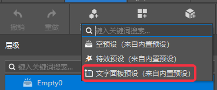
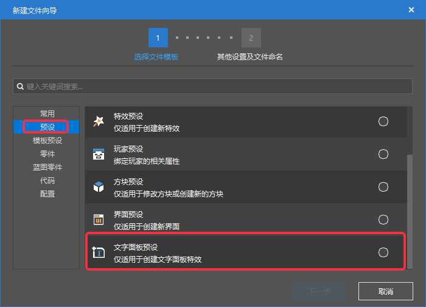
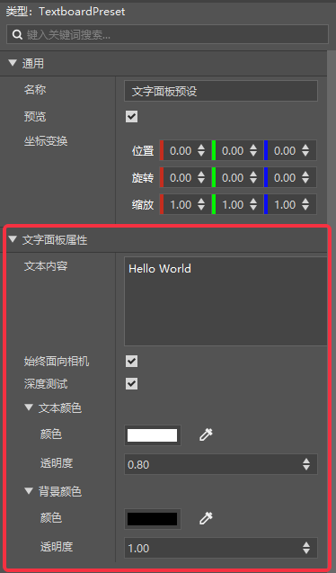
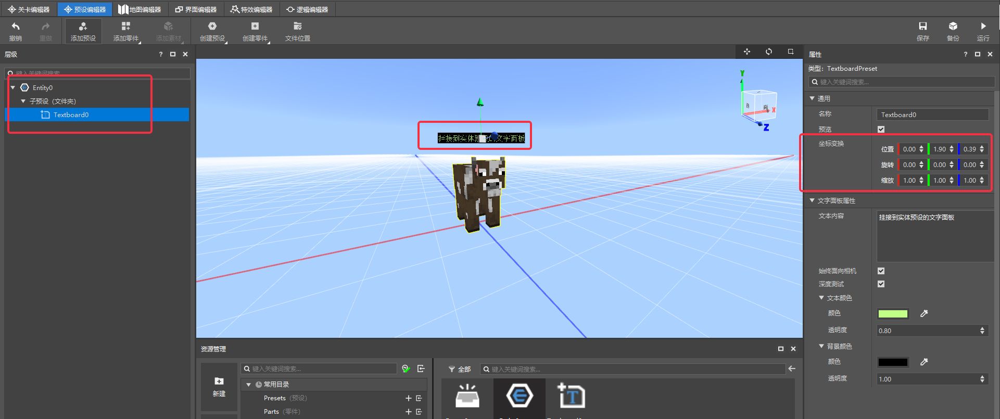

# 文字面板预设

> 目前仅在开发测试中生效，正式服预计在2.2版本上线，请开发者合理安排开发节奏。

## 基础介绍

TextBoardPreset（文字面板预设）是一类绑定**文字面板**的特殊预设，目的是能够快速创建、编辑和使用文字面板。

> 对于文字面板的概念，开发者可以参阅为[文字面板的定义](../../../../20-玩法开发/10-基本概念/1-我的世界基础概念.md#文字面板)以及<a href="../../../../../mcguide/20-玩法开发/14-预设玩法编程/13-PresetAPI/预设对象/预设/文字面板对象TextboardObject.html" rel="noopenner"> 文字面板预设相关接口 </a>

## 创建与添加
我们分别提供了内置文字面板预设和可供创建的普通文字面板预设。

### 添加内置文字面板预设
内置文字面板预设无需创建，即可使用，通过菜单栏=>添加预设=>文字面板预设（来自内置预设）进行添加，如下图所示。

### 创建普通文字面板预设

普通文字面板预设不同于内置的预设，开发者需要通过新建文件向导=→预设分页=→找到文字面板预设=→创建，如下图所示

## 文字面板属性
文字面板预设除了预设所具有的基本属性外，额外提供了文字面板特有的属性，如下图所示

| 属性 | 说明 |
| :--- | :--- |
| 文本内容| 文字面板上所显示的文字内容，支持[样式代码](https://zh.minecraft.wiki/w/%E6%A0%B7%E5%BC%8F%E4%BB%A3%E7%A0%81)|
|始终面向相机| 默认开启，勾选后文字面板会随着相机移动而改变朝向，始终保持正面朝向相机 |
| 深度测试 | 默认开启，勾选后文字面板会按照正常的前后顺序进行遮挡或显示 |
| 文本颜色 | 文字面板上文本内容的颜色 |
| 文本透明度 | 文字面板上文本内容的透明度，范围[0,1]，值越小越透明。 |
| 背景颜色 | 文字面板自身的颜色。 |
| 背景透明度 | 文字面板自身的透明度，范围[0,1]，值越小越透明。 |

## 挂接实体与玩家
文字面板预设既可以直接放置到世界的任意坐标位置，也可以绑定到实体或者玩家的相对位置，我们只需要将文字面板预设挂接到实体或玩家预设下，相比未挂接的情况，我可以看到实体和玩家预设下的文字面板预设多出了一栏坐标变换属性，此时调整这里的属性就是调整相对于父级预设的相对位置，如下图所示。

## 操作示例
这里我们做一个基础的案例演示：

功能需求：
1. 在世界坐标（0，65，0）放置一个文字面板，内容为“你好，我的世界”
2. 为一个牛的实体预设挂接一个文字面板，显示内容“我是一头牛”。

实现步骤：
1. 首先对于第一个功能，我们直接在关卡编辑器将预设库中内置的文字面板预设拖动到场景舞台中，并修改其坐标为（0，65，0），如下图所示

2. 对于第二个功能，我们先分别创建一个使用了牛的模板的实体预设

3. 再创建一个文字面板预设，并将其挂接到实体预设下

4. 调整位置和属性（位置、旋转、缩放可直接使用拖柄调整）

 

5. 在关卡编辑器内将该实体预设拖动到场景舞台上

6. 运行测试，看到最终效果如下图

7.  如果我们进一步调整预设的面板属性，并充分利用[样式代码](https://zh.minecraft.wiki/w/%E6%A0%B7%E5%BC%8F%E4%BB%A3%E7%A0%81)，就能创造出更丰富的效果。

   