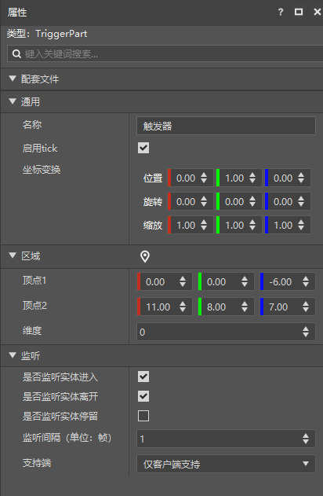

# 触发器

TriggerPart（触发器零件）包含一个长方体的区域，可以使用触发器零件对进出区域的实体进行检测。

点击触发器，可以在他的属性面板中看到以下属性：

- 区域，用于指定触发器的区域
  - 维度：用于指定这个区域在哪个维度
- 监听，影响触发器的事件发送

点击区域页签旁边的定位按钮，可以将触发器的区域显示出来（如下图），之后可以通过挪动坐标系整体移动区域的位置，或者使用鼠标对触发器区域的每一个面进行拖拽。

> 区域的坐标是相对于触发器的坐标，拖动触发器同样可以改变区域的整体位置。

>如果需要在游戏中使用脚本调用此零件，可以参考<a href="../../../../../mcguide/20-玩法开发/14-预设玩法编程/13-PresetAPI/预设对象/零件/触发器零件TriggerPart.html" rel="noopenner"> 触发器零件的API接口文档 </a>