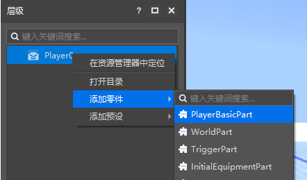
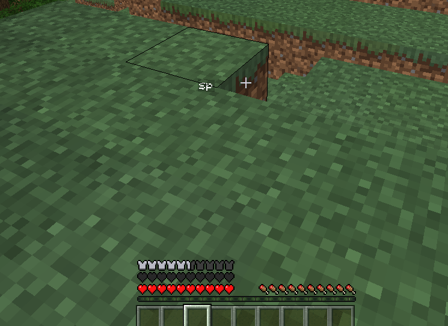

# 玩家基础属性

PlayerBasicPart（玩家基础属性零件）是一种只能挂接到玩家预设下的内置零件。

通过挂接玩家基础属性零件，我们能够对所有玩家的基础属性进行相应的修改。

点击运行，进入游戏，我们可以看到自身的血量上限有40，可以透视到其他玩家的名字。

>如果需要在游戏中使用脚本调用此零件，可以参考<a href="../../../../../mcguide/20-玩法开发/14-预设玩法编程/13-PresetAPI/预设对象/零件/玩家基础属性零件PlayerBasicPart.html" rel="noopenner"> 玩家基础属性零件的API接口文档 </a>