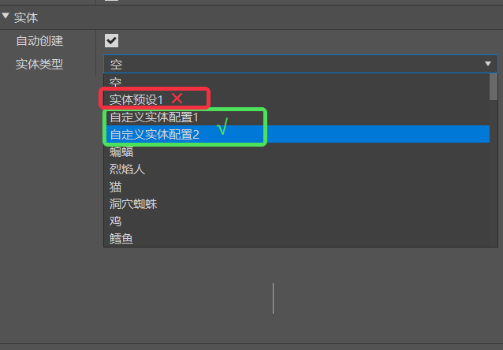

# 实体零件

## 实体组合

实体零件EntiyBasePart用于在预设下管理多个实体预设。

在[预设组装的挂接规则](../../../14-预设玩法编程/11-深入理解预设/1-组装预设.md)中，我们知道空预设下是无法挂载实体预设的，为了让开发者更便捷地管理多个实体，我们提供了实体零件。使用时只需在空预设下挂载此零件，再从属性面板选择对应的实体类型，就能够间接地达成预设下挂载实体的目标。实体零件属性的如下图所示：

- 自动创建：是否在零件初始化时，自动创建关联实体ID，如果不勾选，则需要手动调用零件的API创建关联实体ID，可以参考<a href="../../../../../mcguide/20-玩法开发/14-预设玩法编程/13-PresetAPI/预设对象/零件/实体零件EntityBasePart.html" rel="noopenner"> 实体零件API接口文档 </a>。

- 实体类型：实体零件所绑定的实体类型，这里支持原版实体和未绑定预设的实体配置。
>注意：实体类型不支持实体预设

这里举一个实用例子，对于含有刷怪事件的玩法，开发者可以将每波刷出的怪物制作成一个怪物阵型，从而对每波怪物进行统一的管理，这里就需要用到实体零件，
通过复制或新建，在预设下创建多个该零件，便能构建出一个怪物阵型，如下图所示：

## 注意事项

- 实体零件**只能挂接在空预设**下
- 实体类型属性，**不能选择已经有对应实体预设的类型**，否则创建出来的是实体预设，不受实体零件管理
- 实体零件创建出来的实体，**不会保存到地图**中，在预设卸载，保存退出等时机会自动清除相关实体，在下次预设加载时再重新创建
- 注意避免组合大量实体零件构建怪物阵型，这可能造成加载时卡顿，尤其在低配手机上
- 实体零件进行缩放时，是**xyz轴同步缩放**，但它的父节点可以设置xyz轴分别为不同缩放，以**x轴的最终缩放**为准，尽量避免实体零件的父节点的缩放不一致
- 实体零件进行旋转时，**只支持xy轴旋转**，且只在实体生成时有效，此后由怪物AI控制，如果前面把父节点的缩放设为不一致，旋转实体可能导致x轴的缩放系数发生变化导致实体缩放突变。

>如果需要在游戏中使用脚本调用此零件，可以参考<a href="../../../../../mcguide/20-玩法开发/14-预设玩法编程/13-PresetAPI/预设对象/零件/实体零件EntityBasePart.html" rel="noopenner"> 实体零件的API接口文档 </a>