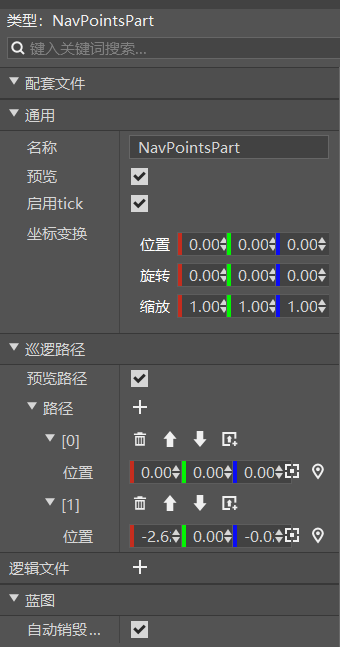
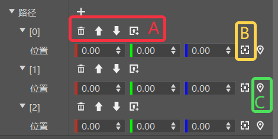

# 导航路径零件
导航路径零件NavPointsPart用于创建一条可视化的路径，并进行路径点的可视化添加和编辑，点击该零件，我们在属性面板可以看到其拥有以下属性：

这里着重讲一下巡逻路径属性，巡逻路径的本质就是一组有顺序的位置坐标数据。巡逻路径有两个属性：

1. 预览路径：用于控制是否开启预览路径，预览路径就是用线段和箭头将所有巡逻点连接起来，让玩家在编辑路径时能够直观地看到每个点之间的位置和顺序关系。

2. 路径：即巡逻路径上的每个巡逻点的信息，通过右侧的"➕"按钮可以新建巡逻点，巡逻点下包含该点的位置坐标。

3. 路径操作方式：每个巡逻点上方的菜单（下图中A框）可以进行巡逻点的删除、上移、下移和上方新建四种快捷操作。右侧的记录摄像机位置（下图中B框）和定位按钮（下图中C框）可以让你更为便捷地进行路径点的可视化选取和移动。

熟练上述操作后能够帮助你快速搭建导航路径，如下图所示：

这里举一个运用导航路径零件的例子：在塔防游戏中，我们希望怪物出生后按照一定的路径进行移动巡逻，比如从起始点开始，走向第二个巡逻点，再走向第三个巡逻点，以此类推，形成一条巡逻路径。那么如何快速进行路径的可视化编辑呢？

为了达到这个效果，我们可以在编辑器内使用导航路径零件，提前构造好巡逻路径点，然后在脚本中使用本零件的接口(<a href="../../../../../mcguide/20-玩法开发/14-预设玩法编程/13-PresetAPI/预设对象/零件/导航路径零件NavPointsPart.html" rel="noopenner"> GetNavigationPoints </a>)快速获得所有巡逻点的数据，再调用寻路接口(<a href="../../../../../mcdocs/1-ModAPI/接口/实体/行为.html" rel="noopenner"> SetMoveSetting </a>)让怪物依次在各个点之间移动，以此达到怪物移动巡逻的效果。

>这里只是一个简单使用案例，导航路径零件主要帮助开发者可视化编辑路径/位置数据，具体使用还需要开发者根据实际需要灵活运用哦~

关于导航路径零件的接口，可以参考<a href="../../../../../mcguide/20-玩法开发/14-预设玩法编程/13-PresetAPI/预设对象/零件/导航路径零件NavPointsPart.html" rel="noopenner"> 导航路径零件的API接口文档 </a>