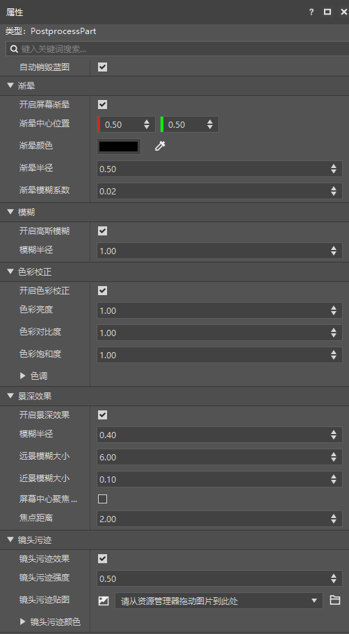
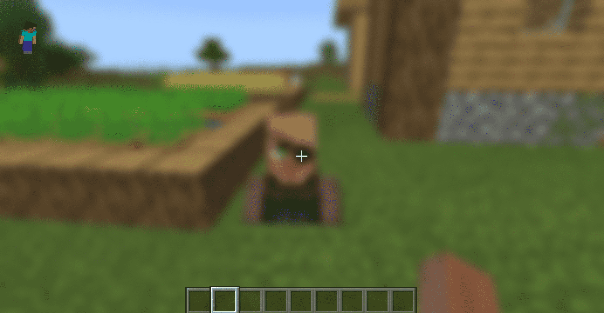
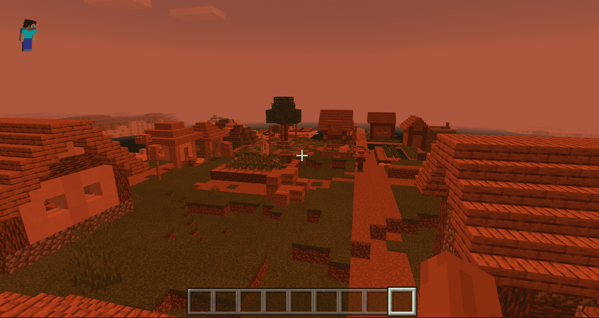
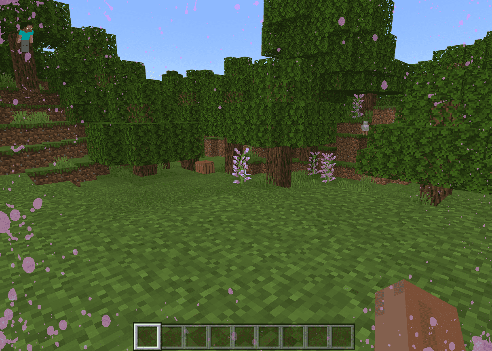

# 后处理零件
后处理零件PostProcessPart用于快速设置并在游戏中使用渐晕、镜头污渍、模糊等后处理效果。

以往开发者想要使用后处理效果，需要手动在零件代码中调用后处理相关的<a href="../../../../../mcdocs/1-ModAPI/接口/后处理/索引.html" rel="noopenner"> ModAPI</a>接口，步骤繁琐且需要先了解python和SDK框架，对新开发者不够友好，此次将后处理效果封装成一个零件，正是为了帮助不会代码的开发者用上后处理的效果，让自己开发的组件达到更高的品质。

> 后处理零件只能挂载在已经勾选预加载的空预设上。

点开零件属性，我们可以看到后处理零件拥有以下属性。

接下来我们逐一介绍后处理零件的几种效果属性。

### 渐晕：效果如下图

| 属性         | 描述                                                         |
| ------------ | ------------------------------------------------------------ |
| 开启屏幕渐晕 | 等同于调用ModAPI下的<a href="../../../../../mcdocs/1-ModAPI/接口/后处理/渐晕.html#setenablevignette" rel="noopenner">SetEnableVignette</a>接口，设置是否开启屏幕渐晕（Vignette）效果，开启后玩家屏幕周围将出现渐晕。 |
| 渐晕中心位置 | 等同于调用ModAPI下的<a href="../../../../../mcdocs/1-ModAPI/接口/后处理/渐晕.html#setvignettecenter" rel="noopenner">SetVignetteCenter</a>接口，设置渐晕（Vignette）的渐晕中心位置，可改变屏幕渐晕的位置。 |
| 渐晕颜色     | 等同于调用ModAPI下的<a href="../../../../../mcdocs/1-ModAPI/接口/后处理/渐晕.html#setvignettergb" rel="noopenner">SetVignetteRGB</a>接口，设置渐晕（Vignette）的渐晕颜色，可改变屏幕渐晕的颜色。 |
| 渐晕半径     | 等同于调用ModAPI下的<a href="../../../../../mcdocs/1-ModAPI/接口/后处理/渐晕.html#setvignetteradius" rel="noopenner">SetVignetteRadius</a>接口，设置渐晕（Vignette）的渐晕半径，半径越大，渐晕越小，玩家的视野范围越大。 |
| 渐晕模糊系数 | 等同于调用ModAPI下的<a href="../../../../../mcdocs/1-ModAPI/接口/后处理/渐晕.html#setvignettesmoothness" rel="noopenner">SetVignetteSmoothness</a>接口，设置渐晕（Vignette）的渐晕模糊系数，模糊系数越大，则渐晕边缘越模糊，模糊的范围也越大。 |

### 模糊：效果如下图

| 属性         | 描述                                                         |
| ------------ | ------------------------------------------------------------ |
| 开启高斯模糊 | 等同于调用ModAPI下的<a href="../../../../../mcdocs/1-ModAPI/接口/后处理/模糊.html#setenablegaussianblur" rel="noopenner">SetEnableGaussianBlur</a>接口，设置是否开启高斯模糊效果，开启后玩家屏幕周围被模糊。 |
| 模糊半径     | 等同于调用ModAPI下的<a href="../../../../../mcdocs/1-ModAPI/接口/后处理/模糊.html#setgaussianblurradius" rel="noopenner">SetGaussianBlurRadius</a>接口，设置高斯模糊效果的模糊半径，半径越大，模糊程度越大，反之则模糊程度越小。 |

### 色彩校正：效果如下图

| 属性             | 描述                                                         |
| ---------------- | ------------------------------------------------------------ |
| 开启色彩校正    | 等同于调用ModAPI下的<a href="../../../../../mcdocs/1-ModAPI/接口/后处理/色彩.html#setenablecoloradjustment" rel="noopenner">SetEnableColorAdjustment</a>接口，设置是否开启色彩校正效果，开启后可进行屏幕色彩调整 。|
| 色彩亮度    | 等同于调用ModAPI下的<a href="../../../../../mcdocs/1-ModAPI/接口/后处理/色彩.html#setcoloradjustmentbrightness" rel="noopenner">SetColorAdjustmentBrightness</a>接口，调整屏幕色彩亮度，亮度值越大，屏幕越亮，反之则越暗。|
| 色彩对比度   | 等同于调用ModAPI下的<a href="../../../../../mcdocs/1-ModAPI/接口/后处理/色彩.html#setcoloradjustmentcontrast" rel="noopenner">SetColorAdjustmentContrast</a>接口，调整屏幕色彩对比度，屏幕对比度值越大，色彩差异则越明显，反之则色彩差异越小。|
| 色彩饱和度    | 等同于调用ModAPI下的<a href="../../../../../mcdocs/1-ModAPI/接口/后处理/色彩.html#setcoloradjustmentsaturation" rel="noopenner">SetColorAdjustmentSaturation</a>接口，调整屏幕色彩饱和度，屏幕饱和度值越大，色彩则越明显，反之则越灰暗。|
| 色调    | 等同于调用ModAPI下的<a href="../../../../../mcdocs/1-ModAPI/接口/后处理/色彩.html#setcoloradjustmenttint" rel="noopenner">SetColorAdjustmentTint</a>接口，调整屏幕色彩的色调，根据输入的色调和强度来调整屏幕色彩，当强度越大时，屏幕整体颜色越偏向输入的色调。|

### 景深效果：效果如下图

| 属性             | 描述                                                         |
| ---------------- | ------------------------------------------------------------ |
| 开启景深效果     | 等同于调用ModAPI下的<a href="../../../../../mcdocs/1-ModAPI/接口/后处理/镜头效果.html#setenabledepthoffield" rel="noopenner">SetEnableDepthOfField</a>接口，设置是否开启景深效果，开启后屏幕出现景深效果，根据焦点距离呈现远处模糊近处清晰或者近处模糊远处清晰的效果。 |
| 模糊半径         | 等同于调用ModAPI下的<a href="../../../../../mcdocs/1-ModAPI/接口/后处理/镜头效果.html#setdepthoffieldblurradius" rel="noopenner">SetDepthOfFieldBlurRadius</a>接口，调整景深效果模糊半径，模糊半径越大，模糊程度越大，反之则越小。 |
| 远景模糊大小     | 等同于调用ModAPI下的<a href="../../../../../mcdocs/1-ModAPI/接口/后处理/镜头效果.html#setdepthoffieldfarblurscale" rel="noopenner">SetDepthOfFieldFarBlurScale</a>接口，调整景深效果远景模糊大小，远景模糊大小越大，远景的模糊程度越大，反之则越小。注意，远景模糊程度的调节依赖于焦点距离，如果焦点处于较远的距离，那么此时远景处于较清晰的状态，模糊程度大小调节不会很明显。 |
| 近景模糊大小     | 等同于调用ModAPI下的<a href="../../../../../mcdocs/1-ModAPI/接口/后处理/镜头效果.html#setdepthoffieldnearblurscale" rel="noopenner">SetDepthOfFieldNearBlurScale</a>接口，调整景深效果近景模糊大小，近景模糊大小越大，近景的模糊程度越大，反之则越小。注意，近景模糊程度的调节依赖于焦点距离，如果焦点处于较近的距离，那么此时近景处于较清晰的状态，模糊程度大小调节不会很明显。 |
| 屏幕中心聚焦模式 | 等同于调用ModAPI下的<a href="../../../../../mcdocs/1-ModAPI/接口/后处理/镜头效果.html#setdepthoffieldusecenterfocus" rel="noopenner">SetDepthOfFieldUseCenterFocus</a>接口，设置景深效果是否开启屏幕中心聚焦模式，开启后聚焦距离将被自动设置为屏幕中心所对应的物体所在的距离。在第一人称视角下，聚焦距离将被自动设置为屏幕准心所对应的物体与相机的距离，即自动聚焦准心所对应的物体。在第三人称视角下，由于屏幕中心总是对应着玩家，因此聚焦距离将被自动设置为玩家与相机的距离，即自动聚焦在玩家自己。 |
| 焦点距离         | 等同于调用ModAPI下的<a href="../../../../../mcdocs/1-ModAPI/接口/后处理/镜头效果.html#setdepthoffieldfocusdistance" rel="noopenner">SetDepthOfFieldFocusDistance</a>接口，调整景深效果焦点距离，距离越小，则远处模糊,近处清晰;距离越大，则远处清晰，近处模糊。该距离为实际距离，即以玩家相机为起点的世界坐标距离。 |

### 镜头污迹：效果如下图

| 属性         | 描述                                                         |
| ------------ | ------------------------------------------------------------ |
| 镜头污迹效果 | 等同于调用ModAPI下的<a href="../../../../../mcdocs/1-ModAPI/接口/后处理/镜头效果.html#setenablelensstain" rel="noopenner">SetEnableLensStain</a>接口，设置是否开启镜头污迹效果，开启后镜头出现污迹效果，可改变使用的污迹贴图及污迹颜色。 |
| 镜头污迹强度 | 等同于调用ModAPI下的<a href="../../../../../mcdocs/1-ModAPI/接口/后处理/镜头效果.html#setlensstainintensity" rel="noopenner">SetLensStainIntensity</a>接口，调整镜头污迹强度，强度越大，污迹越明显，反之则越透明。 |
| 镜头污迹贴图 | 等同于调用ModAPI下的<a href="../../../../../mcdocs/1-ModAPI/接口/后处理/镜头效果.html#setlensstaintexture" rel="noopenner">SetLensStainTexture</a>接口，开启镜头污迹效果后，污迹效果使用的为系统默认贴图。该接口可改变镜头污迹所使用的贴图。注意贴图最好使用透明背景，否则屏幕将被贴图覆盖。 |
| 镜头污迹颜色 | 等同于调用ModAPI下的<a href="../../../../../mcdocs/1-ModAPI/接口/后处理/镜头效果.html#setlensstaincolor" rel="noopenner">SetLensStainColor</a>接口，调整镜头污迹颜色，根据输入的颜色和强度来调整污迹色彩，当强度越大时，污迹颜色越偏向输入的颜色。 |
