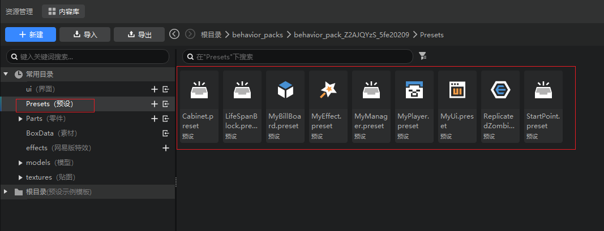

# 理解预设概念

## 什么是预设？
- 预设（Preset）就是预先设定的意思，即开发者们可以将方块、素材、实体、特效以及玩法逻辑拼装成一个预设。

- 预设作为文件被保存在行为包的Presets目录中，如下图，在资源管理器的常用目录中，可以找到Preset文件夹，当然你也可以在精简模式直接打开预设文件夹。
  

- 在使用时，一个预设作为一个整体被放置在游戏中，被放置到游戏中的预设被称为实例。

- 预设的后缀是.preset，如果你对预设到底是什么感兴趣，可以使用文本编辑器打开预设文件，查看它的结构。

> 关于预设架构的使用示例，请查看[第一个预设Mod](../9-第一个预设Mod/0-创建新版作品.md)。

## 预设能做什么？
- 当我们制作游戏时，游戏世界中的每个元素并不是都各具特色，独一无二的，相反，在很多情况下我们需要复用很多游戏资源和玩法逻辑，这时候我们如果能将资源或逻辑集成到一个预设中，就能在需要复用时，在游戏世界中快速地创造这类资源或逻辑的实例。

- 预设是各类游戏引擎经常使用的概念，主要目的是为了将构成游戏元素的资源和代码逻辑组装成一个可复用的文件，提高游戏制作效率。

举个例子：当我们需要制作一个塔防游戏时，需要制作许多种类的怪物，并且在不同时间和地点将不同组合的怪物生成到地图中，并让怪物沿着固定的路径向玩家的大本营进攻。
将这个玩法逻辑梳理下，实际上我们可以复用的资源和逻辑代码有：
  1. 许多种类的怪物（实体预设）
  2. 指定时间指定地点刷新指定怪物的逻辑（刷怪点零件）
  3. 怪物沿着固定路径向大本营进攻的逻辑（怪物巡逻零件）

那么在我们真正去搭建游戏关卡时，只需要将上述的实体和零件代码组装成刷怪点预设和带有巡逻和进攻逻辑的实体预设，就能够快速制造出大量满足塔防玩法的刷怪点和具有进攻大本营逻辑的怪物了。

