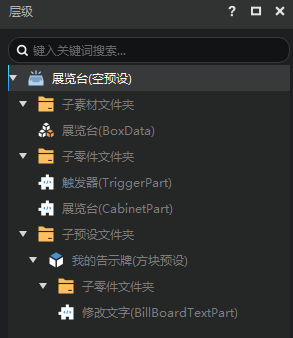
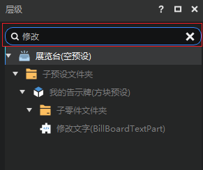
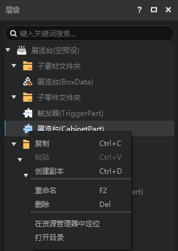
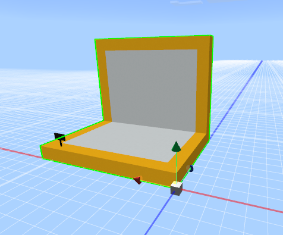
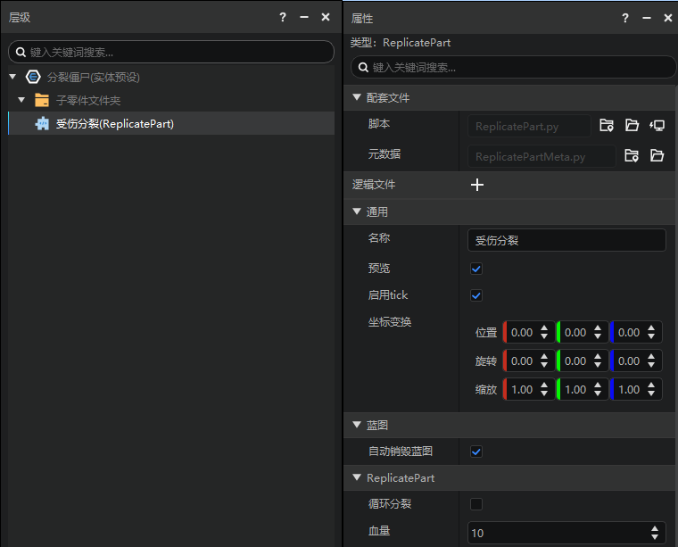
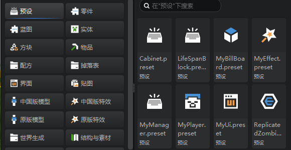
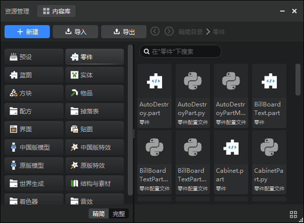

# 预设编辑器
## 一、 启动方式
打开预设编辑器的方式有两种：

- 通过顶部的编辑器切换页签进行切换
- 在资源管理器中双击任意预设文件（xxx.preset）

## 二、 界面构成
预设编辑器主要用于预设的拼装，预览和属性编辑。如下图所示：

- 层级面板：用于显示预设的父子结构关系。
- 预览窗：用于预设的预览，以及对每个对象进行坐标变换的拖拽调整。
- 属性面板：用于显示当前选中的层级条目的属性以及对其进行修改。
- 资源管理器：通用面板，用于管理作品中的所有文件及目录。

> 注意:预设编辑器是对某一个预设的编辑，不能同时编辑多个预设。

## 三、 层级面板

- 层级面板用于显示当前正在编辑的预设的层级结构，通过树形图的方式显示他们的父子关系，如下图所示。

- 层级面板支持搜索，如下图。与关卡编辑器的舞台一样，搜索结果也会显示与它相关的树形结构。

- 层级面板，在根节点上右键，弹出如下菜单：
  - 在资源管理器中定位：在编辑器内置的资源管理器打开这个预设的路径
  - 添加素材：给预设添加素材，二级菜单为可添加的素材
  - 添加零件：给预设添加零件，二级菜单为可以添加的零件
  - 添加预设：给预设添加子预设，二级菜单为可以添加的预设

- 在除了根节点之外的条目上右键，弹出如下菜单：
  - 复制：复制这个条目
  - 粘贴：在层级中粘贴这个条目
  - 创建副本：在层级中创建这个条目的副本
  - 重命名：对这个条目进行重命名
  - 删除：删除这个条目
  - 在资源管理器中定位：资源管理器打开这个条目对应的路径，并选中预设
  - 打开目录：在windows的资源管理器中打开这个条目对应的文件夹

> 当前不能改动子预设的层级

## 四、 预览窗

- 预设编辑器的预览窗里，除了天空之外只会渲染当前正在编辑的预设。

- 你可以在预览窗中对预设条目的坐标变换进行操作。参考[关卡编辑器](../../11-组装简单玩法/0-关卡编辑器.md#三、预览窗)的预览窗。两个编辑器的预览窗的坐标变换操作基本相同。

> 注意：当你在进入预览窗时，实际上会被传送至当前作品的出生点。预览窗内仍然是我的世界，同样存在256的高度限制，这意味着你无法控制相机抵达过高或者过低的位置。

## 五、属性面板
- 属性面板用于查看和修改当前选中的层级条目的属性，如修改预设属性、零件属性等,如图所示。

## 六、资源管理器
- 资源管理面板用于存储和显示当前作品中的所有文件，可以通过精简模式的预设和零件快速寻找需要的文件资源，也可以通过完整模式直接找到预设（Presets）和零件（Parts）文件夹。

## 七、 顶部工具栏功能

- 撤销：移除上一次操作造成的影响，目前支持无限次的撤销，当切换编辑器后，不再记录之前的操作。
- 重做：重新进行上一次撤销的操作。
- 添加预设：给预设添加子预设，弹出菜单为可以添加的预设
- 添加零件：给预设添加零件，弹出菜单为可以添加的零件
- 添加素材：给预设添加素材，弹出菜单为当前可以添加的素材
- 创建预设：弹出新建文件向导，并切换到预设分页，参考[新建文件](../../../15-资源管理/4-新建文件.md)。
- 创建零件：弹出新建文件向导，并切换到零件分页，参考[新建文件](../../../15-资源管理/4-新建文件.md)。
- 文件位置：资源管理器打开这个条目对应的路径，并选中当前正在编辑的预设。
- 反馈：当在编辑器遇到闪退、报错等bug时，可随时通过反馈按钮前往开发者反馈页面向我们反馈。
- 保存：保存当前预设文件。
- 备份：在启动器的作品库中生成一份当前作品的拷贝。
- 运行：保存所有编辑器的内容，并进行开发测试。

