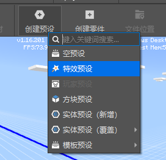

# 预设组装

前面我们已经系统学习了预设系统的基础数据类型和各种内置预设，但它们能实现的功能效果仍旧非常有限。

这一小节将介绍如何利用预设编辑器来组装自己的自定义预设，并以变换动画特效与高级分裂牛为例来阐述制作过程。

## **挂接规则**

在前面的课程里，我们知道可以很方便的把预设、零件、素材挂到另一个预设底下，将它们组装到一起实现特定的功能。

但并非意味着万物皆可挂接，在组装自定义预设前，我们需要明确一下预设，零件，素材等各种游戏对象的挂接规则。

下表是挂接关系表，第一列表示父节点，第一行表示子节点，√表示可以挂接，无内容表示不能挂接

|              | 空预设 | 所有内置预设 | 零件 | 素材 | 实体预设 | 特效预设 | 玩家预设 | 方块预设 | 界面预设 | 文字面板预设 |
| ------------ | ------ | ------------ | ---- | ---- | -------- | -------- | -------- | -------- | -------- | ------------ |
| 空预设       | √      | √            | √    | √    |          | √        |          | √        | √        | √            |
| 所有内置预设 |        |              |      |      |          |          |          |          |          |              |
| 零件         |        |              |      |      |          |          |          |          |          |              |
| 素材         |        |              |      |      |          |          |          |          |          |              |
| 实体预设     |        | √            | √    |      |          | √        |          |          | √        | √            |
| 特效预设     |        | √            | √    |      |          | √        |          |          | √        | √            |
| 玩家预设     |        | √            | √    |      |          | √        |          |          | √        | √            |
| 方块预设     |        | √            | √    |      |          | √        |          |          | √        | √            |
| 界面预设     | √      | √            | √    |      |          | √        |          |          | √        | √            |
| 文字面板预设 |        | √            | √    |      |          | √        |          |          | √        | √            |

- 实体预设，玩家预设不能挂在其他预设下

- 零件、素材不可以单独存在

  - 下面不可挂接任何东西
  - 零件可以挂在任意预设下（内置预设除外）
  - 素材可以挂在空预设下

- 所有内置预设（包括内置空预设、内置特效预设和内置文字面板预设）下无法挂接任何东西

  - 这是由于当前不支持调整子预设的挂接关系

- 无法将预设挂接到自己或任意自己引用的预设底下（不能循环挂接）

  - 内置预设的原理不同，不存在循环挂接的问题
  
  

## 模板预设

在创建预设菜单下，我们提供了一些制作好的模板预设，通过学习这些模板预设可以很好的理解预设的组装流程。

- **变换动画特效**

  一个特效预设，挂接了一个变换动画零件

  该特效会循环播放并循环上下移动

  该零件自定义了持续时间，循环，关键帧等属性，通过修改这些属性，可以实现多种多样的变换动画

- **分裂猪**

  一个生物预设，挂接了一个受伤分裂零件

  当它受伤时会分裂出一个同样的生物，但不包括死亡

  受伤分裂零件自定义了一个循环分裂属性，勾选该属性，则分裂出来的生物也具有受伤分裂特性

## 组装变换动画特效

前面我们已经使用过这个酷炫的特效了，它的制作过程非常简单，本质只是在特效预设上挂了一个功能型零件。

- 首先我们在预设编辑器，通过菜单栏=>创建预设=>特效预设来创建一个新的特效预设。

- 将特效预设的特效文件设为sfxFromEditor.json，此时已经可以预览到这个特效

  如果你没有看到sfxFromEditor这个特效，可以通过创建预设=>模板预设=>变换动画特效来先创建出这个特效，这个过程会把它依赖的的特效等各种资源拷贝到你的组件里，你也可以选择自己已有的任意特效来进行后续的制作。

- 通过菜单栏=>创建零件=>模板零件我们可以很方便地添加一些现成的模板零件，它可以帮助我们学习零件的开发。

- 从模板零件中选取TransformAnimationPart进行创建，创建完成后资源管理器会自动跳转到该零件的目录内。

- 接着将TransformAnimationPart（变换动画零件）挂接到我们的特效预设底下，它就变成了变换动画特效。

## 组装高级分裂牛

前面我们已经使用过分裂猪这个预设，现在我们尝试制作一个分裂牛，并和刚才制作的变换动画特效结合起来。

- 首先通过菜单栏=>创建预设=>模板预设=>分裂猪来创建一个新的生物

  

- 在属性面板上，将其名称改为**带特效的分裂牛**，设置整体模板为牛，并依次点击**应用**和**刷新所有属性**按钮使之生效

  

- 将变换动画特效挂接到这个分裂牛预设上，并将其属性中的关键帧1改为下图所示

  

- 切换到关卡编辑器，放置几个分裂牛到场景中，并控制角色移动到分裂牛附近

  

- 点击保存，然后运行，现在可以看到这个带特效的分裂牛了，尝试去攻击它吧

