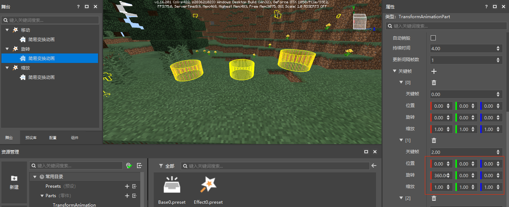
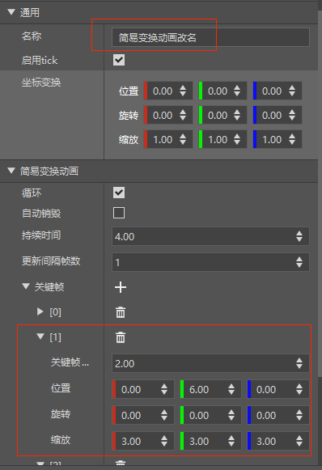
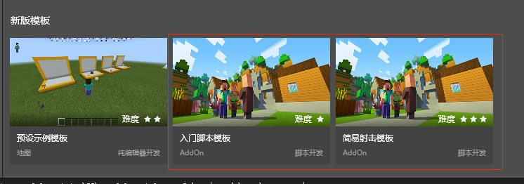

# 实例与属性

前面我们已经学习了如何组装自己的自定义预设，来实现一些炫酷的功能玩法。

这一小节我们将介绍如何修改舞台内的自定义预设/零件属性，来给这些实例赋予不同的功能效果，这有助于指导我们进行后续的零件开发。


## 预设存档

当我们把预设拖进关卡编辑器时，会生成一个预设的虚拟实例，显示在舞台中。

新版关卡编辑器的保存默认只保存预设存档，也就是舞台上显示的所有预设实例，而非整个地图。

预设存档文件位于存档目录的presets.json。


实体预设需要保存到地图中才能生效，当你添加/删除了实体预设时，新版关卡编辑器的保存会触发地图的保存。

**特别注意**：

如果单独把预设存档拷贝到了另一个地图，这个存档里的实体预设会无法加载，需要重新用编辑器打开这个地图保存一次。


## 预设实例

预设的实例化分为虚拟实例化与真实实例化。在编辑器内放置的预设属于虚拟实例，在开发测试运行时，预设才会真实实例化。

虚拟实例可以进行重叠放置，不会因方块重叠而丢失数据，可以通过坐标变换属性/坐标轴拖柄任意调整它的位置，旋转与缩放。


**特别注意**：

素材一经真实实例化就会存入地图存档，**坐标变换的相关API都不再生效**。


## 修改实例属性

预设放置到舞台中之后，我们可以对预设及其子节点的属性进行编辑，让同种预设的不同实例展现不同的效果。

前面我们创建了一个变换动画特效，它的零件默认属性设置的是4s内循环上下移动，接下来我们通过属性修改，来制作一些不同类型的变换特效。

在场景中放置3个变换动画特效，分别命名为移动，旋转，缩放。


将旋转的简易变换动画零件的属性按下图修改：



将缩放的简易变换动画零件的属性按下图修改：


点击保存，然后运行，可以看到3个特效分别播放着不同的变换动画。


## 修改本体属性

预设实例的修改只会影响单个实例，如果希望将修改同时应用于所有实例，需要修改预设本体。

在预设实例上右键，可以定位该实例的本体所在资源管理器路径。


双击预设本体，即可打开预设本体进行编辑。

对预设本体的修改，先会应用到所有实例上，然后实例再应用实例上的修改。

这里我们将零件的名称进行了修改，并将关键帧1的缩放改为了(3.0, 3.0, 3.0)



回到关卡编辑器后，发现3个动效的子节点名称都被修改了，且原来未改动过关键帧1的《移动》预设的关键帧1已经应用了本体的缩放修改。


## 常加载

**常加载**属性表示该预设在加载完成后，即使所在的区块被卸载，它也不会被卸载。

它只能应用于基于空预设组装的预设，不适用与实体预设，特效预设等。

它的主要用途是使一些全局预设移除随区块加载和卸载的特性，避免它卸载后导致逻辑问题。

它常常与预加载一同使用。

**特别注意**：

常加载预设不被卸载并不意味着它关联的方块或地图元素不会被卸载，只是保证它的逻辑会继续驱动。


## 预加载

**预加载**属性表示该预设将在地图初始化时，在地图出生点位置创建一个该预设的实例。

它只能应用于基于空预设组装的预设，不适用与实体预设，特效预设等。

它的主要用途是制作**类似GameManager功能的全局管理型功能预设**，帮助我们制作**不依赖于舞台的AddOn功能玩法**。

这两个新版模板都使用了预加载属性来创建预设以进行功能初始化。



- 使用预加载属性前，需要先设定出生点，这个可以通过地图编辑器=>菜单栏=>出生点功能进行设置。


- 创建一个空预设，改名为GameManager，预加载通常与常加载一并使用，它不会产生坐标更新，将变换更新间隔设为0


- 创建一个空零件，挂接到GameManager预设上，修改零件的InitServer初始化函数为监听聊天事件

  ```python
  def InitServer(self):
      print(self.classType, "InitServer")
      import mod.server.extraServerApi as serverApi
      self.ListenForEvent(serverApi.GetEngineNamespace(), serverApi.GetEngineSystemName(), "ServerChatEvent", self, self.OnServerChatEvent)
  
  def OnServerChatEvent(self, args):
      playerId = args.get("playerId")
      print("OnServerChatEvent", playerId)
      import mod.server.extraServerApi as serverApi
      comp = serverApi.GetEngineCompFactory().CreateMsg(playerId)
      comp.NotifyOneMessage(playerId, "Hello, world", "§c")
  ```

- 点击运行，输入聊天指令，刚编写的零件已经生效了


**特别注意**：

- 预加载预设也可以与舞台场景内的预设协同工作，预加载预设的创建时机要早于舞台预设
- 存在多个预加载预设时，其加载顺序为预设文件名xxx.preset的字母序
- 有少量事件的时机发生在预加载预设创建之前，会导致无法监听到，如房主的AddServerPlayerEvent