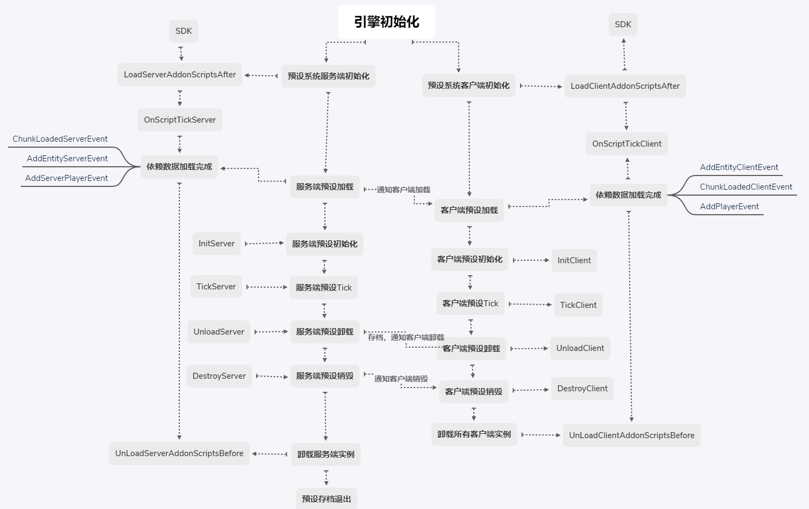

# 预设生命周期

前面我们已经学习了如何使用预设的常加载与预加载等属性，但我们还不知道预设是怎么加载卸载的。

这一小节我们将介绍预设和零件的生命周期，我们应该如何管理MOD里的各种预设和零件，这有助于指导我们进行后续的零件开发。


## **服务端**与客户端实例

在前面学习MOD开发过程中，我们已经了解到服务端和客户端属于两个不同的容器，同样预设和零件的实例也分为服务端实例与客户端实例。

我们希望零件是一个轻量级的功能单位，如果每个零件都需要像system那样分别编写客户端系统类和服务端系统类，那样会显得非常臃肿。

因此我们支持在一个零件类里编写双端代码，当使用零件提供的双端API时，它会自动根据当前是客户端还是服务端返回相应的内容，如GetLevelId()。

如果需要import SDK中的服务端/客户端部分，需要将import代码放到函数内部，且函数命名需要带有Server/Client以进行区分。

下面以玩家基础属性零件为例：

```python
def InitClient(self):
    logger.info("%s InitClient %s %s", self.classType, self.GetParent().GetPlayerId(), self.showName)
    import mod.client.extraClientApi as api
    nameComp = self.CreateComponent(str(self.GetParent().GetPlayerId()), 'Minecraft', 'name')
    nameComp.SetShowName(self.showName)

    if self.GetParent().GetPlayerId() == api.GetLocalPlayerId():
        gameComp = self.CreateComponent(api.GetLevelId(), 'Minecraft', 'game')
        gameComp.SetNameDeeptest(not self.nameDeeptest)
        self.NotifyToServer("OnLoadSuccess", {'id': self.GetParent().GetPlayerId()})
```

```python
def InitServer(self):
    logger.info("%s InitServer %s", self.classType, self.GetParent().GetPlayerId())
    self.ListenSelfEvent('OnLoadSuccess', self, self.OnLoadSuccess)
```

```python
def OnLoadSuccess(self, data):
    logger.info("%s OnLoadSuccess %s", self.classType, self.GetParent().GetPlayerId())
    import mod.server.extraServerApi as api
    pComp = self.CreateComponent(data['id'], "Minecraft", "player")
    pComp.SetPlayerRespawnPos(tuple(self.spawnPos))
    ...
```

- 零件的客户端部分负责在初始化时，将父预设（即玩家）的ID通知服务端
- 零件的服务端部分在初始化时，监听客户端事件，接收到登录玩家的ID时，设置该玩家的相关属性

关于零件的开发规范，详情可以查阅[零件开发规范](../12-深入理解零件/6-零件开发规范.md)。

关于双端实例的通讯与网络同步，我们提供了一些内置API，比如上面这个零件使用到的**NotifyToServer**与**ListenSelfEvent**，详情可以查阅[通讯与网络同步](../12-深入理解零件/3-通讯与网络同步.md)。


## 生命周期

预设系统的完整生命周期如下：



- 总是先加载服务端实例，再加载客户端实例
- 服务端预设实例的坐标变换变更，添加删除素材、零件或子预设，卸载或销毁，都会广播通知所有客户端预设实例进行数据同步，而客户端的任何变更，都不会主动向服务器同步，需要显示调用请求服务端的相关API
- 零件的InitServer/InitClient在预设初始化时调用一次
- 零件的TickServer/TickClient在预设加载后每个逻辑帧调用一次
- 零件的UnloadServer/UnloadClient在预设卸载时调用一次
- 零件的DestroyServer/DestroyClient在预设销毁时调用一次

### 加载依赖

预设加载的前置条件是它的所有变换对象（TransformObject）依赖的区块全部加载完毕。

**特别注意**：

- 不建议构建需要依赖大量区块的大型预设，预设并不是适用来保存地形，城堡类的大型素材
- 不建议设置预设的多个子节点到相距很远的位置，这也会导致预设依赖它们中间跨越的所有区块

实体预设在加载时，会与对应的实体进行绑定，因此它除了依赖区块加载，还依赖于实体的加载。

同理，玩家预设的加载依赖对应的玩家登陆。

客户端预设的加载还依赖于对应的服务端预设加载。

### 加载过程

预设加载过程分为四步：

- 根据预设文件ID获取预设文件，解析预设层次结构本体
- 递归分析预设所依赖的素材，零件，子预设，实例化展开所有游戏对象，并构建游戏对象的父子关系
- 应用预设/零件存档里的实例修改部分
- 应用预设/零件层次结构的坐标变换

### 卸载与销毁

- 当预设的加载依赖不满足，且预设不具有常加载属性时，预设将被卸载。

- 在零件内主动对父预设进行销毁，不会立刻停止零件代码，父预设会继续完成当前帧所有子节点的逻辑，在当前帧的末尾完成销毁
