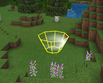
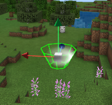
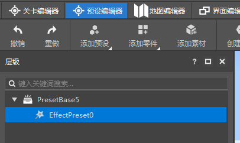
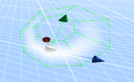
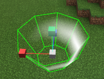
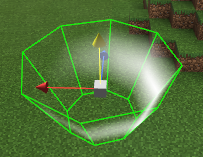
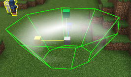
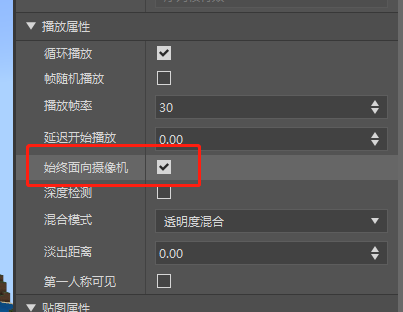
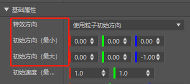
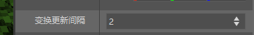

# 预设变换

## 坐标属性

如上图所示,预设属性中坐标变换有三类属性：位置，旋转，缩放。此三类属性都有(x,y,z)轴3个值。

**位置**: 设置预设在父节点坐标系的位置偏移，如果预设是根节点，则设置预设在世界坐标系的位置。

**旋转**: 设置预设在父节点坐标系的旋转欧拉角度。如果预设是根节点，则设置预设在世界坐标系下的旋转欧拉角。

**缩放**: 设置预设在父节点坐标系的缩放系数。如果预设是根节点，则设置预设在世界坐标系下的缩放系数。

**坐标的属性变换顺序**：

如上参数所示，预设是按照当前所在坐标系，先进行**缩放**变换，然后进行**旋转**变换，然后进行位置**平移**变换。

**旋转变换**的顺序是先按**Z轴**旋转，再按**X轴**旋转，再按**Y轴**旋转。

各变换参考的坐标系都是当前所在父节点的坐标系（根节点则是世界坐标系），而不是自身的缩放和旋转变换后的坐标系。

## 预设变换操作

**鼠标拾取和选中**：

鼠标左键**单击**地图**场景中**的特效,生物,素材等预设，即可**选中**当前预设，进行相关操作。

鼠标左键**单击关卡编辑器**里的**舞台界面**中的预设列表项，或者**预设编辑器**里**层级界面**中的预设列表，也可以选中对应预设。

鼠标左键**双击**预设列表项则会**快速定位**到对应预设的位置。

在**预设编辑器**中，因为**根节点**没有坐标变换相关属性，因此**不能选中操作根节点**。

如生物预设，因为不能挂载在其他预设节点下面，因此不能在预设编辑器点击选中和操作。

特效预设可以挂载在预设节点之下，因此可以在预设编辑器下点击选中进行操作。

**切换操作模式**：

在当前选中预设时，按键盘数字键"**1**" "**2**" "**3**" 可以切换操作模式为**位置平移**，**旋转**和**缩放**操作模式。

 

**平移和缩放操作**：点击对应操作坐标轴，按住鼠标左键，移动鼠标方向，即可操作移动或拉伸预设。

**旋转操作**：点击对应操作坐标轴，按住鼠标左键，向**右下**移动**增加**旋转角度，向**左上**移动**减少**旋转角度。

注意，**旋转的顺序是ZXY轴**,因此旋转操作最终效果**由ZXY旋转角度的顺序**决定。

## 预设变换限制

预设操作因为MC的规则限制，

**素材预设变换限制：**

​		位置限制：素材方块对应坐标需为整数，对应非整数部分，舍去小数部分处理。

​		旋转限制：素材方块只能旋转90度的倍数角度，非90度倍数部分忽略，对于负角度按对应正方向角度处理。

​					       如旋转300度，对应素材方块旋转270度。而旋转-40度，对应旋转320度，对应素材旋转270度。

​						   同时一些方块如床等也有旋转方向的限制。

​	    缩放现在:  素材缩放效果不会小于1个方块。

​                          素材缩放最大值100，同时素材方块尺寸不能多于一千万个方块。素材尺寸太大会影响操作性能。

​						  素材缩放尺寸的系数为负值，则当做正值处理。

**生物预设变换限制：**

​		旋转限制：生物旋转只支持Y轴，X和Z轴旋转只忽略。

​	    缩放现在:  生物缩放最小值为0.1,同时缩放效果不会小于1个方块。

​                          素材缩放最大值100，同时素材方块尺寸不能多于一千万个方块。素材尺寸太大会影响操作性能。

特效变换限制：

​		旋转限制：序列帧特效的旋转同时会受到**始终面向相机**的属性影响。

​							粒子特效的旋转同时会受到**特效方向**以及**粒子朝向模式**的影响。

 

## 预设变换API

**变换更新间隔(updateTransformInterval):**

​		用来控制游戏模式下预设及子节点的坐标变换(位置,旋转,缩放)更新间隔，默认值为2。  我的世界逻辑帧率为每秒30帧，建议对于非必要每帧更新的预设设置此值为合适值。

​		设置为0时,通过API设置预设的坐标变换都不会更新,因此其附加子节点也不会跟随更新。设置为1时,每帧更新。设置为2时，则每两帧更新一次。

​		如游戏模式下，生物预设挂载了一个特效预设为子节点。其中生物预设的变换更新间隔是0，则通过API控制生物预设或者游戏内AI或者操作逻辑移动了生物对象，其坐标变换也不会更新修改。因此其挂载的特效也不会有位置或者旋转的跟随变换。如果变换更新间隔为10，则每10帧同步更新一次坐标变换，同时也会更新其特效子节点的位置变换。

**Transform**:

​		Transform对象拥有**pos**(位置),**rotation**(旋转),**scale**(缩放)三个属性,都为**tulpe(x,y,z)**格式。

​        通过**AddOffset**,**AddRotation**,**AddScale**接口,传入对应tuple(x,y,z)参数，可在Transform当前属性基础上修改Transform对应的pos,rotation,scale属性。

​		通过**AddTransform**接口,传入一个Transform对象，可在Transform当前属性基础上同时修改Transform对应的pos,rotation,scale属性。

​       注意，Transform对象本身并没有关联父节点数据，同时也没关联其游戏内所在对象。

​	   通过以上接口直接操作Transform的属性，并不会对游戏内关联对象产生坐标变换的更新。

**TransformObject**:

​		TransformObject对象关联了游戏种的生物，特效等象，同时关联其父节点和子节点。通过此对象API可以控制游戏对象和其子节点的在游戏中的坐标变换。

​	    TransformObject的坐标变换属性有两个坐标参考系，一个是**WorldTransform**，对应的是**世界坐标系**下的坐标变换（位置,旋转,缩放）属性。一个是**LocalTransform**,对应的是其**父节点局部坐标系**下的坐标变换（位置,旋转,缩放）属性。当一个预设节点是根节点时，其WorldTransform和LocalTransform相等。

​		WorldTransform是由LocalTransform和父节点的局部坐标系转换得到，因此以下接口修改WorldTransform会转换成修改对应的LocalTransform属性。而修改LocalTransform即同时修改了WorldTransform属性。

​		**GetLocalTransform**接口:

​		获取当前TransformObject的Transform对象。此Transform属性对应的是其在父节点的局部坐标系下的坐标转换属性。本身为根节点则为世界坐标系下坐标转换属性。

​	   **SetLocalTransform**接口:

​		传入一个Transform对象，设置其在父节点的局部坐标系下的坐标转换属性。本身为根节点则为世界坐标系下坐标转换属性。

​		获取和修改**LocalTransform**具体属性：

​		GetLocalPosition，SetLocalPosition，GetLocalRotation，SetLocalRotation，GetLocalScale，SetLocalScale分别获取和设置LocalTransform的pos(位置),rotation(旋转),scale(缩放)属性。

​		AddLocalOffset，AddLocalRotation，AddLocalScale分别增加LocalTransform的pos(位置),rotation(旋转),scale(缩放)属性值。可用来实现其在父节点局部坐标系下如按速度旋转或者移动的逻辑。

​		**GetWorldTransform**接口：

​		获取当前TransformObject的在世界坐标系下坐标转换属性。当其为根节点时，此值和GetLocalTransform一致。当其为子节点时，则由其LocalTransform和父节点的WorldTransform变换得到。

​	   **SetWorldTransform**接口：

​		传入一个Transform对象，设置其在世界坐标系下转换属性。本身为根节点则和SetLocalTransform一致。其为子节点，则根据父节点的WorldTransform转换得到对应LocalTransform。

​		获取和修改**WorldTransform**具体属性：

​		GetWorldPosition，SetWorldPosition，GetWorldRotation，SetWorldRotation，GetWorldScale，SetWorldScale分别获取和设置**WorldTransform**的pos(位置),rotation(旋转),scale(缩放)属性。

​		AddWorldOffset，AddWorldRotation，AddWorldScale分别增加**WorldTransform**的pos(位置),rotation(旋转),scale(缩放)属性值。可用来实现其在世界坐标系下如按速度旋转或者移动的逻辑。

