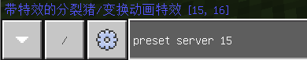

# 预设调试

前面我们已经学习了预设坐标变换的相关内容，这一小节我们将介绍如何在运行时调试MOD里的各种预设和零件。


## 添加调试器

通过预设编辑器=>菜单栏=>创建预设=>模板预设=>调试器可以内置一个预设调试器


## 调试指令

该预设提供了如下指令：

- **preset server**

  打印所有服务端预设概要信息

  

- **preset client**

  打印所有客户端预设概要信息

- **preset server id**

  打印服务端指定ID的预设概要信息

  

- **preset client id**

  打印客户端指定ID的预设概要信息

- **preset server func**

  在服务端执行调试器零件里的指定函数名称为func的函数，如preset server test

  结合前面查询到的预设名称与ID，利用MCStudio的热更功能，可以在运行时对预设进行简单的调试

  ```python
  def test(self):
      # 替换你要调试的对象ID
      objId = 6
      print("test isClient: %s" % self.isClient)
      obj = self.GetManager().getGameObjectById(objId)
      if obj:
          # 写点调试代码
          print(obj.GetWorldPosition())
  ```

- **preset client func**

  在客户端执行调试器零件里的指定函数名称为func的函数