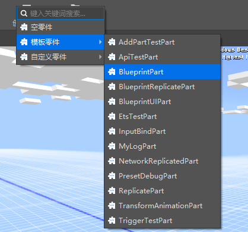

# 零件开发

## 零件构成

当使用编辑器成功创建一个零件时，以创建MyLogPart为例，编辑器会自动创建以下文件:


 - MyLog.part

MyLog.part是零件文件，它记录了该零件的有关信息。开发者无需关心该文件内容，但不建议开发者对该文件作任何形式的更改。

 - MyLogPart.py

 MyLogPart.py是逻辑文件，它继承自PartBase基类，拥有零件给定的生命周期函数和API接口，开发者在该文件中实现零件逻辑，如下例：

```python
class MyLogPart(PartBase):
	def __init__(self):
		super(MyLogPart, self).__init__()
		self.name = "打印位置"
		self.interval = (30, 90)
		self._tickCnt = 0
		self._tickInterval = random.randint(self.interval[0], self.interval[1])

	def TickClient(self):
		self._tickCnt += 1
		if self._tickCnt == self._tickInterval:
			print("%s 在 %s" % (self.GetDisplayPath(), self.GetWorldPosition()))
			self._tickInterval = random.randint(self.interval[0], self.interval[1])
			self._tickCnt = 0
```

 - MyLogPartMeta.py

 MyLogPartMeta.py是元数据文件，当开发者需要在编辑器中对该零件的某个数据成员进行可视化编辑时，可以将该数据成员以一定的规则编写在该Meta文件中，如下例：

```python
class MyLogPartMeta(PartBaseMeta):
	CLASS_NAME = "MyLogPart"
	PROPERTIES = {
		"interval": PVector2(sort=1000, group="MyLogPart", text="打印间隔"),
	}
```


## 零件编辑

- 本体

  当创建一个零件后，零件将作为代码资源存放在资源管理器中。单纯的零件是不会有作用的，只有依赖于预设，即将零件挂接在预设下并且该预设被实例化，零件的代码逻辑才会正常运行。

- 实例

  零件被挂接到预设下，将该零件称为零件实例，实例可以看作对零件的引用。对零件实例的修改会被保存在预设文件中，而不会对零件代码进行修改。相同的，当零件代码被修改时，所有该零件的实例都会同步这一修改，但预设文件中对零件实例的修改仍保留且优先于零件代码生效。

- 变量与自定义属性

 零件中的变量被可视化后才可以在编辑器中动态的、可视化的编辑，才能在被挂接到预设下后被覆写。详情见[自定义属性面板](1-自定义属性面板.md)


## 内置零件

我们的游戏引擎内置了一些内置零件，开发者无法对内置零件的逻辑进行修改，也无法像模板零件一样创建出零件副本。开发者可以为预设创建内置零件，并修改可以修改的数据成员。


目前一共内置了7个零件。

 - PlayerBasicPart

玩家基础数据零件，可以设置玩家基础数据，该零件只能挂在玩家预设下。

 - WorldPart

世界属性零件，可以设置世界属性，该零件建议挂接在设置了预加载的预设下。

 - TriggerPart

触发器零件，可以设置触发条件等。

 - PortalPart

传送门零件，可以设置传送门及其形状。

 - EntityBasePart

实体零件，可以在指定位置生成实体生物

 - NavPointsPart

路径点零件，可以在编辑器中设置相对于零件位置选择一系列路径点，并在运行时通过接口获得路径点的绝对坐标列表。

 - CameraTrackPart

相机轨迹零件，可以在编辑器中设置相机移动轨迹，并在运行时通过接口播放。

## 模板零件

我们的编辑器内置了一些模板零件，开发者可以通过创建模板零件创建出该零件的副本，从而对该零件进行自定义的修改。



目前一共内置了13个模板零件

 - AddPartTestPart

 添加零件测试零件

 - ApiTestPart

 零件接口测试零件

 - MyLogPart

 日志零件，用于测试调试日志。

 - NetworkReplicatedPart

 网络同步零件

 - ReplicatePart

 分裂零件

 - TransformAnimationPart

 变化动画零件

 - TriggerTestPart

 测试触发器零件，可以和TriggerPart配合使用。

 - BlueprintPart

 蓝图零件

 - BlueprintReplicatePart

 蓝图分裂零件

 - BlueprintUIPart

 蓝图UI零件

 - EtsTestPart

Ets测试零件

 - InputBindPart

输入绑定零件

 - PresetDebugPart

预设测试零件

## 零件热更

**返回编辑器时**，零件代码会自动热更并更新当前舞台内的实例，属性刷新

## 零件事件

### 监听SDK事件

零件提供了两种可以监听SDK事件的方式。

#### 拥有各种ID的的SDK事件可直接重载监听

SDK事件中有相当数量的参数中包含实例ID的事件，当此类事件发生时，SDK会在抛出事件的同时通过参数告知我们是哪个ID的实例是这个事件的当事人，对于这些事件的监听我们可以直接重载与事件同名的接口，并将零件挂接到具有实体的预设（如玩家预设、实体预设）上来实现。当事件被提起时所包含的实例ID与该预设的实例ID相匹配时该接口将会被调用。SDK事件中包含以下参数的事件都可以用此方法进行监听。

"id", "entityId", "playerId", "rideId", "actorId", "victimId", "targetId", "srcId", "projectileId", "spawnerId",
"sourceId", "attacker", "victim", "src", "actor", "secondaryActor", "dieEntityId"，"victims", "playerList"

以ReplicatePart为例

```python
class ReplicatePart(PartBase):
	def __init__(self):
		super(ReplicatePart, self).__init__()
        ......

	def ActuallyHurtServerEvent(self, args):
		# 生物Id
        entityId = data["entityId"]
        # 伤害来源，详见Minecraft枚举值文档的ActorDamageCause
        cause = data["cause"]
        # 伤害值
        damage = data["damage"]
        # 吸收的伤害值（原始伤害减去damage）
        absorbedDamage = data["absorbedDamage"]
		......
```

该零件重载了ActuallyHurtServerEvent事件同名函数并实现了分裂该实体预设的功能。

#### 使用监听引擎事件接口监听事件

零件基类PartBase提供了ListenForEvent接口和UnListenForEvent接口用于注册和反注册引擎事件监听。详情见<a href="../../../../mcguide/20-玩法开发/14-预设玩法编程/13-PresetAPI/预设对象/零件/零件PartBase.html" rel="noopenner"> 零件PartBase </a>

### 监听特定零件事件

零件基类PartBase提供了ListenPartEvent,BroadcastClientEvent等接口用于零件之间的事件通讯，相关接口详情见<a href="../../../../mcguide/20-玩法开发/14-预设玩法编程/13-PresetAPI/预设对象/零件/零件PartBase.html" rel="noopenner"> 零件PartBase </a>

以TriggerPart和TriggerTestPart为例

TriggerPart在Tick函数中，满足一定条件时广播给客户端OnTriggerEntityEnter事件

```python
class TriggerPart(PartBase):
	def __init__(self):
		super(TriggerPart, self).__init__()
        ......

	def TickClient(self, args):
		......
        if self.isTriggerEnter and len(enter_entities) > 0:
			data = {
			'TriggerPart': self,
			'EnterEntityIds': enter_entities
			}
			self.BroadcastClientEvent("OnTriggerEntityEnter", data)
        ......
```

TriggerTestPart对该事件注册监听事件

```python
class TriggerTestPart(PartBase):
	def __init__(self):
		super(TriggerTestPart, self).__init__()
        ......

	def InitClient(self):
		......
		id = part.id
		self.ListenPartClientEvent(id, "OnTriggerEntityEnter", self, self.OnTriggerEntityEnter)

	def OnTriggerEntityEnter(self, arg):
		print("TriggerTestPart OnTriggerEntityEnter", arg)
```

### 监听预设系统事件

参考<a href="./4-零件通讯教程.html?catalog=1" rel="noopenner">零件通讯</a>

## 开发调试

零件的逻辑调试写法和先前的脚本开发调试写法一致，开发者可以在适当的零件代码位置打印日志，在进行开发中，这些日志将会被打印在调试日志窗口中，供开发者进行开发调试。


