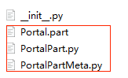
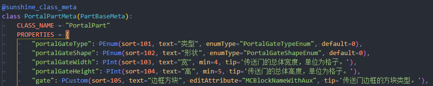
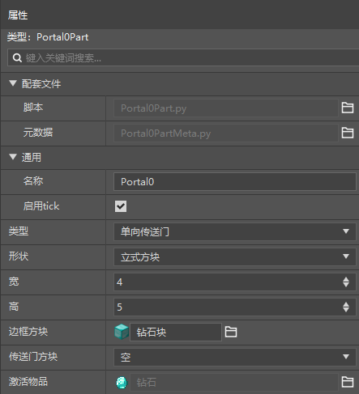
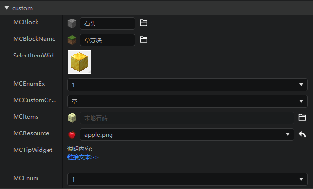
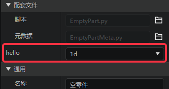

# 自定义属性面板

## 前言

一个完整的零件一般主要有3个文件，以自定义零件中的PortalPart为例，包含Portal.part，PortalMeta.py，Portal.py。



其中Portal.py中定义了一个继承自PartBase的类PortalPart，该类的实例属性诸如"\__init__"方法中的一些"self."开头的变量可通过编辑器的属性面板来进行配置。


PortalMeta.py文件中则定义了各个变量希望在编辑器中呈现的编辑方式。



在编辑器中点击对应的".part"文件即可在属性面板中预览并编辑对应的属性。



## 总览

当前自定义的零件支持编辑python的所有基本类型，即：整数int，浮点数float，布尔bool，字符串str，字典dict，列表list，除此之外，针对一些特定需求，也提供了相应的支持，如下拉列表选择，多维向量等。

下图给出了所有的基本控件样式与写法。代码可在附录中找到。


## 类型与属性

### 通用属性

| 属性     | 默认值 | 说明                                                         |
| :------- | :----- | :----------------------------------------------------------- |
| default  | None   | 属性默认值，当实际值与默认值不相等时会提供一个按钮设为默认值 |
| text     | ""     | 属性在编辑器中的显示名称                                     |
| sort     | 0      | 属性显示顺序，数字越小越靠前                                 |
| editable | True   | 属性在编辑器中是否可编辑（反过来就是是否只读）               |
| tip      | ""     | 鼠标移上去显示的Tips                                         |
| visible  | True   | 属性是否可见                                                 |
| group    | ""     | 所属分组，可用于简单布局。（只适用于第一级结点）             |

### 整数：PInt

除通用属性外的额外属性：

| 属性 | 默认值 | 说明                                            |
| :--- | :----- | :---------------------------------------------- |
| min  | None   | 最小值                                          |
| max  | None   | 最大值                                          |
| step | 1      | 步进量，即每次点击控件中增加/减少按钮修改的差值 |

### 浮点数：PFloat

除通用属性外的额外属性：

| 属性      | 默认值 | 说明                                            |
| :-------- | :----- | :---------------------------------------------- |
| min       | None   | 最小值                                          |
| max       | None   | 最大值                                          |
| step      | 1.0    | 步进量，即每次点击控件中增加/减少按钮修改的差值 |
| precision | 2      | 小数点后位数                                    |

### 布尔值：PBool

无额外属性

### 字符串：PStr

除通用属性外的额外属性：

| 属性  | 默认值 | 说明                     |
| :---- | :----- | :----------------------- |
| regex | None   | 内容需要符合的正则表达式 |

### 列表：PArray

除通用属性外的额外属性：

| 属性           | 默认值 | 说明                                        |
| :------------- | :----- | :------------------------------------------ |
| childAttribute | None   | 子元素的Meta定义，如：childAttribute=PStr() |
| maxSize        | 9999   | 最大长度                                    |
| moveChild      | False  | 子元素添加可以上下移动按钮                   |
| insertChild    | False  | 子元素添加插入新元素到当前位置按钮            |

### 字典：PDict

除通用属性外的额外属性：

| 属性      | 默认值 | 说明                                                      |
| :-------- | :----- | :-------------------------------------------------------- |
| addable   | False  | 允许动态增加子元素，该子元素的key需要存在于此Meta定义中。 |
| removable | False  | 允许动态删除已存在的子元素                                |
| fixList   | []     | 不受动态增删影响的固定属性，如["key1"]                    |

### 枚举类型：PEnum

除通用属性外的额外属性：

| 属性     | 默认值 | 说明                                                         |
| :------- | :----- | :----------------------------------------------------------- |
| enumType | ""     | 使用DefEnum定义的枚举类型数据名称，如DefEnum("MyEnum", {1: "a", 2: "b"})，这里就填"MyEnum" |

### 多维向量：PVector2，PVector3，PVector4

除通用属性外的额外属性：

| 属性      | 默认值 | 说明                                            |
| :-------- | :----- | :---------------------------------------------- |
| min       | None   | 最小值                                          |
| max       | None   | 最大值                                          |
| step      | 1.0    | 步进量，即每次点击控件中增加/减少按钮修改的差值 |
| precision | 2      | 小数点后位数                                    |

### 颜色：PColor

除通用属性外的额外属性：

| 属性   | 默认值 | 说明                                                         |
| :----- | :----- | :----------------------------------------------------------- |
| format | (0,0,0)或"#000000"     | 颜色格式:当format="#RRGGBB"（现在只有这一种），此时，实际值形如："#A6B7C8",当不传format参数时或传的值不支持时，会使用默认格式(r, g, b)。如：(244, 37, 18)|

### 对象数组：PObjectArray

除通用属性外的额外属性：

| 属性        | 默认值 | 说明                               |
| :---------- | :----- | :--------------------------------- |
| itemCreator | None   | 继承于PropertyListObject的自定义类 |
| moveChild      | False  | 子元素添加可以上下移动按钮                   |
| insertChild    | False  | 子元素添加插入新元素到当前位置按钮            |

对于较为复杂的编辑数据，我们除了可以使用列表PArray、字典PDict进行多层嵌套以外，还可以使用对象数组。

首先我们需要创建一个新的编辑对象类，它需要继承PropertyListObject

```python
from Meta.PropertyObject import sunshine_property_object
from Preset.Model.PresetDataMeta import PropertyListObject

@sunshine_property_object
class EventDataObject(PropertyListObject):
	PROPERTIES = {}
```

将EventDataObject用到对象数组PObjectArray中：

```python
@sunshine_class_meta
class LevelStagePartMeta(StageBasePartMeta):
	CLASS_NAME = "LevelStagePart"
	ObjectArrayDef = {
		"events": EventDataObject,
	}
	PROPERTIES = {
		"events": PObjectArray(
			text="刷怪事件", sort=1004, group="阶段",
			itemCreator=EventDataObject
		)
	}
```

ObjectArrayDef和PROPERTIES的key必须保持一致，EventDataObject作为itemCreator参数传入。

这种方式除了让层级更为清晰之外，更重要的是可以隔离自定义函数func传入的obj。

上面这个例子里，EventDataObject里属性func所传入的是EventDataObject，而不是根节点LevelStagePart。

当你需要控制列表内单个对象的不同属性的互相影响时，必须使用对象数组，比如我们通过condition属性来控制dependencyEvents和startTime属性的显隐。

```python
class EventDataObject(PropertyListObject):
	PROPERTIES = {
		"classType": PStr(sort=0, text="类名", default="SpawnMobEvent", visible=False),
		"condition": PEnum(sort=2, text="事件触发条件", enumType='ConditionType'),
		"dependencyEvents": PArray(
			sort=3, text="条件事件", childAttribute=PCustom(text='事件ID', sort=0, editAttribute='MCEnum', extend=getEvents),
			func=lambda obj: {'visible': obj.condition == "dependency"}
		),
		"startTime": PInt(
			text="间隔时间", sort=4, default=10,
			func=lambda obj: {'visible': obj.condition == "timer"}
		),
	}
```

这里的PROPERTIES每个编辑子项的写法与前面介绍的一致。

实际效果：


### 其他
- PCoordinate
   继承自 PVector3，具有与PVector3相同的属性和功能，在原有功能基础上添加了两个辅助按钮，分别是选择地图位置，定位位置。

- PGameObjectArea
   区域选定组件, 可视化当前设置的区域大小。
   继承自PDict, children字段必须为：
   ```python
   {
      'min': PVector3(sort=0, text="顶点1"),
      'max': PVector3(sort=1, text="顶点2"),
      'dimensionId': PInt(sort=2, text="维度")
   }
   ```

- PCustom
   用于扩展的自定义控件类型，editAttribute属性用于设置扩展的控件的类型
   注意：

   - PCustom 很多属性是随着editAttribute的不同设置而有所不同。

   - customFunc 和func 属性没有关系，func是用于动态设置属性的，即可以通过Func属性动态修改控件的text , visible , sort 等属性，customFunc 是某些拓展组件用于设置数据更新函数。

   实例代码：
   ```python
	PROPERTIES = {
		"MCEnum": PCustom(sort=0, text="MCEnum", group="custom", editAttribute="MCEnum", customFunc=updateMCEnum),
		"MCBlock": PCustom(editAttribute="MCBlock", default=('dirt', 0), group="custom", sort=1),
		'MCBlockName': PCustom(sort=2, editAttribute="MCBlockName", group="custom"),
		"SelectItemWidget": PCustom(sort=3, editAttribute="SelectItemWidget", group="custom"),
		"MCEnumEx": PCustom(sort=4, editAttribute="MCEnumEx", customFunc=updateMCEnum, group="custom"),
		"MCCustomCreature": PCustom(sort=5, editAttribute="MCCustomCreature", group="custom"),
		'MCItems': PCustom(
			sort=6,
			editAttribute='MCItems',
			default=('minecraft:apple', 0),
			withNamespace=False,
			withAuxValue=True,
			isBlock=None,
			itemCategory=8,
			categoryList=[8, 31],
			group="custom"
		),
		'MCResource': PCustom(
         sort=7, tip='背包格子中该物品显示的贴图。',
			editAttribute="MCResource",
			baseFolder=["textures"],
			relativePath=['items'],
			extension='.png',
			default='textures/items/apple',
			description='image',
			withExtension=True,
			group="custom"
		),
		'MCTipWidget': PCustom(
			group="custom",
			sort=8, editAttribute="MCTipWidget", text="MCTipWidget",
			content="说明内容:",
			linkText="链接文本>>",
			linkUrl="https://www.baidu.com")
	}
   ```
   效果：
      

   下面是各种扩展控件用法的说明：

   - editAttribute="MCEnum":

      这是一个自定义的枚举控件，相比PEnum这个会自动添加 "":"空" 的默认枚举子项

      跟随属性:

      1. customFunc=updateMCEnum //必要
         updateMCEnum是一个参数为当前零件逻辑对象放回值为一个key值和value都为str类型的字典的函数，该返回值将作为枚举控件的选项数据显示。
      1. searchable=False
         是否以搜索样式显示

		example：

      ```python
      PROPERTIES = {
         "MCEnum": PCustom(sort=0,   text="MCEnum", editAttribute="MCEnum", customFunc=updateMCEnum),
      }
      ...
      def updateMCEnum(obj):
         return {
            "A" : "1",
            "B" : "2",
            "C" : "dd",
      }
      ```

   - editAttribute="MCTipWidget":

	   这是一个自定义的说明控件，用来显示一些必要的提示,注意链接最后不要有/

      example：
      ```python
      'MCTipWidget': PCustom(
         group="custom",
         sort=8, editAttribute="MCTipWidget", text="MCTipWidget",
         content="说明内容:",
         linkText="链接文本>>",
         linkUrl="https://www.baidu.com")
      ```

   - editAttribute="MCBlock":

      选取原版方块的控件，返回值是一个第一个元素是去命名空间的identifier的tuple,如：('birch_button', 0)

      example：

      ```python
         "MCBlock": PCustom(
            text="原生方块", editAttribute="MCBlock", default=('dirt', 0)
         )
      ```

   - editAttribute="MCBlockName":

	   选取原版方块的控件,返回值是方块的identifier , 如 "minecraft:stone"

      example：

      ```python
      'MCBlockName': PCustom(sort=4, editAttribute="MCBlockName"),
      ```

   - editAttribute="SelectItemWidget"：

	   选取mc物品的控件,只显示图标,返回值是形如{'itemName': 'minecraft:stripped_crimson_hyphae', 'auxValue': 0}的dict,

      example：

      ```python
         "SelectItemWidget": PCustom(sort=11, text="物品",
            editAttribute="SelectItemWidget"),
      ```


   - editAttribute="MCEnumEx"

      效果同editAttribute="MCEnum",可以支持当前值不在枚举列表的情况。

	- editAttribute="MCCustomCreature":

	   自定义生物选取控件，返回值是生物的identifier

	   example：

      ```python
         "MCCustomCreature":PCustom(sort=3, editAttribute="MCCustomCreature"),
	   ```

   - editAttribute='MCItems':

		选取mc物品的控件,显示小图标和名字
   	跟随属性：
      1. withNamespace：bool(False)
         返回值是否带命名空间 默认值False

      2. withAuxValue：bool(True)
         是否返回Aux值 ,该值用于指定子物品分类id 默认值True

      3. isBlock：bool(None)

	      选择列表是否需要方块，三种情况：None 所有物品，True 只有方块，False 只没有方块，默认值为None

      4. itemCategory：int(31)
         默认选中分类，与categoryList配合使用

               建筑 = 1
               自然 = 8
               物品 = 4
               装备 = 2
               全部 = 31

      5. categoryList；[int]

         这是一个数组，用于设置显示物品分类列表页的内容，物品分类参考 itemCategory,默认值是None，会显示所有分类页

      example：

      ```python
      'MCItems': PCustom(
         sort=4,
         editAttribute='MCItems',
         default=('minecraft:apple', 0),
         withNamespace=False,
         withAuxValue=True,
         isBlock=None,
         itemCategory=16,
         categoryList=[16,31]
      ),
      ...
      self.MCItems = ('end_bricks', 0)
	   ```
	   返回值：如果有多个默认值则使用tuple类型，withAuxValue与的设置相关

   - editAttribute="MCResource":

      文件资源选取控件，返回相对于当前存档路径的相对路径

      跟随属性：
      1. extension: [str]

         过滤文件后缀名

      2. pack：str(None)

	      如果是“b”字符串则以行为包里的文件夹为查找目录，否则是资源包的文件夹，默认值None

      3. baseFolder:[str]

	      字符串数组，文件夹路径数组，用于设置搜索路径，返回结果不包含此路径 默认值[]

      4. relativePath:[str]

         字符串数组，文件夹路径数组，在baseFolder的基础上继续设置搜索路径，返回结果包含此路径 默认值[]

      5. recursive: bool(False)

         是否递归遍历文件搜索文件，如果False只会搜索当前路径（由pack，baseFolder，relativePath决定）下的文件，默认值False

      6. withExtension:bool(False)

         返回值是否带文件后缀

      example：

      ```python
      'MCResource': PCustom(
         sort=4, tip='背包格子中该物品显示的贴图。',
         editAttribute="MCResource",
         baseFolder = ["textures"],
         relativePath=['items'],
         extension='.png',
         default='textures/items/apple',
         description='image',
         withExtension= True,
      )
      ...
      self.MCResource = "items/apple.png"
      ```

- 原生/自定义生物下拉列表

  在编辑器内，我们提供了EntityManager单例，它提供了如下接口：

  - getCreatureEnum：原生生物和自定义生物
  - getExtraCreatureEnum：自定义生物

  利用这些接口，结合PCustom，可以定制编辑器的生物下拉列表，以下为内置的实体零件样例：

  ```python
  from Meta.ClassMetaManager import sunshine_class_meta
  from Meta.TypeMeta import PBool, PStr, PInt, PCustom, PVector3, PVector3TF, PEnum, PDict, PFloat, PArray, PVector2
  from MC.World.EntityManager import EntityManager
  from Preset.Model import PartBaseMeta

  @sunshine_class_meta
  class EntityBasePartMeta(PartBaseMeta):
      CLASS_NAME = "EntityBasePart"
      PROPERTIES = {
          "engineType": PCustom(sort=101, group="实体", text="实体类型", editAttribute="MCEnum", customFunc=lambda _: EntityManager.getCreatureEnum()),
      }
  ```

- 原生/自定义物品选择

  ```python
  "item": PCustom(sort=102, text="类型", editAttribute='MCItems', withAuxValue=True, withNamespace=True),
  ```

- func 属性说明实例

   ```python
   def updateMCEnum(obj):
	return {
		"d": "2",
		"b": "1",
	}
   def updateMCEnum1(obj):
      return {
         "d": "2d",
         "b": "1d",
      }

   def fun1():
      return {"visible": True, "text": "hello", "customFunc": updateMCEnum1}

   @sunshine_class_meta
   class EmptyPartMeta(PartBaseMeta):
      CLASS_NAME = "EmptyPart"
      PROPERTIES = {
         "test": PCustom(sort=1, text="test", func=fun1, editAttribute="MCEnum", customFunc=updateMCEnum)
	}
   ```
   
   如上所示组件通过func属性动态修改了text属性和customFunc属性，func所指向的函数会在当前编辑数据有变化时被调用。


## 附录：

### 示例

#### MyPart.py

```python
from Preset.Model.PartBase import PartBase
from Preset.Model.GameObject import registerGenericClass

@registerGenericClass("MyPart")
class MyPart(PartBase):
   def __init__(self, uuid):
      super(SafeAreaData, self).__init__(uuid)
      self.int1 = 1
      self.int2 = 2
      self.float1 = 1.1
      self.float2 = 2.2
      self.bool1 = True
      self.bool2 = False
      self.str1 = "str1"
      self.str2 = "str2"
      self.enum1 = 1
      self.enum2 = "zombie"
      self.vector2 = [1.0, 2.0]
      self.vector3 = [1.0, 2.0, 3.0]
      self.vector4 = [1.0, 2.0, 3.0, 4.0]
      self.color1 = [10, 20, 30]
      self.color2 = "#A6B7C8"
      self.array1 = ["item1", "item2", "item3"]
      self.array2 = [1, 2, 3]
      self.dict1 = {"key1": 1, "key2": "str_2"}
      self.dict2 = {"key1": 1, "key2": "str_2"}

      self.groupedInt = 1
      self.groupedFloat = 1.1
      self.groupedBool = True
      self.groupedStr = "grouped str"
      self.groupedEnum = "pig"
      self.groupedVector3 = [1.0, 2.0, 3.0]
      self.groupedColor = [40, 50, 60]
      self.groupedArray = ["item1", "item2", "item3"]
      self.groupedDict = {"key1": 1, "key2": "str_2"}
```

#### MyPartMeta.py

```python
from Meta.ClassMetaManager import sunshine_class_meta
from Meta.EnumMeta import DefEnum
from Meta.TypeMeta import PInt, PEnum
from Preset.Model import PartBaseMeta


DefEnum("IntOption", {1: "选项1", 2: "选项2"})
DefEnum("StrOption", {"zombie": "僵尸", "pig": "猪"})


@sunshine_class_meta
class SafeAreaDataMeta(PartBaseMeta):
   CLASS_NAME = "SafeAreaData"
   PROPERTIES = {
      "int1": PInt(text="整数1", sort=1, default=1, tip="这是个整数"),
      "int2": PInt(text="整数2", sort=2, default=1),
      "float1": PFloat(text="浮点数1", sort=3, default=1.1),
      "float2": PFloat(text="浮点数2", sort=4, default=2.0),
      "bool1": PBool(text="Bool1", sort=5, default=False),
      "bool2": PBool(text="Bool2", sort=6),
      "str1": PStr(text="字符串1", sort=7, default=""),
      "str2": PStr(text="字符串2", sort=8, default="default"),
      "enum1": PEnum(text="枚举1", sort=9, enumType="IntOption"),
      "enum2": PEnum(text="枚举2", sort=10, enumType="StrOption"),
      "vector2": PVector2(text="二维向量", sort=11),
      "vector3": PVector3(text="三维向量", sort=13),
      "vector4": PVector4(text="四维向量", sort=15),
      "color1": PColor(text="颜色1", sort=16),
      "color2": PColor(text="颜色2", sort=17, format="#RRGGBB"),
      "array1": PArray(text="字符串数组", sort=18, childAttribute=PStr()),
      "array2": PArray(text="整数数组", sort=19, childAttribute=PInt()),
      "dict1": PDict(text="字典1", sort=20, children={
         "key1": PInt(),
         "key2": PStr(),
      }),
      "dict2": PDict(text="字典2", sort=21, removable=True, addable=True, children={
         "key1": PInt(),
         "key2": PStr(),
      }),
      "groupedInt": PInt(text="组内整数", sort=22, group="分组1：数字"),
      "groupedFloat": PFloat(text="组内浮点数", sort=23, group="分组1：数字"),
      "groupedBool": PBool(text="组内Bool", sort=24, group="分组2：其他"),
      "groupedStr": PStr(text="组内字符串", sort=25, group="分组2：其他"),
      "groupedEnum": PEnum(text="组内枚举", sort=26, enumType="StrOption", group="分组2：其他"),
      "groupedVector3": PVector3(text="组内Vector3", sort=27, group="分组2：其他"),
      "groupedColor": PColor(text="组内颜色", sort=28, group="分组2：其他"),
      "groupedArray": PArray(text="组内数组", sort=29, childAttribute=PStr(), group="分组2：其他"),
      "groupedDict": PDict(text="组内字典", sort=30, group="分组2：其他", children={
         "key1": PInt(),
         "key2": PStr(),
      }),
   }
```

#### 实际效果


